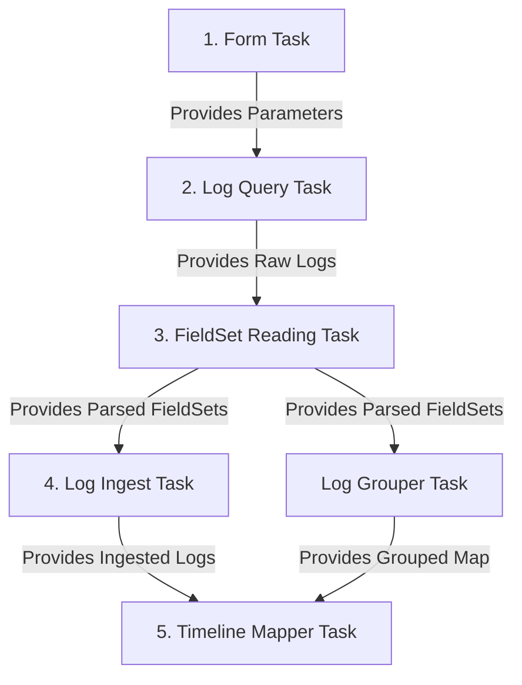

# KHI Log Parser Support Guidelines

This guide outlines the patterns, package boundaries, implementation steps, and best practices for adding support for new log types or modifying existing log parsers in KHI.

---

## 1. Package Structure & Boundaries

When implementing a new log parser or modifying an existing one, you MUST separate the **contract** (IDs, public types, and configurations) from the **implementation** (the actual task logic). This guarantees that task IDs are fully initialized before implementation and prevents circular import dependencies.

The parser package must reside under `pkg/task/inspection/` and adhere to the following structure:

```plaintext
pkg/task/inspection/<log_type_name>/
├── contract/
│   ├── taskid.go          // Defines all TaskIDs and TaskReferences.
│   ├── fieldset.go        // (Optional) Defines the strongly-typed FieldSets and their Readers.
│   ├── timeline_type.go   // (Optional) Defines timeline types and verb types.
│   ├── timeline_path.go   // (Optional) Helper functions to build hierarchical paths.
│   └── log_type.go        // (Optional) Defines log-specific types or constants.
└── impl/
    ├── form_task.go       // (Optional) Implements form-related parameter tasks.
    ├── query_task.go      // (Optional) Implements log query/filter tasks.
    ├── ingester_task.go   // (Optional) Implements the LogIngester task.
    ├── <name>_mapper.go   // (Optional) Implements LogToTimelineMapper tasks (can be multiple).
    └── registration.go    // Implements task registration to the KHI registry.
```

### Key Package Boundaries

> [!IMPORTANT]
>
> - **Contract Package (`contract/`)**: MUST NOT import the `impl` package. External packages can freely import the `contract` package to depend on parser task IDs, FieldSet types, or TimelineType constants.
> - **Implementation Package (`impl/`)**: Implements the actual tasks. It imports the `contract` package. **External packages MUST NOT import the `impl` package.**
> - **Registration**: Tasks inside the `impl` package are registered through `impl/registration.go`. There is no root-level `registration.go` file in this directory.

---

## 2. The Five Log Parsing Steps

A complete log parser in KHI generally consists of 5 sequential steps, represented as distinct DAG tasks:



### Step 1: Form Tasks (Form-related)

Exposes interactive input fields (e.g., text boxes, multi-select checkboxes) to let users configure parameters before running the inspection.

- **Utility:** `formtask.NewTextFormTaskBuilder` or `formtask.NewSetFormTaskBuilder`.

### Step 2: Log Query Tasks

Queries logs from the data source (e.g., Google Cloud Logging or local files) using parameters provided by the Form tasks.

- **Utility:** `googlecloudcommon_contract.NewListLogEntriesTask` (for any logs on Cloud Logging) or `inspection_task.NewInspectionTask`.

### Step 3: FieldSet Reading Tasks

Reads structured log fields in parallel and attaches strongly-typed structs called **FieldSets** to log objects so subsequent tasks can access them efficiently.

- **Utility:** `inspectiontaskbase.NewFieldSetReadTask` with custom `log.FieldSetReader`s.

### Step 4: Log Ingestion Tasks

Information linked to the log is parsed here into a writable format, receiving information from the FieldSets (e.g. Timestamp, Severity, and Summary are initialized and stage mutations).

- **Utility:** `inspectiontaskbase.NewLogIngesterTask`.

### Step 5: Timeline Mapping Tasks

Maps the ingested logs to resource timelines as events or state revisions.

- **Utility:** `inspectiontaskbase.NewLogToTimelineMapperTask`.

---

## 3. Step-by-Step Implementation Code Samples

Let's look at a concrete example of supporting a custom log type called `customapp`.

### A. The Contract Package (`pkg/task/inspection/customapp/contract/`)

#### `taskid.go`

Defines the TaskIDs and TaskReferences for all 5 steps.

```go
package customapp_contract

import (
 inspectiontaskbase "github.com/GoogleCloudPlatform/khi/pkg/core/inspection/taskbase"
 "github.com/GoogleCloudPlatform/khi/pkg/core/task/taskid"
 "github.com/GoogleCloudPlatform/khi/pkg/model/log"
)

const TaskIDPrefix = "customapp.khi.google.com/"

// 1. Form Task ID
var InputFilterKeywordTaskID = taskid.NewDefaultImplementationID[string](TaskIDPrefix + "input-keyword")

// 2. Log Query Task ID
var LogQueryTaskID = taskid.NewDefaultImplementationID[[]*log.Log](TaskIDPrefix + "query")

// 3. FieldSet Reading Task ID
var FieldSetReadTaskID = taskid.NewDefaultImplementationID[[]*log.Log](TaskIDPrefix + "fieldset-read")

// 4. Log Ingestion Task ID
var LogIngesterTaskID = taskid.NewDefaultImplementationID[[]*log.Log](TaskIDPrefix + "log-ingester")

// 5. Log Grouper & Timeline Mapper Task IDs
var LogGrouperTaskID = taskid.NewDefaultImplementationID[inspectiontaskbase.LogGroupMap](TaskIDPrefix + "log-grouper")
var LogToTimelineMapperTaskID = taskid.NewDefaultImplementationID[inspectiontaskbase.TimelineMapperResult](TaskIDPrefix + "timeline-mapper")
```

#### `fieldset.go`

Defines the strongly-typed FieldSet and its reader.

```go
package customapp_contract

import (
 "github.com/GoogleCloudPlatform/khi/pkg/common/structured"
 "github.com/GoogleCloudPlatform/khi/pkg/model/log"
)

// CustomAppFieldSet holds structured log data extracted from the log entry.
type CustomAppFieldSet struct {
 AppName   string
 RequestID string
 Payload   string
}

// Kind returns the unique identifier of this FieldSet.
func (fs *CustomAppFieldSet) Kind() string {
 return "customapp.khi.google.com/FieldSet"
}

// CustomAppFieldSetReader extracts CustomAppFieldSet from a raw log node reader.
type CustomAppFieldSetReader struct{}

// FieldSetKind returns the Kind string of CustomAppFieldSet.
func (r *CustomAppFieldSetReader) FieldSetKind() string {
 return "customapp.khi.google.com/FieldSet"
}

// Read parses fields from structured log data.
func (r *CustomAppFieldSetReader) Read(reader *structured.NodeReader) (log.FieldSet, error) {
 return &CustomAppFieldSet{
  AppName:   reader.ReadStringOrDefault("app_name", "unknown-app"),
  RequestID: reader.ReadStringOrDefault("request_id", ""),
  Payload:   reader.ReadStringOrDefault("payload", ""),
 }, nil
}

var _ log.FieldSetReader = (*CustomAppFieldSetReader)(nil)
```

#### `timeline_type.go`

Defines custom timeline types and resource verbs.

```go
package customapp_contract

import (
 "github.com/GoogleCloudPlatform/khi/pkg/model/khifile/v6/style"
)

var (
 // TimelineTypeCustomApp is the timeline type style for Custom App resources.
 TimelineTypeCustomApp = style.MustRegisterTimelineType(
  "customapp",
  "Custom Application",
  "dns",
  0.6,
  style.ColorWhite,
  style.ColorBlack,
  style.MustForceConvertSRGBHex("#4285F4"),
  true,
  1000,
  style.AlphabeticalSortPolicy(),
 )

 // VerbCustomAppProcess is the verb style for Custom App state updates.
 VerbCustomAppProcess = style.MustRegisterVerb("Process", style.MustForceConvertSRGBHex("#0F9D58"), style.ColorWhite, true)
)
```

#### `log_type.go`

Defines custom log types.

```go
package customapp_contract

import (
 "github.com/GoogleCloudPlatform/khi/pkg/model/khifile/v6/style"
)

var (
 // LogTypeCustomApp is the log type style for Custom App logs.
 LogTypeCustomApp = style.MustRegisterLogType(
  "customapp",
  "Custom Application Logs",
  style.MustForceConvertSRGBHex("#4285F4"),
  style.ColorWhite,
 )
)
```

#### `timeline_path.go` (Optional)

Defines helper functions to build hierarchical timeline paths.

For custom application timelines, you can define helpers to construct paths consistently. If your custom application runs as part of a Kubernetes Pod, you can build a sub-timeline path nested directly under the standard Kubernetes Pod timeline by referencing standard K8s timeline types from `inspectioncore_contract`.

- MustXXXTimeline func must receive the context as its first argument.
- If the MustXXXTimeline func isn't for a root timeline, it must receive the parent timeline path as its second argument.

```go
package customapp_contract

import (
 "context"

 "github.com/GoogleCloudPlatform/khi/pkg/common/khictx"
 khifilev6 "github.com/GoogleCloudPlatform/khi/pkg/model/khifile/v6"
 inspectioncore_contract "github.com/GoogleCloudPlatform/khi/pkg/task/inspection/inspectioncore/contract"
)

// MustCustomAppTimeline returns the hierarchical timeline path for a standalone Custom App.
// Constructs a path like: customapp/<appName>
func MustCustomAppTimeline(ctx context.Context, appName string) *khifilev6.TimelinePath {
 builder := khictx.MustGetValue(ctx, inspectioncore_contract.Builder)
 return builder.TimelineAccumulator.GetPath(nil, khifilev6.PathSegment{
  Name: appName,
  Type: TimelineTypeCustomApp,
 })
}

// MustCustomAppPodTimeline returns the hierarchical timeline path for Custom App logs nested under a Pod.
// Constructs a path like: <apiVersion>/<kind>/<namespace>/<podName>/customapp
func MustCustomAppPodTimeline(ctx context.Context, podTimelinePath *khifilev6.TimelinePath) *khifilev6.TimelinePath {
  if podTimelinePath == nil || podTimelinePath.Type.GetId() != inspectioncore_contract.TimelineTypeResource.GetId() {
  panic("parent timeline path must be Resource type")
 }

 builder := khictx.MustGetValue(ctx, inspectioncore_contract.Builder)
 return builder.TimelineAccumulator.GetPath(podTimelinePath, khifilev6.PathSegment{
  Name: "customapp",
  Type: TimelineTypeCustomApp,
 })
}
```

---

### B. The Implementation Package (`pkg/task/inspection/customapp/impl/`)

#### `form_task.go` (Step 1)

Implements form tasks to get user-defined input.

```go
package customapp_impl

import (
 "context"

 "github.com/GoogleCloudPlatform/khi/pkg/core/inspection/formtask"
 customapp_contract "github.com/GoogleCloudPlatform/khi/pkg/task/inspection/customapp/contract"
 googlecloudcommon_contract "github.com/GoogleCloudPlatform/khi/pkg/task/inspection/googlecloudcommon/contract"
)

const formPriority = googlecloudcommon_contract.FormBasePriority + 5000

// InputFilterKeywordTask defines a text input form task for filtering logs.
var InputFilterKeywordTask = formtask.NewTextFormTaskBuilder(
 customapp_contract.InputFilterKeywordTaskID,
 formPriority,
 "Filter Keyword",
).
 WithDescription("Keyword to filter Custom App logs.").
 WithDefaultValueFunc(func(ctx context.Context, previousValues []string) (string, error) {
  if len(previousValues) > 0 {
   return previousValues[0], nil
  }
  return "default-keyword", nil
 }).
 Build()
```

#### `query_task.go` (Step 2)

Implements querying logs from Google Cloud Logging based on parameters.

```go
package customapp_impl

import (
 "context"
 "fmt"

 coretask "github.com/GoogleCloudPlatform/khi/pkg/core/task"
 "github.com/GoogleCloudPlatform/khi/pkg/core/task/taskid"

 "github.com/GoogleCloudPlatform/khi/pkg/model/log"
 googlecloudcommon_contract "github.com/GoogleCloudPlatform/khi/pkg/task/inspection/googlecloudcommon/contract"
 googlecloudk8scommon_contract "github.com/GoogleCloudPlatform/khi/pkg/task/inspection/googlecloudk8scommon/contract"
 customapp_contract "github.com/GoogleCloudPlatform/khi/pkg/task/inspection/customapp/contract"
 inspectioncore_contract "github.com/GoogleCloudPlatform/khi/pkg/task/inspection/inspectioncore/contract"
)

// LogQueryTask executes Cloud Logging filter to fetch logs.
var LogQueryTask = googlecloudcommon_contract.NewListLogEntriesTask(&customAppLogQueryTaskSetting{})

type customAppLogQueryTaskSetting struct{}

func (s *customAppLogQueryTaskSetting) TaskID() taskid.TaskImplementationID[[]*log.Log] {
 return customapp_contract.LogQueryTaskID
}

func (s *customAppLogQueryTaskSetting) Dependencies() []taskid.UntypedTaskReference {
 return []taskid.UntypedTaskReference{
  googlecloudk8scommon_contract.ClusterIdentityTaskID.Ref(),
  customapp_contract.InputFilterKeywordTaskID.Ref(),
 }
}

func (s *customAppLogQueryTaskSetting) Description() *googlecloudcommon_contract.ListLogEntriesTaskDescription {
 return &googlecloudcommon_contract.ListLogEntriesTaskDescription{

  QueryName:      "Custom App logs",
  ExampleQuery:   `resource.type="gke_cluster" AND log_id("custom-app")`,
 }
}

func (s *customAppLogQueryTaskSetting) LogFilters(ctx context.Context, taskMode inspectioncore_contract.InspectionTaskModeType) ([]string, error) {
 keyword := coretask.GetTaskResult(ctx, customapp_contract.InputFilterKeywordTaskID.Ref())
 query := fmt.Sprintf(`resource.type="gke_cluster" AND log_id("custom-app") AND textPayload:"%s"`, keyword)
 return []string{query}, nil
}

func (s *customAppLogQueryTaskSetting) DefaultResourceNames(ctx context.Context) ([]string, error) {
 clusterIdentity := coretask.GetTaskResult(ctx, googlecloudk8scommon_contract.ClusterIdentityTaskID.Ref())
 return []string{fmt.Sprintf("projects/%s", clusterIdentity.ProjectID)}, nil
}

func (s *customAppLogQueryTaskSetting) TimePartitionCount(ctx context.Context) (int, error) {
 return 5, nil
}

var _ googlecloudcommon_contract.ListLogEntriesTaskSetting = (*customAppLogQueryTaskSetting)(nil)
```

#### `parser_tasks.go` (Steps 3, 4, 5)

Defines FieldSet reading, log ingestion, log grouping, and timeline mapping.

```go
package customapp_impl

import (
 "context"
 "fmt"

 "github.com/GoogleCloudPlatform/khi/pkg/common/khictx"
 inspectiontaskbase "github.com/GoogleCloudPlatform/khi/pkg/core/inspection/taskbase"
 "github.com/GoogleCloudPlatform/khi/pkg/core/task/taskid"
 khifilev6 "github.com/GoogleCloudPlatform/khi/pkg/model/khifile/v6"

 "github.com/GoogleCloudPlatform/khi/pkg/model/log"
 customapp_contract "github.com/GoogleCloudPlatform/khi/pkg/task/inspection/customapp/contract"
 googlecloudcommon_contract "github.com/GoogleCloudPlatform/khi/pkg/task/inspection/googlecloudcommon/contract"
 inspectioncore_contract "github.com/GoogleCloudPlatform/khi/pkg/task/inspection/inspectioncore/contract"
)

// FieldSetReadTask reads fields in parallel (Step 3).
var FieldSetReadTask = inspectiontaskbase.NewFieldSetReadTask(
 customapp_contract.FieldSetReadTaskID,
 customapp_contract.LogQueryTaskID.Ref(),
 []log.FieldSetReader{
  &customapp_contract.CustomAppFieldSetReader{},
  &googlecloudcommon_contract.GCPDefaultSeverityFieldSetReader{},
 },
)

// CustomAppLogIngester V2 LogIngester (Step 4).
type CustomAppLogIngester struct{}

func (i *CustomAppLogIngester) RawLogTask() taskid.TaskReference[[]*log.Log] {
 return customapp_contract.FieldSetReadTaskID.Ref()
}

func (i *CustomAppLogIngester) Dependencies() []taskid.UntypedTaskReference {
 return []taskid.UntypedTaskReference{}
}

func (i *CustomAppLogIngester) ProcessLog(ctx context.Context, l *log.Log) (*khifilev6.LogChangeSet, error) {
 cs, err := khifilev6.NewLogChangeSet(l)
 if err != nil {
  return nil, err
 }
  // Log related parsing logic. LogType, Timestamp, Severity and Summary must be set.

 cs.SetLogType(foocontract.LogTypeFoo)
 // Explicitly retrieve and ingest Timestamp from CommonFieldSet.
 if commonFS, err := log.GetFieldSet(l, &log.CommonFieldSet{}); err == nil {
  cs.SetTimestamp(commonFS.Timestamp)
  // Do not use commonFS.Severity because it's deprecated.
 }

 // Retrieve and ingest Severity from DefaultSeverityFieldSet.
 if severityFS, err := log.GetFieldSet(l, &inspectioncore_contract.DefaultSeverityFieldSet{}); err == nil {
  cs.SetSeverity(severityFS.Severity)
 }

 // Retrieve custom fields to generate summary.
 if customFS, err := log.GetFieldSet(l, &customapp_contract.CustomAppFieldSet{}); err == nil {
  cs.SetSummary(fmt.Sprintf("[%s] %s", customFS.AppName, customFS.Payload))
 }

 return cs, nil
}

var LogIngesterTask = inspectiontaskbase.NewLogIngesterTask(
 customapp_contract.LogIngesterTaskID,
 &CustomAppLogIngester{},
)

// LogGrouperTask groups logs byAppName (helper for Step 5).
var LogGrouperTask = inspectiontaskbase.NewLogGrouperTask(
 customapp_contract.LogGrouperTaskID,
 customapp_contract.FieldSetReadTaskID.Ref(),
 func(ctx context.Context, l *log.Log) string {
  if customFS, err := log.GetFieldSet(l, &customapp_contract.CustomAppFieldSet{}); err == nil {
   return customFS.AppName
  }
  return "unknown-app"
 },
)

// CustomAppTimelineMapper maps logs to timeline (Step 5).
type CustomAppTimelineMapper struct {
 inspectiontaskbase.StatelessMapperBase // Embed stateless helper.
}

func (m *CustomAppTimelineMapper) LogIngesterTask() taskid.TaskReference[[]*log.Log] {
 return customapp_contract.LogIngesterTaskID.Ref()
}

func (m *CustomAppTimelineMapper) Dependencies() []taskid.UntypedTaskReference {
 return []taskid.UntypedTaskReference{}
}

func (m *CustomAppTimelineMapper) GroupedLogTask() taskid.TaskReference[inspectiontaskbase.LogGroupMap] {
 return customapp_contract.LogGrouperTaskID.Ref()
}

func (m *CustomAppTimelineMapper) ProcessLogByGroup(ctx context.Context, l *log.Log, _ struct{}) (*khifilev6.TimelineChangeSet, struct{}, error) {
 commonFS, err := log.GetFieldSet(l, &log.CommonFieldSet{})
 if err != nil {
  return nil, struct{}{}, err
 }
 customFS, err := log.GetFieldSet(l, &customapp_contract.CustomAppFieldSet{})
 if err != nil {
  return nil, struct{}{}, err
 }

 builder := khictx.MustGetValue(ctx, inspectioncore_contract.CurrentV6Builder)
 targetPath := builder.TimelineAccumulator.GetPath(nil, khifilev6.PathSegment{
  Name: customFS.AppName,
  Type: customapp_contract.TimelineTypeCustomApp,
 })

 cs := khifilev6.NewTimelineChangeSet(l)

 // Record a revision on timeline for state change.
 cs.AddRevision(targetPath, &khifilev6.StagingRevision{
  ChangedTime:  commonFS.Timestamp,
  ResourceBody: customFS.Payload,
  VerbType:     customapp_contract.VerbCustomAppProcess,
 })

 return cs, struct{}{}, nil
}

var LogToTimelineMapperTask = inspectiontaskbase.NewLogToTimelineMapperTask(
 customapp_contract.LogToTimelineMapperTaskID,
 &CustomAppTimelineMapper{},
 inspectioncore_contract.FeatureTaskLabel(
  "Custom App Logs",
  "Parser and timeline mapping for Custom App logs.",
  9000,
  false,
 ),
)

var _ inspectiontaskbase.LogToTimelineMapper[struct{}] = (*CustomAppTimelineMapper)(nil)
```

### C. Specialized Pattern: `ManifestLogToTimelineMapper` (Multi-Group Merge Mapper)

For advanced scenarios requiring the tracking and synchronization of **multiple related resource logs** chronologically (such as a parent `Pod` and its subresources like `Status` or `Binding`), KHI provides `NewManifestLogToTimelineMapper`.

This mapper automatically merges logs from multiple roles into a single stream sorted strictly by timestamp, and passes the state `T` across all events.

#### Key Interfaces and Structures

- **`RelatedGroupSet`**: Groups related logs by role name (e.g., `"source" -> PodGroup`, `"target" -> BindingGroup`).
- **`MultiGroupLogEvent`**: Contains the currently yielding `Log`, the role (`GroupRole`), and the helper methods:
  - `GetLastBodyReader(role string) (*structured.NodeReader, bool)`: Retrieves the latest manifest body of the specified role as a `NodeReader` at the time of the event using highly optimized `O(log N)` binary search.
  - `GetLastBodyYAML(role string) (string, bool)`: Retrieves the latest manifest body as a YAML string.

#### Code Sample: Single-Pass Stateful Manifest Mapper

```go
package myapp_impl

import (
 "context"
 "time"

 "github.com/GoogleCloudPlatform/khi/pkg/core/task/taskid"
 pb "github.com/GoogleCloudPlatform/khi/pkg/generated/khifile/v6"
 khifilev6 "github.com/GoogleCloudPlatform/khi/pkg/model/khifile/v6"
 "github.com/GoogleCloudPlatform/khi/pkg/model/log"
 commonlogk8saudit_contract "github.com/GoogleCloudPlatform/khi/pkg/task/inspection/commonlogk8saudit/contract"
)

type MyState struct {
 WasDeleted bool
}

type MyManifestMapper struct {
 // Embeds single pass helper.
 commonlogk8saudit_contract.ManifestSinglePassMapperBase[*MyState]
}

func (m *MyManifestMapper) TaskID() taskid.TaskImplementationID[inspectiontaskbase.TimelineMapperResult] {
 return mycontract.MyManifestMapperTaskID
}

func (m *MyManifestMapper) LogIngesterTask() taskid.TaskReference[[]*log.Log] {
 return commonlogk8saudit_contract.K8sAuditLogIngesterTaskID.Ref()
}

func (m *MyManifestMapper) GroupedLogTask() taskid.TaskReference[commonlogk8saudit_contract.ResourceManifestLogGroupMap] {
 return commonlogk8saudit_contract.ResourceLifetimeTrackerTaskID.Ref()
}

func (m *MyManifestMapper) Dependencies() []taskid.UntypedTaskReference {
 return []taskid.UntypedTaskReference{}
}

// ResolveRelatedGroupSets groups a parent resource (source) and its subresource (target) together.
func (m *MyManifestMapper) ResolveRelatedGroupSets(ctx context.Context, groupedLogs commonlogk8saudit_contract.ResourceManifestLogGroupMap) ([]commonlogk8saudit_contract.RelatedGroupSet, error) {
 result := []commonlogk8saudit_contract.RelatedGroupSet{}
 for _, group := range groupedLogs {
  if group.Resource.Type() == commonlogk8saudit_contract.Subresource {
   parentGroup := groupedLogs[group.Resource.ParentIdentity().ResourcePathString()]
   result = append(result, commonlogk8saudit_contract.RelatedGroupSet{
    Roles: map[string]*commonlogk8saudit_contract.ResourceManifestLogGroup{
     "source": parentGroup,
     "target": group,
    },
   })
  }
 }
 return result, nil
}

// ProcessLog processes chronologically merged events.
func (m *MyManifestMapper) ProcessLog(ctx context.Context, event commonlogk8saudit_contract.MultiGroupLogEvent, state *MyState) (*khifilev6.TimelineChangeSet, *MyState, error) {
 if state == nil {
  state = &MyState{}
 }

 cs := khifilev6.NewTimelineChangeSet(event.Log)

 // Handle parent deletion event to propagate deletion to the subresource.
 if event.GroupRole == "source" && event.EventType == commonlogk8saudit_contract.ChangeEventTypeDeletion {
  targetGroup := event.GroupSet.Roles["target"]
  targetPath := MustResolveTimelinePath(ctx, targetGroup.Resource)

  cs.AddRevision(targetPath, &khifilev6.StagingRevision{
   ChangedTime: time.Now(),
   StateType:   commonlogk8saudit_contract.RevisionStateK8sResourceIsDeleted,
  })
  state.WasDeleted = true
 }

 return cs, state, nil
}

var _ commonlogk8saudit_contract.ManifestLogToTimelineMapper[*MyState] = (*MyManifestMapper)(nil)
```

#### `registration.go`

Registers the tasks with the central registry.

```go
package customapp_impl

import (
 coreinspection "github.com/GoogleCloudPlatform/khi/pkg/core/inspection"
 coretask "github.com/GoogleCloudPlatform/khi/pkg/core/task"
)

// Register registers all customapp tasks to the central registry.
func Register(registry coreinspection.InspectionTaskRegistry) error {
 return coretask.RegisterTasks(
  registry,
  InputFilterKeywordTask,
  LogQueryTask,
  FieldSetReadTask,
  LogIngesterTask,
  LogGrouperTask,
  LogToTimelineMapperTask,
 )
}
```

---

## 4. Testing Log Parsers

Refer to [log-timeline-mapper](skill://log-timeline-mapper) for detailed unit testing strategies of `LogIngester` and `LogToTimelineMapper`.

### Testing `ManifestLogToTimelineMapper`

Since `ManifestLogToTimelineMapper` coordinates chronologically merged streams and tracks previous states, testing it requires:

1. **Chronological Merge Validation**: Testing that events from different roles are merged correctly.
2. **Historical Snapshot Validation**: Testing that `GetLastBodyReader` or `GetLastBodyYAML` accurately yields the snapshot of other roles at the event's timestamp.

Use a **Table-Driven Test** pattern to verify these behaviors comprehensively.

#### Test Example: Table-Driven Snapshot Verification

```go
func TestGetLastBody(t *testing.T) {
 t1 := time.Date(2026, 5, 26, 10, 0, 0, 0, time.UTC)
 t2 := t1.Add(time.Minute)

 nodeA1, _ := structured.FromGoValue(map[string]any{"value": "A1"}, &structured.AlphabeticalGoMapKeyOrderProvider{})
 nodeB1, _ := structured.FromGoValue(map[string]any{"value": "B1"}, &structured.AlphabeticalGoMapKeyOrderProvider{})

 logA1 := log.NewLogWithFieldSetsForTest(&log.CommonFieldSet{Timestamp: t1})
 logB1 := log.NewLogWithFieldSetsForTest(&log.CommonFieldSet{Timestamp: t2})

 groupSet := RelatedGroupSet{
  Roles: map[string]*ResourceManifestLogGroup{
   "roleA": {
    Logs: []*ResourceManifestLog{
     {Log: logA1, ResourceBodyYAML: "value: A1", ResourceBodyReader: structured.NewNodeReader(nodeA1)},
    },
   },
   "roleB": {
    Logs: []*ResourceManifestLog{
     {Log: logB1, ResourceBodyYAML: "value: B1", ResourceBodyReader: structured.NewNodeReader(nodeB1)},
    },
   },
  },
 }

 events := make([]MultiGroupLogEvent, 0)
 for event := range iterateMultiGroupLog(groupSet) {
  events = append(events, event)
 }

 testCases := []struct {
  name         string
  eventIndex   int
  expectedRole string
  roleToCheck  string
  wantFound    bool
  wantYAML     string
 }{
  {
   name:         "event 0: check roleA body",
   eventIndex:   0,
   expectedRole: "roleA",
   roleToCheck:  "roleA",
   wantFound:    true,
   wantYAML:     "value: A1",
  },
  {
   name:         "event 0: check roleB body (not exist yet)",
   eventIndex:   0,
   expectedRole: "roleA",
   roleToCheck:  "roleB",
   wantFound:    false,
  },
  {
   name:         "event 1: check roleA body from roleB event",
   eventIndex:   1,
   expectedRole: "roleB",
   roleToCheck:  "roleA",
   wantFound:    true,
   wantYAML:     "value: A1",
  },
 }

 for _, tc := range testCases {
  t.Run(tc.name, func(t *testing.T) {
   e := events[tc.eventIndex]

   if e.GroupRole != tc.expectedRole {
    t.Errorf("expected group role %q, got %q", tc.expectedRole, e.GroupRole)
   }

   yaml, ok := e.GetLastBodyYAML(tc.roleToCheck)
   if ok != tc.wantFound {
    t.Errorf("GetLastBodyYAML(%q) ok = %t, want %t", tc.roleToCheck, ok, tc.wantFound)
   }
   if ok && yaml != tc.wantYAML {
    t.Errorf("GetLastBodyYAML(%q) = %q, want %q", tc.roleToCheck, yaml, tc.wantYAML)
   }
  })
 }
}
```

### Testing Tasks Implemented with `ManifestLogToTimelineMapper`

To unit test a concrete mapper task implementing `ManifestLogToTimelineMapper[T]`, you should isolate and test its `ProcessLog` (and `PreProcessLog`) method using table-driven tests.

The test setup requires:

1. **v6 Builder Initialization**: Instantiate a `khifilev6.Builder` and construct the expected `TimelinePath` instances.
2. **Context Injection**: Inject the builder into the test context utilizing `khictx.WithValue` and the key `inspectioncore_contract.Builder`.
3. **Mock Event Construction**: Manually instantiate a `MultiGroupLogEvent` with mock logs and roles, and supply a mock `RelatedGroupSet` if testing body-reference lookups.
4. **Fluent ChangeSet Assertions**: Verify the generated timelines using the fluent asserter utility `testchangeset.AssertTimeline`.

#### Task Unit Test Example

This example isolates and tests the `MyManifestMapper` defined in Section 3.C.

```go
func TestMyManifestMapper_ProcessLog(t *testing.T) {
 // 1. Set up the mock Builder and construct comparison paths hierarchically.
 builder := khifilev6.NewBuilder()
 cluster := builder.TimelineAccumulator.GetPath(nil, khifilev6.PathSegment{Name: "k8s", Type: inspectioncore_contract.TimelineTypeK8sCluster})
 api := builder.TimelineAccumulator.GetPath(cluster, khifilev6.PathSegment{Name: "core/v1", Type: inspectioncore_contract.TimelineTypeAPIVersion})
 kind := builder.TimelineAccumulator.GetPath(api, khifilev6.PathSegment{Name: "pod", Type: inspectioncore_contract.TimelineTypeKind})
 ns := builder.TimelineAccumulator.GetPath(kind, khifilev6.PathSegment{Name: "default", Type: inspectioncore_contract.TimelineTypeNamespace})
 pod := builder.TimelineAccumulator.GetPath(ns, khifilev6.PathSegment{Name: "my-pod", Type: inspectioncore_contract.TimelineTypeResource})
 targetPath := builder.TimelineAccumulator.GetPath(pod, khifilev6.PathSegment{Name: "binding", Type: TimelineTypeSubresource})

 testCases := []struct {
  name      string
  event     MultiGroupLogEvent
  prevState *MyState
  assert    func(t *testing.T, ctx context.Context, cs *khifilev6.TimelineChangeSet, state *MyState)
 }{
  {
   name: "parent pod deletion propagates delete revision to subresource binding",
   event: MultiGroupLogEvent{
    Log: log.NewLogWithFieldSetsForTest(
     &log.CommonFieldSet{Timestamp: time.Date(2026, 5, 26, 10, 0, 0, 0, time.UTC)},
    ),
    GroupRole: "source", // Parent resource
    EventType: ChangeEventTypeDeletion,
    GroupSet: RelatedGroupSet{
     Roles: map[string]*ResourceManifestLogGroup{
      "target": {
       Resource: &ResourceIdentity{
        APIVersion:      "core/v1",
        Kind:            "pod",
        Name:            "my-pod",
        Namespace:       "default",
        SubresourceName: "binding",
       },
      },
     },
    },
   },
   prevState: &MyState{WasDeleted: false},
   assert: func(t *testing.T, ctx context.Context, cs *khifilev6.TimelineChangeSet, state *MyState) {
    // Verify the generated staged revisions using fluent assertions.
    testchangeset.AssertTimeline(t, cs).
     HasRevision(targetPath, &khifilev6.StagingRevision{
      StateType: commonlogk8saudit_contract.RevisionStateK8sResourceIsDeleted,
     })

    // Verify that state changes are correctly tracked.
    if !state.WasDeleted {
     t.Errorf("state.WasDeleted = false, want true")
    }
   },
  },
 }

 mapper := &MyManifestMapper{}
 for _, tc := range testCases {
  t.Run(tc.name, func(t *testing.T) {
   // 2. Inject the SAME Builder instance into context.
   ctx := khictx.WithValue(t.Context(), inspectioncore_contract.Builder, builder)

   // 3. Call ProcessLog directly.
   cs, nextState, err := mapper.ProcessLog(ctx, tc.event, tc.prevState)
   if err != nil {
    t.Fatalf("ProcessLog() returned unexpected error: %v", err)
   }

   // 4. Assert outcomes.
   tc.assert(t, ctx, cs, nextState)
  })
 }
}
```
