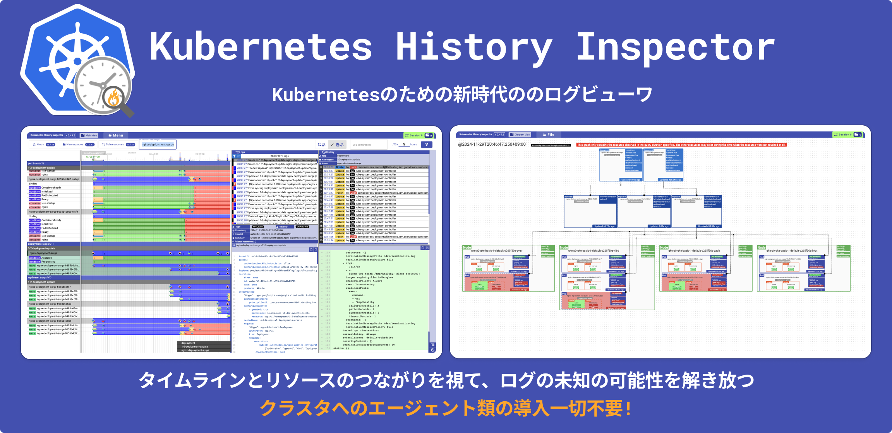
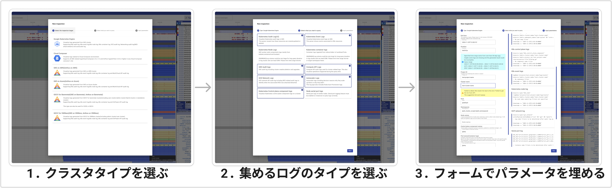
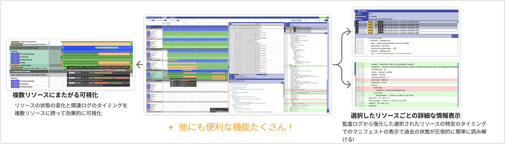
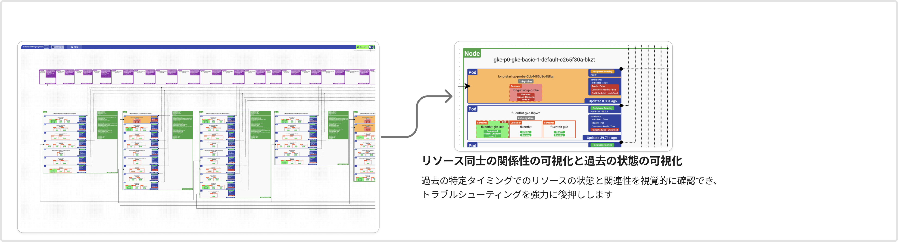

# Kubernetes History Inspector

Language: [English](./README.md) | 日本語



Kubernetes History Inspector (KHI) は、Kubernetesクラスタのログ可視化ツールです。
KHIは、大量のログをインタラクティブなタイムラインビュー等として可視化し、Kubernetesクラスタ内の複数のコンポーネントにまたがる複雑な問題のトラブルシューティングを強力にサポートします。

## KHI の機能と特徴

- **事前設定不要:** KHIはクラスタ内のエージェント等を必要とせず、既存のログから可視化を提供します。クラスタへの事前の設定やインストールは不要です。さらに、ログがログバックエンド上に保持されている限り、過去の問題のトラブルシューティングにもKHIを活用できます。

- **圧倒的に簡単なログ収集:** KHIは、Kubernetes 関連ログの収集を大幅に簡素化します。ユーザーは、複雑なログフィルタを記述する代わりに、インタラクティブなGUIを利用してクエリを生成、実行できます。



- **インタラクティブなタイムラインによるク包括的なクラスタの可視化:** KHIは、様々なログを用いて包括的なクラスタ上での出来事を可視化します。
  - **リソース履歴の可視化:** KHI は、リソースの状態をタイムライン上に表示します。また、監査ログを解析し変更履歴を確認することが可能です。
  - **複数のリソースタイプにわたる複数のログタイプの可視化:** KHI は、関連リソース間のさまざまなタイプのログを関連付け、全体像を提供します。
  - **リソース間のログのタイムライン比較:** タイムラインビューでは、ユーザーはリソース間のログを時間軸で比較できるため、関係性と依存関係を容易に特定できます。
  - **強力なインタラクティブフィルター:** KHI は意図的に大量のログをメモリにロードします。これにより、ユーザーはインタラクティブにログをフィルタリングし、大規模なデータセット内から必要な情報を迅速に特定できます。



- **リソースの関連性の可視化 (アルファ機能):** KHI は、特定の時点での Kubernetes クラスタのリソースの状態とそれらの関係を示す図を生成できます。これは、インシデント中のクラスタ中のリソース同士の関連性を把握することを可能にします。



## サポート環境

### クラスタ

- Google Cloud
  - [Google Kubernetes Engine](https://cloud.google.com/kubernetes-engine/docs/concepts/kubernetes-engine-overview)
  - [Cloud Composer](https://cloud.google.com/composer/docs/composer-3/composer-overview)
  - [GKE on AWS](https://cloud.google.com/kubernetes-engine/multi-cloud/docs/aws/concepts/architecture)
  - [GKE on Azure](https://cloud.google.com/kubernetes-engine/multi-cloud/docs/azure/concepts/architecture)
  - [GDCV for Baremetal](https://cloud.google.com/kubernetes-engine/distributed-cloud/bare-metal/docs/concepts/about-bare-metal)
  - GDCV for VMWare

- OSS
  - kube-apiserver 監査ログ (JSONlines 形式) (近日公開予定)

### ログバックエンド

- Google Cloud
  - Cloud Logging (Google Cloud 上のすべてのクラスタ)

- その他
  - ファイルによるログアップロード (近日公開予定)

## 動かしてみる (Dockerイメージから実行)

1. [Cloud Shell](https://shell.cloud.google.com) を開きます。
2. `docker run -p 8080:8080 ghcr.io/googlecloudplatform/khi:latest` を実行します。
3. ターミナル上のリンク `http://localhost:8080` をクリックして、KHI の使用を開始してください！

> [!TIP]
> メタデータサーバーが利用できない他の環境で KHI を実行する場合は、プログラム引数でアクセストークンを渡すことができます。
>
>```
>$ docker run -p 8080:8080 ghcr.io/googlecloudplatform/khi:latest -host 0.0.0.0 -access-token=`gcloud auth print-access-token`
>```

## 動かしてみる (ソースから実行)

<details>
<summary>動かしてみる (ソースから実行)</summary>

### 前提条件
- Go 1.23.*
- Node.js 環境 18.19.*
- [`gcloud` CLI](https://cloud.google.com/sdk/docs/install)
- 最新の Google Chrome

### 開発環境のセットアップ (1 回限りの設定)
1. このリポジトリをダウンロードまたはクローンします。  
  例: `git clone https://github.com/GoogleCloudPlatform/khi.git`
2. プロジェクトルートに移動します。  
  例: `cd khi`
3. プロジェクトルートから `cd ./web && npm install` を実行します。

### KHI の実行
1. [`gcloud` で認証します。](https://cloud.google.com/docs/authentication/gcloud)  
  例: ユーザーアカウントの認証情報を使用する場合は、`gcloud auth login` を実行します。
2. プロジェクトルートから `make build-web && KHI_FRONTEND_ASSET_FOLDER=./dist go run cmd/kubernetes-history-inspector/main.go` を実行します。  
  `localhost:8080` を開き、KHI の使用を開始してください！

</details>

## ユーザーガイド

[ユーザーガイド](./docs/ja/user-guide.md) をご確認ください。

> [!IMPORTANT]
> KHI は最新の Google Chrome でのみテストしています。
> 他のブラウザでも動作する可能性がありますが、他のブラウザで動作しない場合でもサポートしません。

## コントリビュート

プロジェクトに貢献したい場合は、[コントリビューティングガイド](./docs/contributing.md) をお読みください。

## 免責事項

このツールは、公式にサポートされている Google Cloud 製品ではありません。問題を見つけたり、機能のリクエストがある場合は、[本レポジトリ上のIssueを作成して報告してください](https://github.com/GoogleCloudPlatform/khi/issues/new?template=Blank+issue)。ベストエフォートではありますが確認し、対応いたします。
