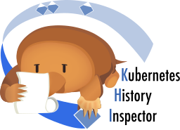
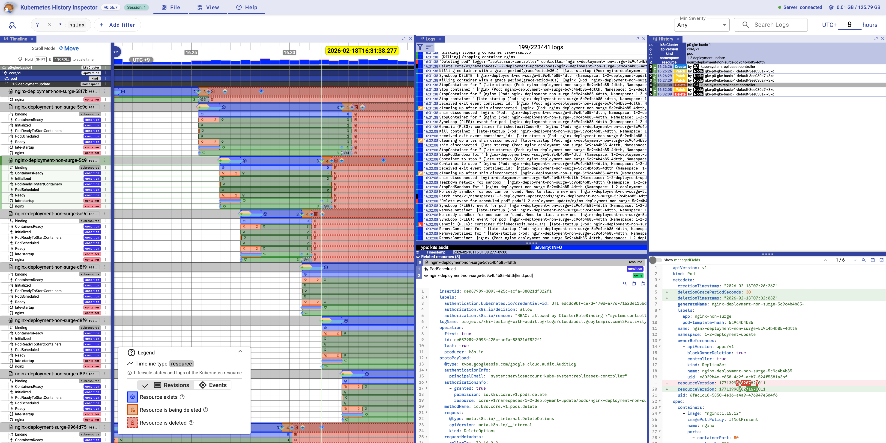
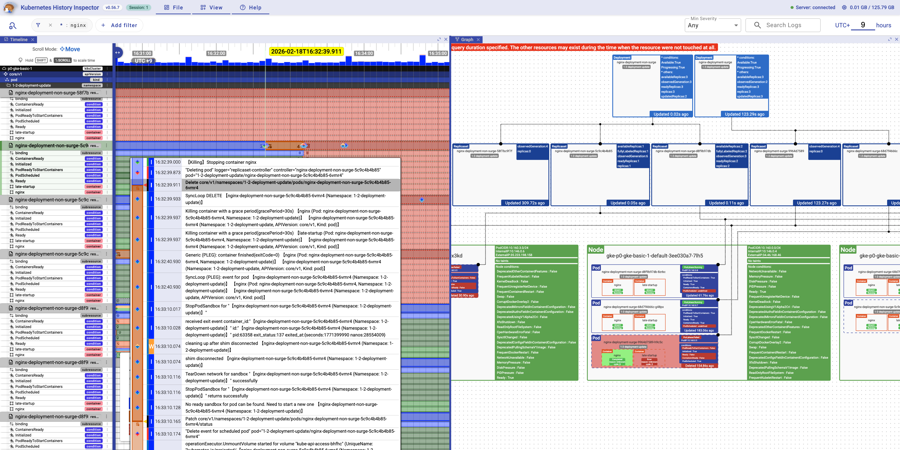

<p align="center">
  <picture>
    <source media="(prefers-color-scheme: dark)" srcset="./docs/images/logo-dark.svg">
    
  </picture>
</p>
<table align="center">
  <tr>
    <td align="center">
      Language: <a href="./README.md">English</a> | 日本語
    </td>
  </tr>
  <tr>
    <td align="center">
      <a href="https://github.com/GoogleCloudPlatform/khi/releases"></a>
      <a href="https://github.com/GoogleCloudPlatform/khi/actions/workflows/pullrequest.yaml"></a>
      <a href="https://opensource.org/licenses/Apache-2.0"></a>
    </td>
  </tr>
</table>

https://github.com/user-attachments/assets/2a735154-1684-4575-a18d-177c012e1a09

<hr/>

# Kubernetes History Inspector

Kubernetes History Inspector (KHI) は、Kubernetes クラスタのログ可視化ツールです。
大量のログをインタラクティブなタイムラインビューなどで可視化し、Kubernetes クラスタ内の複数のコンポーネントにまたがる複雑な問題のトラブルシューティングを強力にサポートします。

クラスタ内へのエージェント等のインストールの必要はなく、ログを読み込ませるだけで、トラブルシューティングに役立つ以下のログの可視化を提供します。

<table width="100%">
  <thead>
    <tr>
      <th width="50%" align="center">タイムラインビュー</th>
      <th width="50%" align="center">トポロジービュー</th>
    </tr>
  </thead>
  <tbody>
    <tr>
      <td valign="top" align="center">
        
        <p align="left">監査ログ等から特定期間の複数リソースに対する変更、ステータス等の遷移をわかりやすくタイムライン、差分として表示。</p>
      </td>
      <td valign="top" align="center">
        
        <p align="left">kube-apiserverの監査ログから復元した特定タイミングのリソースの関係性をわかりやすく可視化。</p>
      </td>
    </tr>
  </tbody>
</table>

## 実行方法

1. [Cloud Shell](https://shell.cloud.google.com) を開きます。
2. 以下の `docker` コマンドを実行します:

   ```bash
   docker run -p 127.0.0.1:8080:8080 gcr.io/kubernetes-history-inspector/release:latest
   ```

3. ターミナル上のリンク `http://localhost:8080` をクリックして、KHI の使用を開始してください！

> [!NOTE]
> ソースコードから KHI をビルドする場合は [開発ガイド](/docs/ja/development-contribution/development-guide.md) をご覧ください。

<details>
<summary>Cloud Shell 以外の環境（ローカル環境等）で実行する場合</summary>

メタデータサーバが利用できない他の環境で KHI を実行する場合は、[アプリケーションのデフォルト認証情報](https://cloud.google.com/docs/authentication/provide-credentials-adc)をホストのファイルシステムからコンテナにマウントして認証できます。

### Linux, MacOS or WSL 環境

```bash
gcloud auth application-default login
docker run \
 -p 127.0.0.1:8080:8080 \
 -v ~/.config/gcloud/application_default_credentials.json:/root/.config/gcloud/application_default_credentials.json:ro \
 gcr.io/kubernetes-history-inspector/release:latest
```

### Windows PowerShell 環境

```bash
gcloud auth application-default login
docker run `
-p 127.0.0.1:8080:8080 `
-v $env:APPDATA\gcloud\application_default_credentials.json:/root/.config/gcloud/application_default_credentials.json:ro `
gcr.io/kubernetes-history-inspector/release:latest
```

</details>

Google Cloud 上で必要な権限の設定については [Google Cloud Permissions 設定](/docs/ja/setup-guide/google-cloud-permissions.md) を参照してください。

詳細は [Getting Started](/docs/en/tutorial/getting-started.md) を参照してください。

## サポートされている製品・環境

### Kubernetes クラスタ

- Google Cloud

  - [Google Kubernetes Engine](https://cloud.google.com/kubernetes-engine/docs/concepts/kubernetes-engine-overview)
  - [Cloud Composer](https://cloud.google.com/composer/docs/composer-3/composer-overview)
  - [GKE on AWS](https://cloud.google.com/kubernetes-engine/multi-cloud/docs/aws/concepts/architecture)
  - [GKE on Azure](https://cloud.google.com/kubernetes-engine/multi-cloud/docs/azure/concepts/architecture)
  - [GDCV for Baremetal](https://cloud.google.com/kubernetes-engine/distributed-cloud/bare-metal/docs/concepts/about-bare-metal)
  - [GDCV for VMWare](https://cloud.google.com/kubernetes-engine/distributed-cloud/vmware/docs/overview)

- その他環境
  - JSONlines 形式の kube-apiserver 監査ログ ([チュートリアル (Using KHI with OSS Kubernetes Clusters - Example with Loki | 英語のみ)](/docs/en/setup-guide/oss-kubernetes-clusters.md))

### ログバックエンド

- Google Cloud

  - Cloud Logging（Google Cloud 上のすべてのクラスタ）

- その他環境
  - ファイルによるログアップロード([チュートリアル (Using KHI with OSS Kubernetes Clusters - Example with Loki | 英語のみ)](/docs/en/setup-guide/oss-kubernetes-clusters.md))

### 動作環境

- Google Chrome（最新版）
- `docker` コマンド

> [!IMPORTANT]
> KHI は最新のGoogle Chromeでしかテストされていません。
> 他のブラウザでも動作する可能性はありますが、動作しない場合でもプロジェクトとしてサポートしていません。

## 環境ごとの設定

### Google Cloud

[Google Cloud 権限設定および認証・監査ログガイド](/docs/ja/setup-guide/google-cloud-permissions.md)を参照してください。

### OSS Kubernetes

[OSS Kubernetesクラスタのログの可視化（Loki）](/docs/ja/setup-guide/oss-kubernetes-clusters.md)を参照してください。

## ユーザーガイド

[ユーザーガイド](/docs/ja/visualization-guide/user-guide.md) をご確認ください。

## KHIプロジェクトへの貢献

プロジェクトへの貢献をご希望の場合は、[コントリビューションガイド](/docs/en/development-contribution/contributing.md) をお読みの上、[KHI開発環境のセットアップ](/docs/ja/development-contribution/development-guide.md)を実施してください。

## 免責事項

KHI は Google Cloud の公式製品ではございません。不具合のご報告や機能に関するご要望がございましたら、お手数ですが当リポジトリの[Github issues](https://github.com/GoogleCloudPlatform/khi/issues/new?template=Blank+issue)にご登録ください。可能な範囲で対応させていただきます。

> [!IMPORTANT]
> KHI のポートをインターネット向けに公開しないでください。
> KHI 自身は認証、認可の機能を提供しておらず、ローカルユーザからのみアクセスされることが想定されています。
