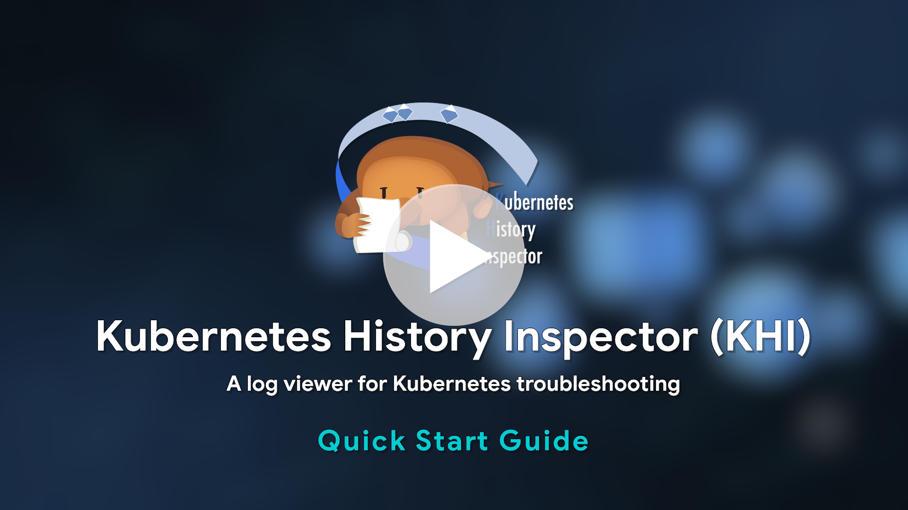

<p align="center">
  <picture>
    <source media="(prefers-color-scheme: dark)" srcset="./docs/images/logo-dark.svg">
    
  </picture>
</p>
<table align="center">
  <tr>
    <td align="center">
      Language: English | <a href="./README.ja.md">日本語</a>
    </td>
  </tr>
  <tr>
    <td align="center">
      <a href="https://github.com/GoogleCloudPlatform/khi/releases"></a>
      <a href="https://github.com/GoogleCloudPlatform/khi/actions/workflows/pullrequest.yaml"></a>
      <a href="https://opensource.org/licenses/Apache-2.0"></a>
    </td>
  </tr>
</table>

[](https://github.com/user-attachments/assets/591357d0-9402-4dd1-b30f-6ae7e25b5cc9)

<hr/>

# Kubernetes History Inspector

Kubernetes History Inspector (KHI) is a rich log visualization tool for Kubernetes clusters. KHI transforms vast quantities of logs into an interactive, comprehensive timeline view.
This makes it an invaluable tool for troubleshooting complex issues that span multiple components within your Kubernetes clusters. Also, KHI is agentless, allowing anyone to access its features without a complicated process.

<table width="100%">
  <thead>
    <tr>
      <th width="50%" align="center">Timeline view</th>
      <th width="50%" align="center">Topology view</th>
    </tr>
  </thead>
  <tbody>
    <tr>
      <td valign="top" align="center">
        
        <p align="left">Timeline view visualizes resource status change timings with timeline charts and manifest diffs from Kubernetes audit logs.</p>
      </td>
      <td valign="top" align="center">
        
        <p align="left">Topology view visualizes relationships among Kubernetes resources, solely from kube-apiserver audit logs.</p>
      </td>
    </tr>
  </tbody>
</table>

## Getting started

The easiest way to try KHI is using [Cloud Shell](https://shell.cloud.google.com), where the metadata server is available without requiring initial credential setup.

### Running in Cloud Shell

1. Open [Cloud Shell](https://shell.cloud.google.com)
2. Run the following command:

   ```bash
   docker run -p 127.0.0.1:8080:8080 gcr.io/kubernetes-history-inspector/release:latest
   ```

3. Click the link `http://localhost:8080` on the terminal and start working with KHI!

### Running in environment without a metadata server (Local PC, etc.)

<details>

If you want to run KHI in an environment where the metadata server is not available, you can use Application Default Credentials (ADC) by mounting your ADC file from your host filesystem to the container.

#### For Linux, MacOS or WSL

```bash
gcloud auth application-default login
docker run \
 -p 127.0.0.1:8080:8080 \
 -v ~/.config/gcloud/application_default_credentials.json:/root/.config/gcloud/application_default_credentials.json:ro \
 gcr.io/kubernetes-history-inspector/release:latest
```

#### For Windows PowerShell

```bash
gcloud auth application-default login
docker run `
-p 127.0.0.1:8080:8080 `
-v $env:APPDATA\gcloud\application_default_credentials.json:/root/.config/gcloud/application_default_credentials.json:ro `
gcr.io/kubernetes-history-inspector/release:latest
```

</details>

---

- For running KHI in automated workflows (CI/CD, alert triggers, etc.) without starting the web server, see the [Job Mode Guide](/docs/en/setup-guide/job-mode.md).
- To build KHI from source code, see the [Development Guide](/docs/en/development-contribution/development-guide.md).
- For more details, try [Getting started](/docs/en/tutorial/getting-started.md).

## Supported Products & Environments

### Kubernetes cluster

- Google Cloud
  - [Google Kubernetes Engine](https://cloud.google.com/kubernetes-engine/docs/concepts/kubernetes-engine-overview)
  - [Cloud Composer](https://cloud.google.com/composer/docs/composer-3/composer-overview)
  - [GKE on AWS](https://cloud.google.com/kubernetes-engine/multi-cloud/docs/aws/concepts/architecture)
  - [GKE on Azure](https://cloud.google.com/kubernetes-engine/multi-cloud/docs/azure/concepts/architecture)
  - [GDCV for Baremetal](https://cloud.google.com/kubernetes-engine/distributed-cloud/bare-metal/docs/concepts/about-bare-metal)
  - [GDCV for VMWare](https://cloud.google.com/kubernetes-engine/distributed-cloud/vmware/docs/overview)

- Other
  - kube-apiserver audit logs as JSONlines ([Tutorial](/docs/en/setup-guide/oss-kubernetes-clusters.md))

### Logging backend

- Google Cloud
  - Cloud Logging (For all clusters on Google Cloud)

- Other
  - Log file upload ([Tutorial](/docs/en/setup-guide/oss-kubernetes-clusters.md))

### Supported environment

- Latest Google Chrome
- `docker` command

> [!IMPORTANT]
> We only test KHI on the latest version of Google Chrome.
> KHI may work with other browsers, but we do not provide support if it does not.

## Environment Setup Guide

### Google Cloud

Read [Google Cloud Permissions & Configuration Guide](/docs/en/setup-guide/google-cloud-permissions.md).

### OSS Kubernetes

Read [Using KHI with OSS Kubernetes Clusters - Example with Loki](/docs/en/setup-guide/oss-kubernetes-clusters.md).

## User Guide

Read [user guide](/docs/en/visualization-guide/user-guide.md).

## Development Contribution Guide

If you'd like to contribute to the project KHI, read [Contribution Guide](/docs/en/development-contribution/contributing.md) and then follow [Development Guide](/docs/en/development-contribution/development-guide.md)

## Disclaimer

Please note that this tool is not an officially supported Google Cloud product. If you find any issues and have a feature request, [file a Github issue on this repository](https://github.com/GoogleCloudPlatform/khi/issues/new?template=Blank+issue) and we are happy to check them on best-effort basis.

> [!IMPORTANT]
> Do not expose KHI port on the internet.
> KHI itself is not providing any authentication or authorization features and KHI is intended to be accessed from its local user.
