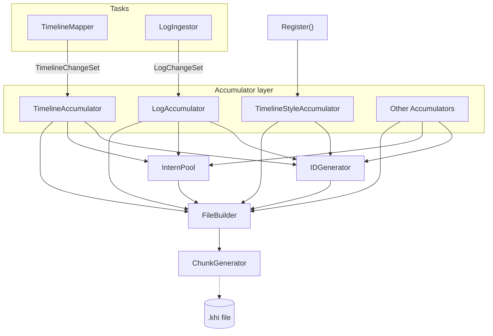

# KHI Backend Serializer Architecture

## Overview

The data flow from when the TimelineMapper and LogIngestor tasks in the KHI backend write actual data until it is compiled into a file is structured as follows:



- **Tasks**: Each task adds analyzed elements and logs to the Accumulator layer. TimelineStyle does not change from startup, so various styles are appended in the Register function during initialization.
- **Accumulator Layer**: Generates IDs, handles deduplication, and converts data to Proto types.
- **IDGenerator / InternPool**: Centrally handles ID allocation, string interning, and structured data flattening. These are called from the Accumulator side.
- **FileBuilder / ChunkGenerator**: Builds the Protobuf chunk binaries based on the aggregated data and pools, then writes them to the final `.khi` file.

## 1. Base Utilities

ID management and string interning utilities serve as the foundation for Protobuf serialization and data size optimization. These are utilities called from the serializer side and are not directly called by tasks.

### 1.1 ID Generator

An interface to issue and manage unique integer IDs for various elements. It manages separate ID spaces for each ID type (such as timelines and strings) and is used to construct references on Protobuf during serialization.

- IDs are positive integers starting from 1.
- ID = 0 always means NULL and is reserved.

```go
// Namespace-scoped ID generator defined in pkg/model/khifile/v6/ids.go
gen := &IDGenerator{}

// Issue a timeline ID
timelineID := gen.New(IDTimelinePath)

// Issue a string pool ID
stringID := gen.New(IDString)
```

### 1.2 Interning

To efficiently store repetitive data in the KHI file, we intern elements and hold their IDs instead of storing the raw values directly.
The InternPool interns strings and structured data field paths, mapping identical elements to the same ID.

This mechanism eliminates holding duplicate long strings in heap memory within the KHI backend, improving memory efficiency.

```go
// Initialize pool by passing IDGenerator
gen := &IDGenerator{}
pool := NewInternPool(gen)

// Register a string to the pool to get a unique ID (InternStringRef)
// Even if the string "error" is called multiple times, the same ID is returned
ref1 := pool.InternString("error")
ref2 := pool.InternString("error")

// ref1.id and ref2.id will have the same value
// To get the original string, call the Resolve method
originalStr := ref1.Resolve() // "error"
```

### 1.3 Structured Data Flattening Utility

If nested structured map data, such as log bodies and restored manifests, is directly converted to Protobuf Struct, the file size inflates due to duplicate key strings. The `structured.Node` type built on the KHI parser side is converted to `InternedStruct` using `ToInternedStruct`.

```go
import "github.com/GoogleCloudPlatform/khi/pkg/common/structured"

// Example structured data
var logBody structured.Node

// Decompose and compress keys and values using the pool, then convert to InternedStruct
internedBody, err := ToInternedStruct(logBody, pool)
if err != nil {
    // Error handling
}

// The built internedBody is a pb.InternedStruct type and can be directly used for chunk output
// Internally, map keys are grouped into a single FieldPathSetID, and values are held as a slice in matching order
```

### 1.4 ChunkGenerator Mechanism

Since Proto messages have a 64MB size limit, they must be split if necessary.

`NewSplittingGenerator` receives an iterator of arbitrary Protobuf messages, calculates the exact serialized size of each message, and groups them into a batch. Using this, FileBuilder writes the actual file while splitting chunks.

## 2. Existing Structure and Timeline Management

In KHI v5 and earlier, the association between logs and timelines was managed by a string-based linked list structure called resourcePath. In the v6 format, this inefficient string-based structure is replaced with an ID-based tree structure called TimelinePath.

### 2.1 TimelinePath and TimelinePathPool

TimelinePath is a new struct that represents a single node in the timeline hierarchical tree structure.

```go
// pkg/model/khifile/v6/timeline_path.go
type TimelinePath struct {
    Parent *TimelinePath
    Name   *InternStringRef
    Type   *pb.TimelineType
    ID     uint32
}
```

Instead of repeating string path concatenation, TimelinePathPool guarantees the uniqueness of and caches TimelinePath instances. This drastically reduces redundant string joining costs and memory overhead on the backend. In the final stage of serialization, these TimelinePaths are converted to IDs and output to TimelineChunk.

### 2.2 TimelineRegistry and Data Accumulation Example

`TimelineRegistry` and `TimelineBuilder` are introduced to safely accumulate timeline data (such as logs and resource change histories). Efficient registry management is performed using TimelinePath pointers as keys instead of string-based map lookups.

Inside tasks, a path is constructed using TimelinePathPool, and a thread-safe TimelineBuilder is retrieved from TimelineRegistry to append data.

```go
// 1. Path Construction: The Get method accepts multiple PathSegments in a single call.
// This is an example of efficiently constructing the standard resource hierarchy: APIVersion, Kind, Namespace, ResourceName.
podPath := pathPool.Get(nil,
    khifilev6.PathSegment{Name: "v1", Type: style.TimelineTypeAPIVersion},
    khifilev6.PathSegment{Name: "Pod", Type: style.TimelineTypeKind},
    khifilev6.PathSegment{Name: "default", Type: style.TimelineTypeNamespace},
    khifilev6.PathSegment{Name: "my-pod", Type: style.TimelineTypeResource},
)

// 2. Retrieving the Builder and Appending Data:
// GetBuilder returns a thread-safe TimelineBuilder for the target path.
builder := registry.GetBuilder(podPath)

// The Builder contains a sync.Mutex internally, allowing events and revisions to be safely added in parallel.
builder.AddEvent(&pb.Event{LogId: logID})
builder.AddRevision(&pb.Revision{
    LogId:        logID,
    ChangedTime:  timestamp,
    VerbType:     verbID,
    StateType:    stateID,
    ResourceBody: internedBody,
})
```

With these architectural updates, every step from log collection to final Protobuf serialization is optimized to resolve based on pointers and unique integer IDs.

## 3. Style Data Dynamic Registration

KHI is designed to be extensible by allowing plugin developers to add task packages under `pkg/task/inspection/*`. In previous versions, style information like timeline icons, colors, log types, and verbs was hardcoded in a shared enum package. This meant plugin developers had to directly modify core packages in the shared repository, presenting an extensibility problem.

### 3.1 Dynamic Registration to the Registry

Each plugin registers its enums and style information by calling Register functions inside the contract package during its package initialization.

```go
// Example of registration on the plugin side
var (
    LogTypeContainer = style.RegisterLogType(&style.LogType{
        Label:       "Container",
        Description: "Container runtime logs",
    })
)
```

Registration of timeline-related styles is fully performed during application initialization. All styles are numbered at this timing so that style information is ready to be embedded upon output.

### 3.2 Icons

KHI builds a font atlas for the icon font used by WebGL on the frontend at build time.
Since this font atlas grows depending on registered styles, the build process retrieves the list of all icons registered in the application to generate the font atlas. The image and font information constituting this icon font atlas are embedded into the KHI style chunk and utilized on the frontend.

## 4. Separation of the ChangeSet Pattern and Testability

In previous backend versions, tasks written to the global state via a data structure called `ChangeSet` to accumulate changes, which were then flushed to the history together. Storing declarative changes instead of directly manipulating state makes assertions in unit tests extremely simple.

The new architecture in v6 inherits this powerful testing approach, but splits the old single `ChangeSet` into the following two structures to match the separated log and timeline structures.

### 4.1 LogChangeSet

Accumulates changes to log metadata.

```go
// Conceptual design
type LogChangeSet struct {
    LogID       uint32
    Summary     *string
    SeverityID  *style.SeverityID
    LogTypeID   *style.LogTypeID
}

func (cs *LogChangeSet) SetSummary(summary string) { ... }
func (cs *LogChangeSet) SetSeverity(severityID uint32) { ... }
```

Tasks generate and modify a `LogChangeSet` for the target log, and finally flush it to `LogAccumulator` to reflect it in the actual `LogChunk` data.

### 4.2 TimelineChangeSet

Accumulates elements appended to timelines.

```go
// Conceptual design
type TimelineChangeSet struct {
    // Accumulate Revisions per TimelinePath
    revisions map[*TimelinePath][]*pb.Revision
    // Accumulate Events per TimelinePath
    events    map[*TimelinePath][]*pb.Event
}

func (cs *TimelineChangeSet) AddEvent(path *TimelinePath) { ... }
func (cs *TimelineChangeSet) AddRevision(path *TimelinePath, rev *pb.Revision) { ... }
```

Tasks construct a `TimelineChangeSet` based on log analysis. During testing, you can verify if the expected `Revision` or `Event` is appended to the correct `TimelinePath` simply by asserting on this `TimelineChangeSet`.

During production execution, the `TimelineChangeSet` returned by tasks is flushed to `TimelineBuilder` in cooperation with `TimelineRegistry`, allowing safe parallel processing. This achieves both high testability and thread-safe parallel building.
