# KHI Frontend Parser Architecture

This document explains the parser architecture on the frontend side (Angular/TypeScript) for supporting the KHI v6 file format.

## Overview

To efficiently process huge files while guaranteeing extensibility for future format updates, KHI adopts the Streamed Data Assembly architecture.

The data flow from files to the domain layer `InspectionData` is structured as follows:

```mermaid
flowchart TD
    File[".khi File (ArrayBuffer)"] --> Streamer[KHIFileParser]
    
    subgraph Registry [Version Registry]
        Blueprint[ParserBlueprint]
    end

    Streamer -->|1. Header version resolution| Registry
    Registry -.->|Return matching Blueprint| Streamer

    subgraph Streaming Phase [Streaming & Decoding]
        Streamer -->|2. Read chunk| Decoder[Protobuf Decode]
        Decoder -->|Raw Proto object| Ingest[IDataAssembler.ingest]
    end

    subgraph Assembly Phase [Priority-Based Assembly]
        Ingest --> StringPoolAssembler
        Ingest --> LogAssembler
        Ingest --> TimelineAssembler
    end

    %% Outflow from Assembly to Domain
    StringPoolAssembler -->|3. priority-ordered assembleInto| Domain[InspectionData]
    LogAssembler -->|Deduplicate IDs via string pool| Domain
    TimelineAssembler --> Domain
```



* **KHIFileParser**: The orchestrator that sequentially reads the file binary.
* **ParserBlueprint**: The registry defining which chunk types are processed by which decoders and assemblers for each file version.
* **DataAssembler**: The class holding states to receive decoded Protobuf objects and transform them into the final domain model.
* **InspectionData**: The class holding the domain model used by the actual application. InspectionData is independent of Protobuf types. DataAssembler converts data to DTOs and delivers them to InspectionData.

## 1. Core Interfaces and Blueprint

Instead of depending on nested factories, KHI registers a `ParserBlueprint` for each file version, mapping chunk types to their respective assemblers.

### 1.1 DataAssembler

The ParserBlueprint registers a DataAssembler interface implementation for each Proto type. First, each DataAssembler receives data via `ingest` whenever a new Proto message is decoded. Finally, `assembleInto` is called with InspectionData, attaching the converted DTO values to InspectionData.

```typescript
// Assembler holding states to collect decoded Protobuf and build the final model
interface DataAssembler<TProto> {
    // Receive a decoded chunk (may be called multiple times due to chunk splitting)
    ingest(proto: TProto): void;
    
    // Integrate the collected data into the final InspectionData
    assembleInto(model: InspectionData): void;
}
```

### 1.2 Blueprint Registry

Defines chunk parsing strategies for each file version.

```typescript
// Definition of the processing method for a specific chunk type
interface ChunkDefinition<TProto = any> {
    typeId: number;
    // Pure function to decode raw byte arrays into Protobuf objects
    decode: (bytes: Uint8Array) => TProto; 
    // Factory method for stateful assemblers
    createAssembler: () => DataAssembler<TProto>;
    // Execution priority for dependency resolution (smaller values assemble earlier)
    priority: number; 
}

// Registry of chunk definitions specific to each version
type ParserBlueprint = Map<number, ChunkDefinition>;

// Implementation Example: Blueprint definition for v6
const V6_BLUEPRINT: ParserBlueprint = new Map([
    [2, { // InterningPoolChunk
        typeId: 2,
        decode: (bytes) => InterningPoolChunk.fromBinary(bytes),
        createAssembler: () => new V6StringPoolAssembler(),
        priority: 10 // The string pool must be resolved before other chunks
    }],
    [3, { // LogChunk
        typeId: 3,
        decode: (bytes) => LogChunk.fromBinary(bytes),
        createAssembler: () => new V6LogAssembler(),
        priority: 100
    }],
    //...
]);
```

With this design, even if a new version like v8 is introduced in the future, KHI can transparently support it simply by adding `V8_BLUEPRINT` without modifying the implementation of `KHIFileParser`.

## 2. Execution Flow

`KHIFileParser` acts as a generic orchestrator independent of Protobuf schemas or specific file versions. To prevent memory spikes, it sequentially streams the ArrayBuffer.

### 2.1 Header Verification and Blueprint Resolution

Reads the magic bytes `KHI` and the version number from the beginning of the file. It retrieves the corresponding `ParserBlueprint` from the `VERSION_REGISTRY` based on the version number. If the version is unsupported, it throws an error immediately.

### 2.2 Chunk Streaming and Ingestion

Repeats the following steps until reaching the file EOF:

1. Reads the chunk size and chunk type.
2. Retrieves the corresponding `ChunkDefinition` from the Blueprint based on the chunk type.
3. Extracts the byte array, calls `decode`, and converts it to a Protobuf object.
4. Lazily initializes the matching `DataAssembler` and passes the decoded object to `ingest` to accumulate the data.

### 2.3 Priority-Based Assembly

After reaching the end of the file, it transforms the accumulated data into the final domain model.

1. Creates an empty `InspectionData` object.
2. Sorts the `ChunkDefinition` of the executed assemblers in ascending order of their `priority`.
3. Calls `assembleInto` on each assembler sequentially in the sorted order.

This guarantees reliable dependency resolution. For example, the StringPool assembler with priority `10` builds `model.stringPool` first, and the Log assembler with priority `100` then references the compiled string pool to correctly assemble the domain model.

### 2.4. Error Handling and Traceability

Since locating the cause of errors during binary parsing is difficult, KHI implements an error handling strategy with rich context information.

* `KHIInvalidFileError`: Thrown during header verification.
* `KHIVersionMismatchError`: Thrown for unsupported file versions.
* `KHIChunkDecodeError`: Thrown upon Protobuf decoding failure.
* `KHIDataAssemblyError`: Thrown upon integration failure during the `assembleInto` phase.

## 3. Domain Layer

The object that the parser finally constructs and outputs is `InspectionData`, the root of the domain layer. This layer represents the pure data model in the KHI frontend application and has the following characteristics and roles:

* `InspectionData` and its store groups, such as `LogStore` and `TimelineStore`, do not depend on Protobuf generated code like `_pb.js` or `_pb.d.ts`.
* Structural designs for transfer and persistence, such as chunk splitting and gzip compression, are resolved and combined when the parser converts the data into `InspectionData`.
* Mechanisms like string interning are transparently resolved when elements are dynamically retrieved from stores; string IDs are resolved to actual strings, and `InternedStructs` are decoded to JavaScript objects. This allows the frontend to hold huge logs in a compact size.
* Provides easily searchable structures. Since frontend views retrieve data from the domain layer, it provides a unified, fast search interface.
* The domain layer is held in a compact form considering JS memory layouts as it always resides in frontend memory. For example, the Log type returned by the domain layer uses the Adaptor pattern, fetching parent store details on demand.

```typescript
export class Log {
  constructor(public readonly id: number, private readonly store: LogStore) {}

  get timestamp(): bigint { return this.store._getTimestamp(this.id); }
  get summary(): string { return this.store._getSummary(this.id); }
  get body(): any { return this.store._decodeBody(this.id); }
  get severity(): ReadonlyDomainElement<Severity> { return this.store._getSeverity(this.id); }
}
```

Using JavaScript getters, the resolution of strings from IDs and the decoding of structures are performed lazily when UI or ViewModel requires them.
