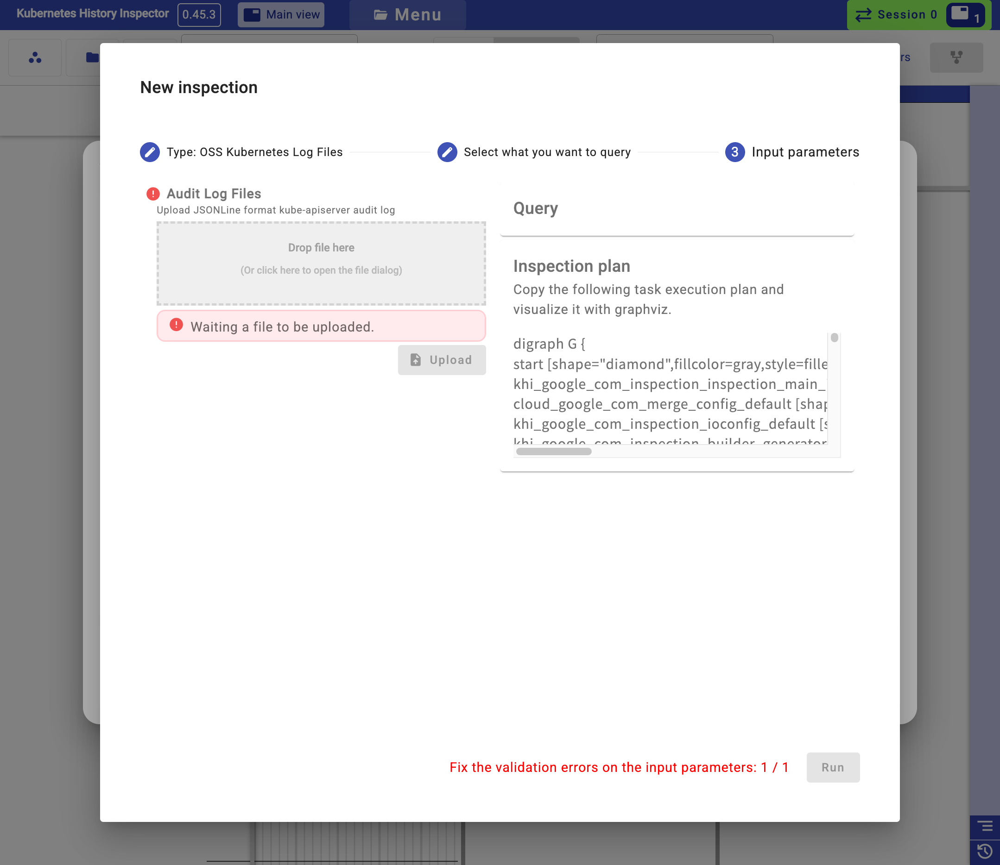
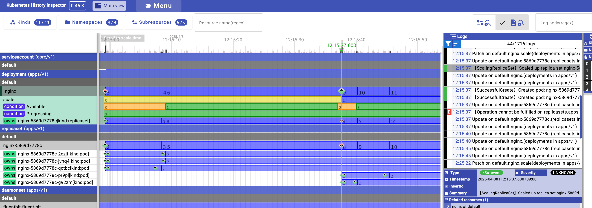

# Using KHI with OSS Kubernetes Clusters - Example with Loki

Kubernetes History Inspector (KHI) can visualize a wealth of information using Kubernetes audit logs alone. This tutorial demonstrates how to visualize the state of OSS Kubernetes cluster using [kind](https://kind.sigs.k8s.io/) and [Loki](https://grafana.com/oss/loki/) for log aggregation.

**Prerequisites:**

Before you start, ensure you have the following tools installed:

* [Docker](https://docs.docker.com/get-docker/) or [Podman](https://podman.io/getting-started/installation)
* [kind](https://kind.sigs.k8s.io/docs/user/quick-start/#installation)
* [Helm](https://helm.sh/docs/intro/install/)
* [LogCLI](https://grafana.com/docs/loki/latest/query/logcli/getting-started/) (for querying Loki)

## 1. Cluster Setup

First, we need to create a `kind` Kubernetes cluster with audit logging enabled.

**a. Create an Audit Policy:**

Kubernetes audit logs record actions taken by users, administrators, and system components. We need an audit policy file to tell the Kubernetes API server what to log. Create a file named `audit-policy.yaml` in a new directory called `audit-policy` with the following content:

```yaml
# audit-policy/audit-policy.yaml
apiVersion: audit.k8s.io/v1
kind: Policy
# Log metadata for sensitive resources like configmaps and secrets.
rules:
- level: Metadata
  resources:
  - group: "" # core API group
    resources: ["configmaps", "secrets"]

# Log request and response bodies for all other resources.
# This provides detailed information for KHI's timeline view.
- level: RequestResponse
```

**Explanation:**

* `level: Metadata`: Logs request metadata (requesting user, timestamp, resource, verb, etc.) but not the request or response body.
* `level: RequestResponse`: Logs event metadata as well as the request and response bodies. This level provides the most detailed information, which is crucial for KHI to track resource details effectively in the timeline view. Using `Metadata` level extensively will result in less information being available in the KHI timeline.

**b. Create a Kind Configuration:**

Next, create a `kind` configuration file (e.g., `kind-config.yaml`) to define the cluster structure and enable audit logging by mounting the policy file and specifying audit log paths.

```yaml
# kind-config.yaml
kind: Cluster
apiVersion: kind.x-k8s.io/v1alpha4
nodes:
- role: control-plane
  # Mount the audit policy directory into the control-plane node
  extraMounts:
  - hostPath: audit-policy/ # Directory to audit-policy.yaml on your host machine
    containerPath: /etc/kubernetes/audit # Path inside the control-plane container
    readOnly: true
  kubeadmConfigPatches:
  - |
    apiVersion: kubeadm.k8s.io/v1beta3
    kind: ClusterConfiguration
    metadata:
      name: config
    apiServer:
      extraArgs:
        # Tell the API server where the audit policy is
        audit-policy-file: "/etc/kubernetes/audit/audit-policy.yaml"
        # Tell the API server where to write audit logs
        audit-log-path: "/var/log/kubernetes/audit.log"
      extraVolumes:
        # Mount the audit policy directory into the apiserver pod
        - name: audit-config
          hostPath: /etc/kubernetes/audit
          mountPath: /etc/kubernetes/audit
          readOnly: true
          pathType: Directory
        # Mount the host log directory into the apiserver pod to write logs
        - name: audit-logs
          hostPath: /var/log/kubernetes
          mountPath: /var/log/kubernetes
          readOnly: false
          pathType: DirectoryOrCreate # Creates the directory if it doesn't exist
- role: worker
- role: worker
- role: worker
```

**c. Create the Kind Cluster:**

Now, create the cluster using the configuration file:

```bash
kind create cluster --config kind-config.yaml
```

This command will bootstrap a Kubernetes cluster with one control-plane node and three worker nodes, configured for audit logging.

## 2. (Optional) Deploy Loki

This step is optional. If you already have a running Loki instance (self-hosted or Grafana Cloud), you can configure Fluent Bit to send logs there. Otherwise, deploy a simple Loki instance within the `kind` cluster for this tutorial.

**a. Create Loki Values File:**

Create a file named `loki-values.yaml` for the Loki Helm chart:

```yaml
# loki-values.yaml
loki:
  commonConfig:
    replication_factor: 1
  schemaConfig:
    configs:
      - from: "2025-01-01"
        store: tsdb
        object_store: s3
        schema: v13
        index:
          prefix: loki_index_
          period: 24h
minio:
  enabled: true
deploymentMode: SingleBinary
singleBinary:
  replicas: 1
backend:
  replicas: 0
read:
  replicas: 0
write:
  replicas: 0
```

**b. Install Loki using Helm:**

Add the Grafana Helm repository and install Loki:

```bash
helm repo add grafana https://grafana.github.io/helm-charts
helm repo update
helm install loki grafana/loki -f loki-values.yaml --namespace khi --create-namespace
```

Wait for all Loki pods (including MinIO if enabled) to reach the `Running` state:

```bash
kubectl get pods -n khi -l app.kubernetes.io/instance=loki
```

## 3. Deploy Fluent Bit

We'll use Fluent Bit, a lightweight log processor and forwarder, deployed as a DaemonSet to collect logs from all nodes (including the control-plane) and send them to Loki.

**a. Create Fluent Bit Values File:**

Create a file named `fluentbit-values.yaml`:

```yaml
# fluentbit-values.yaml
# Ensure Fluent Bit runs on the control-plane node to access audit logs
tolerations:
  - key: node-role.kubernetes.io/control-plane
    operator: Exists
    effect: NoSchedule
config:
  inputs: |
    [INPUT]
        Name             tail
        Path             /var/log/containers/*.log
        multiline.parser cri
        Tag              kube.*
        Read_from_Head   On
        Mem_Buf_Limit    5MB
        Skip_Long_Lines  On
    [INPUT]
        Name              tail
        Tag               kubevar.audit
        Path              /mnt/audit/audit.log
        Parser            json
        Read_from_Head    On
        DB                /var/log/flb_audit.db
        Mem_Buf_Limit     16MB
        Buffer_Max_Size   8MB
        Buffer_Chunk_Size 8MB
        Refresh_Interval  10
  filters: |
    # Filter to add Kubernetes metadata to container logs
    [FILTER]
        Name                kubernetes
        Match               kube.*
        Merge_Log           On
        Keep_Log            Off
        K8S-Logging.Parser  On
        K8S-Logging.Exclude On
    # Filter to add a 'job' label to audit logs for easier querying in Loki
    [FILTER]
        Name    modify
        Match   kubevar.audit
        Add     job      audit
  outputs: |
    [OUTPUT]
        Name            loki
        Match           *
        Host            loki-gateway.khi.svc.cluster.local
        Port            80
        Label_Keys      $job,$kubernetes_namespace_name, $kubernetes_pod_name, $kubernetes_container_name
        Tenant_Id       KHI
# Volume to mount the kind-node's audit log directory
extraVolumes:
  - name: auditlog
    hostPath:
      path: /var/log/kubernetes # Path on the node where audit logs are written
# Mount the audit log volume into the Fluent Bit container
extraVolumeMounts:
  - name: auditlog
    mountPath: /mnt/audit # Path inside the Fluent Bit container
    readOnly: true
```

**b. Install Fluent Bit using Helm:**

Add the Fluent Helm repository and install Fluent Bit:

```bash
helm repo add fluent https://fluent.github.io/helm-charts
helm repo update
helm install fluentbit fluent/fluent-bit --values fluentbit-values.yaml --namespace khi
```

Wait for all Fluent Bit pods to become `Running`:

```bash
kubectl get pods -n khi -l app.kubernetes.io/instance=fluentbit
```

## 4. Generate Sample Operations

To have some data to inspect, let's perform some basic operations on the cluster. For example, create, scale, and delete an Nginx deployment:

```bash
# Create a deployment with 3 replicas
kubectl create deployment nginx --image nginx --replicas 3

# Scale up the deployment
kubectl scale deployment nginx --replicas 5

# Scale down the deployment
kubectl scale deployment nginx --replicas 1

# Delete the deployment
kubectl delete deployment nginx
```

These actions will generate audit log entries that Fluent Bit will collect and send to Loki.

## 5. Export Audit Logs with LogCLI

Now, retrieve the collected audit logs from Loki using `logcli`.

**a. Port-forward the Loki Service:**

Make the Loki service accessible on your local machine:

```bash
kubectl port-forward --namespace khi service/loki-gateway 8000:80
```

Keep this command running in a separate terminal.

**b. Query Loki:**

Use `logcli` to query Loki for the audit logs and save them to a file named `audit_log_export.jsonl`. Adjust the `--from` and `--to` timestamps to encompass the time you ran the `kubectl` commands.

```bash
logcli query '{job="audit"}' \
    --org-id=KHI \
    --timezone=UTC \
    --from="2025-04-08T00:00:00Z" \
    --to="2025-04-09T00:00:00Z" \
    --output=raw \
    --limit=0 \
    --addr=http://localhost:8000 \
    -q > audit_log_export.jsonl
```

**Explanation:**

* `'{job="audit"}'`: Selects logs with the label `job` set to `audit` (added by our Fluent Bit filter).
* `--org-id=KHI`: Specify the tenant ID we configured in Fluent Bit.
* `--timezone=UTC`: Use UTC timezone for timestamps.
* `--from`, `--to`: Define the time range for the query (adjust as needed). Use RFC3339 format (e.g., YYYY-MM-DDTHH:MM:SSZ).
* `--output=raw`: Output only the log lines without timestamps or labels.
* `--limit=0`: Retrieve all matching log lines (no limit).
* `--addr=http://localhost:8000`: The address of the port-forwarded Loki service.

***Note:** We use `--output=raw` here because in this tutorial Fluent Bit was configured to send the raw JSON audit log line directly to Loki. If your logging pipeline parses the JSON and stores it as structured metadata within Loki (e.g., using Loki's JSON parser or pipeline stages), you cannot use `--output=raw`. In that case, you would need to query Loki and reconstruct the original JSONL format required by KHI yourself, potentially using `logcli` with a different output format (like `--output=json`) and processing the results with tools like `jq`.*

## 6. Inspect with KHI

Finally, let's use KHI to inspect the exported audit logs.

**a. Run KHI:**

Start the KHI server using Docker:

```bash
# You don't need to pass Google Cloud credentials to the container.
docker run --rm -p 127.0.0.1:8080:8080 asia-docker.pkg.dev/kubernetes-history-inspector/release/khi:latest
```

You should see output indicating the server is running:

```bash
global > INFO Initializing Kubernetes History Inspector...
global > INFO Starting Kubernetes History Inspector server...
 Starting KHI server with listening 0.0.0.0:8080
For Cloud Shell users:
        Click this address >> http://localhost:8080 << Click this address

(For users of the other environments: Access http://localhost:8080 with your browser. Consider SSH port-forwarding when you run KHI over SSH.)

```

**b. Access KHI UI:**

Open your web browser and navigate to `http://localhost:8080`.

**c. Create New Inspection:**

1. Click on "New Inspection".
2. Select "OSS Kubernetes Cluster" as the inspection type.


**d. Upload Log File and Run:**

1. In the "Input Parameters" section, under "File Upload", click "Browse" or drag-and-drop the `audit_log_export.jsonl` file you created.
2. Click the "Run" button.
3. Wait for the inspection process to complete.



**e. Explore the Results:**

Once the inspection is finished, click the "Open" button to view the results. Explore the different views, especially the "Timeline" view. You should be able to see the events related to the Nginx deployment creation, scaling, and deletion, illustrating how the cluster state changed over time.



## 7. Cleanup

To remove the resources created during this tutorial, delete the `kind` cluster:

```bash
kind delete cluster
```

This concludes the tutorial on using KHI with an OSS Kubernetes cluster and Loki. You can adapt these steps to integrate KHI with your existing logging infrastructure.
