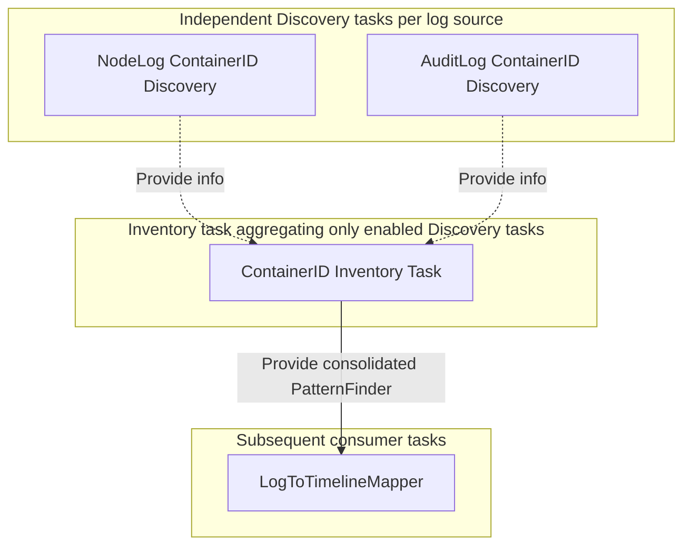

# Advanced Task Patterns and Utilities

[< Previous: Log Processing Cookbook](./02-log-processing-cookbook.md) | [Back to Index](../khi-task-system-concept.md)

---

This document explains the specifications and utilities used to build advanced analysis pipelines and UI integrations in KHI, including task registration, label selection, resource discovery, input forms, progress reporting, and caching strategies.

## 1. Registering Tasks to the Inspection Task Server

KHI build scripts automatically configure the system to register a package's `Module` during initialization if a `module.go` file exists in an `impl` directory under `pkg/task/inspection`.
To define a package that adds new tasks or Inspection Types, declare an exported `Module` variable of type `coreinspection.Module` in `module.go`.

```go
// Module declares the OSS Kubernetes log files inspection type and the tasks that build timelines from uploaded kube-apiserver audit logs.
var Module = coreinspection.Module{
    Name: "oss/k8s",
    Scope: coreinspection.Scope{
        inspectioncore.InspectionTypeLabelKeyLogSource:    "file",
        inspectioncore.InspectionTypeLabelKeyEnvironment:  "oss",
        inspectioncore.InspectionTypeLabelKeyBasePlatform: "kubernetes",
    },
    InspectionTypes: []coreinspection.InspectionType{ossk8s.OSSKubernetesLogFilesInspectionType},
    Tasks: []coretask.UntypedTask{
        InputAuditLogFilesTask,
        InputNodeLogFilesTask,
        SerialPortLogIngesterTask,
    },
}
```

## 2. Inspection Task Labels

On the "New Inspection" screen in KHI, the system dynamically determines which tasks to include and run in the graph based on the selected environment and log types. To control this behavior, you can attach special labels to inspection tasks.

### 2.1 Filtering Tasks with `Module.Scope`

In KHI, each `InspectionType` defines a set of key-value labels indicating its target environment, log source, and platform:

- `inspectioncore.InspectionTypeLabelKeyEnvironment` (`"khi.google.com/environment"`)
- `inspectioncore.InspectionTypeLabelKeyLogSource` (`"khi.google.com/log_source"`)
- `inspectioncore.InspectionTypeLabelKeyBasePlatform` (`"khi.google.com/base_platform"`)

To restrict tasks so that they only run for compatible inspection types, set `Scope` on `coreinspection.Module` in `impl/module.go` (and narrow the scope further for specific tasks using `SubModules`):

```go
var Module = coreinspection.Module{
    Name: "googlecloud/example",
    Scope: coreinspection.Scope{
        inspectioncore.InspectionTypeLabelKeyEnvironment:  "googlecloud",
        inspectioncore.InspectionTypeLabelKeyBasePlatform: "kubernetes",
    },
    Tasks: []coretask.UntypedTask{TaskA, TaskB},
    SubModules: []coreinspection.Module{
        {
            Name:  "cloud-logging",
            Scope: coreinspection.Scope{inspectioncore.InspectionTypeLabelKeyLogSource: "cloud_logging"},
            Tasks: []coretask.UntypedTask{CloudLoggingOnlyTask},
        },
    },
}
```

When an inspection starts, the runner checks that all key-value pairs in the module's scope match the selected `InspectionType.Labels`. Tasks in a module without a `Scope` are treated as global tasks and are included for all inspection types.

### 2.2 FeatureTask Labels

The FeatureTask label is a special label that exposes a task as a toggleable feature on KHI's "New Inspection" screen.
By specifying this label on main feature tasks such as mappers, you allow users to enable or disable the feature.

```go
inspectioncore.FeatureTaskLabel("Feature label", "Detailed description of the feature", 1000, true)
```

## 3. Task Utilities for Discovering Information from Logs (`Inventory` and `Discovery` Tasks)

### 3.1 Why the Inventory-Discovery Pattern is Needed (Motivation)

A major feature of KHI is that users can freely enable or disable individual features (parser tasks) on the "New Inspection" screen.
For example, the relationship between a container ID and a Pod name **might be discovered from node logs, or it might be discovered from audit logs**.
If a subsequent mapper task directly depends on a specific parser task that extracts container IDs from node logs, **that parser task is forcibly included in the task graph and executed during dependency resolution even if the user disabled node log parsing**.

To support this feature-toggle independence and loosely coupled information integration from multiple sources, KHI uses the **`Inventory`-`Discovery` task pattern**.



Instead of depending directly on a specific parser, an **Inventory task** dynamically and transparently **aggregates results only from Discovery tasks that are currently enabled (available)** in the inspection environment, and provides the merged value to subsequent tasks.
This allows KHI to fully leverage information discovered from other enabled log sources (such as audit logs) without breaking graph resolution when specific log parsing features are disabled.

### 3.2 Creating Discovery Tasks and Integrating with Inventory Tasks

In KHI, you declare a `coretask.Tag[T]` for the inventory type, create **independent Discovery tasks** for each log source that publish to the tag via `coretask.ProvidesTag`, and combine them with a **single Inventory task** built via `inspectiontaskbase.DefineInventoryTask`.

1. **Discovery tasks publish via `coretask.ProvidesTag(tag)`**:
   Each discovery task declares its prerequisite log parser input on its `Binder` and attaches `coretask.ProvidesTag(tag)`.
2. **Active-feature aggregation by `DefineInventoryTask`**:
   `inspectiontaskbase.DefineInventoryTask` binds `coretask.UseTag(b, tag.Ref(coretask.FromActiveFeatures))`, which pulls in and merges outputs **only from discovery tasks whose prerequisite data sources belong to enabled features**.

#### Example Code: Two Discovery Tasks (Node Log and Audit Log) and an Integrated Inventory Task

```go
// 1. Declare a tag in the root package for the discovered container identity maps
var ContainerIDInventoryTag = coretask.NewTag[k8saudit.ContainerIDToContainerIdentity](
    "khi.google.com/inventory/container-id",
)

// 2-A. Discovery task for container IDs from node logs
var NodeLogContainerIDDiscoveryTask = inspectiontaskbase.DefineInspectionTask(
    NodeLogContainerIDDiscoveryTaskID,
    func(b *coretask.Binder) inspectiontaskbase.InspectionTaskFunc[k8saudit.ContainerIDToContainerIdentity] {
        logsInput := coretask.Use(b, NodeLogParserTaskID.Ref())
        return func(ctx context.Context, taskMode inspectioncore.InspectionTaskModeType) (k8saudit.ContainerIDToContainerIdentity, error) {
            if taskMode == inspectioncore.TaskModeDryRun {
                return nil, nil
            }
            return extractContainersFromNodeLogs(logsInput.Get(ctx)), nil
        }
    },
    coretask.ProvidesTag(ContainerIDInventoryTag),
)

// 2-B. Discovery task for container IDs from audit logs
var AuditLogContainerIDDiscoveryTask = inspectiontaskbase.DefineInspectionTask(
    AuditLogContainerIDDiscoveryTaskID,
    func(b *coretask.Binder) inspectiontaskbase.InspectionTaskFunc[k8saudit.ContainerIDToContainerIdentity] {
        logsInput := coretask.Use(b, AuditLogParserTaskID.Ref())
        return func(ctx context.Context, taskMode inspectioncore.InspectionTaskModeType) (k8saudit.ContainerIDToContainerIdentity, error) {
            if taskMode == inspectioncore.TaskModeDryRun {
                return nil, nil
            }
            return extractContainersFromAuditLogs(logsInput.Get(ctx)), nil
        }
    },
    coretask.ProvidesTag(ContainerIDInventoryTag),
)

// 3. Merge function that deduplicates and combines results from multiple sources
func mergeContainerIDs(results []k8saudit.ContainerIDToContainerIdentity) (k8saudit.ContainerIDToContainerIdentity, error) {
    result := map[string]*k8saudit.ContainerIdentity{}
    for _, r := range results {
        for cid, s := range r {
            if current, ok := result[cid]; ok {
                // Merge and complement information if the same container ID already exists
                result[cid] = current.Merge(s)
            } else {
                result[cid] = s
            }
        }
    }
    return result, nil
}

// 4. Inventory task that aggregates and merges results only from enabled Discovery tasks
var ContainerIDInventoryTask = inspectiontaskbase.DefineInventoryTask(
    ContainerIDInventoryTaskID,
    ContainerIDInventoryTag,
    mergeContainerIDs,
)
```

By scoping tag resolution to active features, KHI achieves a resource inventory that operates safely and flexibly even when users disable certain log parsing features.

### 3.3 Building Searchers with PatternFinder to Reduce Complexity

If subsequent parsers and mappers repeatedly search raw lists aggregated by an `InventoryTask` in a loop, the computational complexity becomes `O(N * M)`, which takes an enormous amount of time.
To avoid this, KHI converts the aggregated inventory into high-speed search automatons (or prefix trees) based on the Aho-Corasick algorithm or binary search, called **`PatternFinder`**, using **`PatternFinderTask` / `DiscoveryTask`**.

Common Discovery / PatternFinder utilities:

- **`NodeNameDiscoveryTask`**: Aggregates mapping tables for node names, cluster information, and IP addresses.
- **`ResourceUIDDiscoveryTask` / `ResourceUIDPatternFinderTask`**: Records mappings between Kubernetes object UIDs (`metadata.uid`) and resource names or namespaces, enabling high-speed reverse lookups from audit logs that contain only UIDs.
- **`ContainerIDDiscoveryTask` / `ContainerIDPatternFinderTask`**: Instantly resolves Pod names and namespaces from long hashes (`6123c6aac...`) or prefixes output by container runtimes.
- **`IPLeaseHistoryDiscoveryTask`**: Tracks IP address allocation history over time to identify Pods and Nodes from an IP at a specific timestamp.

#### Using PatternFinders in Mapper Tasks

By binding a Discovery/PatternFinder task reference on the `Binder` in `DefineLogToTimelineMapperTask`, you can read the searcher inside `ProcessLogByGroup` via its `coretask.Input[T]` handle and perform high-speed O(1) to O(log N) association lookups using functions like `patternfinder.FindAllWithStarterRunes(...)`.

```go
type MyMapper struct {
    inspectiontaskbase.SinglePassMapperBase[MyGroupData]
    containerFinder coretask.Input[patternfinder.PatternFinder[*k8saudit.ContainerIdentity]]
}

func (m *MyMapper) ProcessLogByGroup(ctx context.Context, l *log.Log, prevData MyGroupData) (*khifilev6.TimelineChangeSet, MyGroupData, error) {
    // Read the container ID searcher from the bound input handle
    containerFinder := m.containerFinder.Get(ctx)

    originalMsg := l.Message // Message body
    // Scan high-speed for container ID patterns starting with alphabet or digit runes
    results := patternfinder.FindAllWithStarterRunes(originalMsg, containerFinder, false, '"')

    cs := khifilev6.NewTimelineChangeSet(l)
    for _, res := range results {
        // Add Pod timeline event based on the discovered container information
        podPath := MustK8sPodTimeline(ctx, clusterName, res.Value.PodNamespace, res.Value.PodName)
        cs.AddEvent(podPath)
    }
    return cs, prevData, nil
}

var MyMapperTask = inspectiontaskbase.DefineLogToTimelineMapperTask(
    MyMapperTaskID,
    inspectiontaskbase.TimelineMapperInputs{
        LogIngester: MyLogIngesterTaskID.Ref(),
        GroupedLogs: MyGrouperTaskID.Ref(),
    },
    func(b *coretask.Binder) inspectiontaskbase.TimelineMapper[MyGroupData] {
        return &MyMapper{
            containerFinder: coretask.Use(b, k8saudit.ContainerIDPatternFinderTaskID.Ref()),
        }
    },
)
```

## 4. Task Forms and User Input Fields (`formtask`)

To allow users to enter or select parameters (such as project IDs, locations, cluster names, time ranges, or log files) in KHI's "New Inspection" dialog, implement tasks using the declarative form task package (`github.com/GoogleCloudPlatform/khi/pkg/core/inspection/formtask`).

### 4.1 Types of Form Definition Functions

Choose from the following 4 form definition functions depending on the input format:

- **`formtask.DefineTextForm(...)`**: Defines form tasks for string or text input (supporting autocomplete, type conversion, and regular expression validation).
- **`formtask.DefineSetForm(...)`**: Defines form tasks that let users select single or multiple values from options, such as dropdowns or checklists.
- **`formtask.DefineCheckboxForm(...)`**: Defines form tasks for boolean checkbox toggles.
- **`formtask.DefineFileForm(...)`**: Defines form tasks that accept log file uploads or file path selections from the user's local environment.

### 4.2 Building Rich Input Forms and Autocomplete Integrations

`formtask.DefineTextForm` accepts the required form metadata (`id`, `priority`, `label`, `description`) and a `bind` function (`func(b *coretask.Binder) formtask.TextFormSpec[T]`) that declares any upstream inputs on `b` and returns optional callbacks in `TextFormSpec[T]`:

- **`DefaultValue`**: Dynamically calculates default values based on input history from previous inspection runs or bound upstream task inputs (`formtask.PreviousOrDefaultValue` is available as a helper).
- **`Suggestions`**: Dynamically sorts and presents autocomplete suggestion lists from bound autocomplete task inputs as the user types (`common.SortForAutocomplete` is standard).
- **`Validator`**: Performs required field checks or regular expression checks, displaying error messages in the UI and blocking execution when input is invalid.
- **`Converter`**: Converts the validated input string into the task's output type `T` (defaults to identity when `T` is `string`).
- **`Readonly` / `Hint` / `ValidationTiming`**: Controls field editability, informational hints, and validation timing.

#### Example Code: Location Input Task with Autocomplete and Validation

The following is a declarative task implementation example used in `InputLocationsTask`, incorporating autocomplete integration and validation (`Validator`):

```go
var InputLocationsTask = formtask.DefineTextForm(
    gcpcommon.InputLocationsTaskID,
    gcpcommon.PriorityForResourceIdentifierGroup+3000,
    "Location",
    "The location (region) to specify where the resource exists",
    func(b *coretask.Binder) formtask.TextFormSpec[string] {
        autocompleteLocation := coretask.Use(b, gcpcommon.AutocompleteLocationTaskID.Ref())
        return formtask.TextFormSpec[string]{
            DefaultValue: func(ctx context.Context, previousValues []string) (string, error) {
                locations := autocompleteLocation.Get(ctx)
                if len(previousValues) > 0 && slices.Contains(locations.Values, previousValues[0]) {
                    return previousValues[0], nil
                }
                if len(locations.Values) == 0 {
                    return "", nil
                }
                return locations.Values[0], nil
            },
            Suggestions: func(ctx context.Context, value string, previousValues []string) ([]string, error) {
                regions := autocompleteLocation.Get(ctx)
                return common.SortForAutocomplete(value, regions.Values), nil
            },
            Validator: func(ctx context.Context, value string) (string, error) {
                if value == "" {
                    return "location is required", nil
                }
                return "", nil
            },
        }
    },
)
```

### 4.3 Reading Input Values from Subsequent Tasks

Consumer tasks (such as log query tasks or resource identification tasks) that bind the input form task reference with `coretask.Use` can safely read user-confirmed input values (`string`, etc.) with proper types via the returned `coretask.Input[T]` handle:

```go
var ClusterIdentityTask = inspectiontaskbase.DefineInspectionTask(
    k8scommon.ClusterIdentityTaskID,
    func(b *coretask.Binder) inspectiontaskbase.InspectionTaskFunc[GoogleCloudClusterIdentity] {
        locationInput := coretask.Use(b, gcpcommon.InputLocationsTaskID.Ref())
        clusterNameInput := coretask.Use(b, k8scommon.InputClusterNameTaskID.Ref())
        return func(ctx context.Context, taskMode inspectioncore.InspectionTaskModeType) (GoogleCloudClusterIdentity, error) {
            return GoogleCloudClusterIdentity{
                Location:    locationInput.Get(ctx),
                ClusterName: clusterNameInput.Get(ctx),
            }, nil
        }
    },
)
```

## 5. Low-Level Task Utilities

### 5.1 Dynamic Progress Reporting (`progress` Package)

Every task in KHI automatically has progress metadata attached to its execution `context.Context` by the task runner interceptor. You can report task progress dynamically to the frontend during execution using the `progress` package (`github.com/GoogleCloudPlatform/khi/pkg/core/inspection/progress`).

By default, the runner displays a shortened task ID as the progress label. To provide a human-readable display title for the task in the progress bar, attach `coretask.WithTitle("...")` to the task labels when defining the task:

```go
var HeavyProcessingTask = inspectiontaskbase.DefineInspectionTask(
    HeavyProcessingTaskID,
    func(b *coretask.Binder) inspectiontaskbase.InspectionTaskFunc[ResultType] {
        logsInput := coretask.Use(b, SourceLogsTaskID.Ref())
        return func(ctx context.Context, taskMode inspectioncore.InspectionTaskModeType) (ResultType, error) {
            // Task implementation...
        }
    },
    coretask.WithTitle("Analyze Node Logs"),
)
```

#### 1. Tracking Progress for a Known Number of Items (`progress.NewTracker` and `progress.ForEach`)

When the total number of items is known in advance, use `progress.NewTracker` or `progress.ForEach`. The tracker automatically throttles UI updates to avoid excessive rendering overhead, calculates the completion ratio, and estimates the remaining time (ETA):

```go
var HeavyProcessingTask = inspectiontaskbase.DefineInspectionTask(
    HeavyProcessingTaskID,
    func(b *coretask.Binder) inspectiontaskbase.InspectionTaskFunc[ResultType] {
        logsInput := coretask.Use(b, SourceLogsTaskID.Ref())
        return func(ctx context.Context, taskMode inspectioncore.InspectionTaskModeType) (ResultType, error) {
            if taskMode != inspectioncore.TaskModeRun {
                return ResultType{}, nil
            }

            logs := logsInput.Get(ctx)

            // Create a tracker for the total number of logs with a unit label
            tracker := progress.NewTracker(ctx, len(logs), progress.WithUnit("logs"))
            defer tracker.Done()

            for _, l := range logs {
                // Process each log entry...
                processLog(l)
                tracker.Inc()
            }

            return result, nil
        }
    },
    coretask.WithTitle("Process Logs"),
)
```

For simple slice iterations, you can use `progress.ForEach` to handle tracker creation, incrementing, and cleanup automatically:

```go
err := progress.ForEach(ctx, logs, func(i int, l *log.Log) error {
    return processLog(l)
}, progress.WithUnit("logs"))
```

#### 2. Reporting Indeterminate Progress or Custom Ratios (`progress.ReportIndeterminate` and `progress.Report`)

When the total amount of work cannot be determined in advance (such as streaming items from a channel or waiting for an external API response), use `progress.ReportIndeterminate` to show an indeterminate progress bar with a status message, or `progress.Report` to set an explicit completion ratio (`0.0` to `1.0`):

```go
var UnknownLengthTask = inspectiontaskbase.DefineInspectionTask(
    UnknownLengthTaskID,
    func(b *coretask.Binder) inspectiontaskbase.InspectionTaskFunc[ResultType] {
        coretask.After(b, SomeDependencyTaskID.Ref())
        return func(ctx context.Context, taskMode inspectioncore.InspectionTaskModeType) (ResultType, error) {
            if taskMode != inspectioncore.TaskModeRun {
                return ResultType{}, nil
            }

            // Report indeterminate progress with a status message
            progress.ReportIndeterminate(ctx, "Fetching resources from API...")

            // Process items discovered dynamically...
            for item := range dynamicItemsChannel {
                process(item)
            }

            return result, nil
        }
    },
    coretask.WithTitle("Fetch Dynamic Resources"),
)
```

### 5.2 Caching Task Results (`DefineCachedTask`)

For high-cost tasks where results depend only on input parameters, such as heavy computations or external API calls, use `inspectiontaskbase.DefineCachedTask[T]` to cache and reuse the latest computed result while the digest of its inputs remains unchanged.

Pass a `bind` function that declares the upstream inputs on `*coretask.Binder` and returns an `inspectiontaskbase.CachedTaskSpec[T]` with:

- **`Scope`**: Controls the cache lifetime:
  - **`inspectiontaskbase.CacheScopeInspection`** (default zero value): Caches the value in `InspectionSharedMap`, reusing it across `DryRun` updates and the `Run` execution of the same inspection.
  - **`inspectiontaskbase.CacheScopeGlobal`**: Caches the value in `GlobalSharedMap`, reusing it across different inspections as long as the input digest matches.
- **`InputDigest`**: A function `func(ctx context.Context) string` that computes a digest string from the bound inputs. `Compute` runs only when this digest differs from the cached entry's digest.
- **`Compute`**: A function `func(ctx context.Context) (T, error)` that computes the value when there is a cache miss. Errors are returned directly and are not cached.

#### Example Code

The following is a complete implementation example of `DefineCachedTask` that reuses the cached value within the same inspection when the input parameter digest is unchanged:

```go
var CachedHeavyTask = inspectiontaskbase.DefineCachedTask(
    CachedHeavyTaskID,
    func(b *coretask.Binder) inspectiontaskbase.CachedTaskSpec[ResultType] {
        paramsInput := coretask.Use(b, InputParamsTaskID.Ref())
        return inspectiontaskbase.CachedTaskSpec[ResultType]{
            Scope: inspectiontaskbase.CacheScopeInspection,
            InputDigest: func(ctx context.Context) string {
                return calculateDigest(paramsInput.Get(ctx))
            },
            Compute: func(ctx context.Context) (ResultType, error) {
                return doHeavyCalculation(paramsInput.Get(ctx))
            },
        }
    },
)
```

> [!TIP]
> **Releasing Resources When an Inspection Ends**
> If you want to clean up cached data or resources created by `DefineCachedTask` with `CacheScopeInspection` when the inspection is destroyed, you can tie into the inspection lifecycle using `context.AfterFunc` as follows:
>
> ```go
> inspectionContext := khictx.MustGetValue(ctx, inspectioncore.InspectionContext)
> context.AfterFunc(inspectionContext, func() {
>     // Release resources such as closing sockets or deleting temporary files
> })
> ```

---

[< Previous: Log Processing Cookbook](./02-log-processing-cookbook.md) | [Back to Index](../khi-task-system-concept.md)
