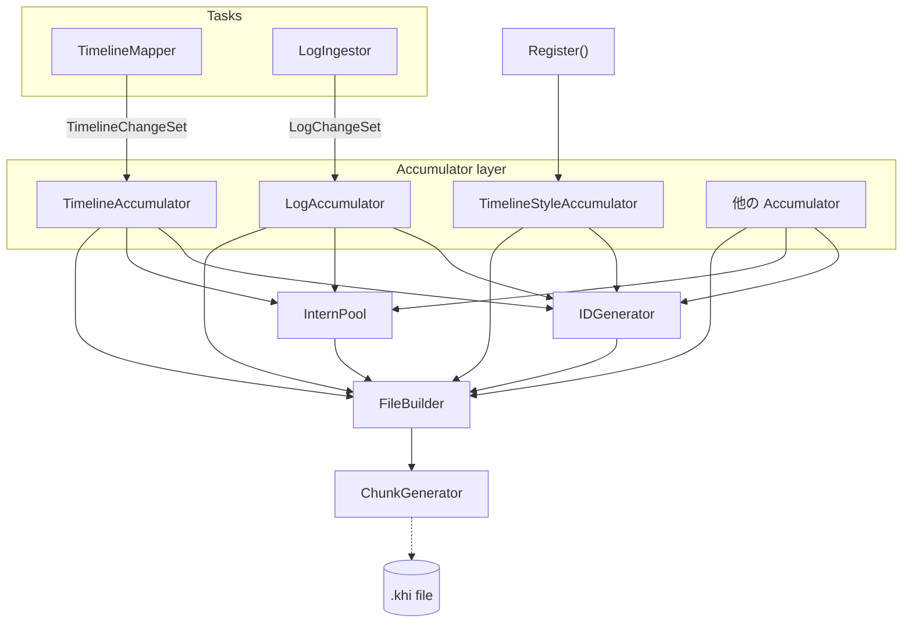

# KHI バックエンドシリアライザ アーキテクチャ

## 概要

KHIバックエンドにおけるTimelineMapperやLogIngestorタスクが実際のデータを書き込んでからファイルになるまでのデータの流れは以下のようになっています。



- **Tasks**: 各タスクが解析した要素やログを Accumulator 層に追加します。TimelineStyle は起動時から変化がないため、初期化時に Register 関数内で各種スタイルを追記します。
- **Accumulator Layer**: ID を生成し、重複排除処理や Proto 型への変換を行います。
- **IDGenerator / InternPool**: ID の割り当て、文字列のインターン化、および構造化データのフラット化を一元的に行います。 Accumulator 側から呼び出されます。
- **FileBuilder / ChunkGenerator**: 集約されたデータとプール群を元に Protobuf の各チャンクバイナリを構築し、最終的な `.khi` ファイルへ書き出します。

## 1. ベースユーティリティ

Protobuf でのシリアライズやデータサイズ最適化の基盤となる、ID 管理および文字列のインターン化のユーティリティです。これらはシリアライザ側から呼び出されるユーティリティであり、各タスクなどが直接呼び出すものではありません。

### 1.1 IDジェネレーター

各種要素に対して一意の整数IDを発行・管理するためのインターフェースです。タイムラインや文字列など、IDの種別ごとに個別のID空間を管理し、シリアライズ時にProtobuf上で参照関係を構築するために使用されます。

- IDは1以上の正の整数値
- ID=0 は常にNULLを意味し、予約されている

```go
// pkg/model/khifile/v6/ids.go にて定義されている名前空間付きのIDジェネレーター
gen := &IDGenerator{}

// タイムラインのIDを発行
timelineID := gen.New(IDTimelinePath)

// 文字列プールのIDを発行
stringID := gen.New(IDString)
```

### 1.2 インターン

KHIファイル内に繰り返し登場するデータを効率的に保持するため、データを直接保持する代わりに一意の整数 ID で管理します。
InternPool が文字列と構造化データのフィールドパスを管理し、同一の要素に対して常に同一の ID を返す役割を持ちます。

この機構により、バックエンド内部で重複する長大な文字列を重複して保持することがなくなり、メモリ効率が向上します。

```go
// IDGeneratorを渡してプールを初期化
gen := &IDGenerator{}
pool := NewInternPool(gen)

// 文字列をプールに登録して一意の ID である InternStringRef を取得
// "error" という文字列が複数回呼ばれても、プール内では同一の ID が返却されます
ref1 := pool.InternString("error")
ref2 := pool.InternString("error")

// ref1.id と ref2.id は同じ値になります
// 元の文字列を取得する場合は Resolve メソッドを呼び出します
originalStr := ref1.Resolve() // "error"
```

### 1.3 構造化データのフラット化ユーティリティ

ログの本文や復元されたマニフェスト情報など、任意の階層構造を持つJSON/YAMLデータは、そのままProtobufのStructに変換するとキー文字列の重複によりサイズが肥大化します。KHIのパーサー側で構築される `structured.Node` 型は、`ToInternedStruct` を用いて `InternedStruct` に変換されます。

```go
import "github.com/GoogleCloudPlatform/khi/pkg/common/structured"

// 例: structured.Node としてのログ本文
// {"level": "info", "message": "hello"} などの構造データ
var logBody structured.Node

// プールを用いてキーと値を分解・圧縮し、InternedStruct へ変換
internedBody, err := ToInternedStruct(logBody, pool)
if err != nil {
    // エラーハンドリング
}

// 構築された internedBody は pb.InternedStruct 型としてそのままチャンク出力に使用可能です。
// 内部でマップキーが FieldPathSetID として単一の ID にまとめられ、値は順序を揃えたスライスとして保持されます。
```

### 1.4 ChunkGenerator 機構

Protoのメッセージには64MBのサイズ制限があるため、必要に応じて分割する必要があります。

`NewSplittingGenerator` は、任意の Protobuf メッセージのイテレータを受け取り、各メッセージのシリアライズ後の正確なサイズを計算しながら自動的にまとめるためのイテレーターです。これによりFileBuilderがChunkを分割しながら実際のファイルを書き込むことができます。

## 2. 既存構造の整理とタイムライン管理

KHI v5 以前では、ログとタイムラインの紐付けを resourcePath と呼ばれる文字列ベースの連結リスト構造で管理していました。v6 フォーマットではこの非効率な文字列ベースの構造を廃止し、新たに TimelinePath と呼ばれる ID ベースの木構造管理機構に刷新しました。

### 2.1 TimelinePath と TimelinePathPool

TimelinePath は、タイムラインの階層木構造における単一のノードを表現する新しい構造体です。

```go
// pkg/model/khifile/v6/timeline_path.go
type TimelinePath struct {
    Parent *TimelinePath
    Name   *InternStringRef
    Type   *pb.TimelineType
    ID     uint32
}
```

文字列パスの結合処理を繰り返す代わりに、TimelinePathPool が TimelinePath インスタンスの一意性を保証し、キャッシュします。これにより、バックエンド側での無駄な文字列結合コストとメモリのオーバーヘッドが劇的に削減されました。シリアライズの最終段階では、これらの TimelinePath は ID に変換され、TimelineChunk に出力されます。

### 2.2 TimelineRegistry とデータ蓄積の具体例

タイムラインのデータを安全に蓄積するために `TimelineRegistry` と `TimelineBuilder` が導入されています。古いパス文字列ベースのマップ検索ではなく、`TimelinePath` のポインタをキーとした効率的なレジストリ管理が行われます。

タスクの内部では、`TimelinePathPool` を使ってパスを構築し、`TimelineRegistry` からスレッドセーフな `TimelineBuilder` を取得してデータを追加します。

```go
// 1. パスの構築: Get メソッドは可変長引数で複数の PathSegment を一度に受け取れます。
// APIVersion, Kind, Namespace, ResourceName のリソース階層を効率的に構築する例です。
podPath := pathPool.Get(nil,
    khifilev6.PathSegment{Name: "v1", Type: style.TimelineTypeAPIVersion},
    khifilev6.PathSegment{Name: "Pod", Type: style.TimelineTypeKind},
    khifilev6.PathSegment{Name: "default", Type: style.TimelineTypeNamespace},
    khifilev6.PathSegment{Name: "my-pod", Type: style.TimelineTypeResource},
)

// 2. Builder の取得とデータの追加:
// GetBuilder は対象パスに対するスレッドセーフな TimelineBuilder を返します。
builder := registry.GetBuilder(podPath)

// Builder は内部に sync.Mutex を持っており、並行処理から安全にイベントやリビジョンを追加できます。
builder.AddEvent(&pb.Event{LogId: logID})
builder.AddRevision(&pb.Revision{
    LogId:        logID,
    ChangedTime:  timestamp,
    VerbType:     verbID,
    StateType:    stateID,
    ResourceBody: internedBody,
})
```

これらのアーキテクチャ刷新により、ログの収集段階から最終的な Protobuf シリアライズに至るまで、全てがポインタと一意な整数 ID に基づいて解決されるよう最適化されています。

## 3. スタイル情報の動的登録

KHI はプラグイン開発者が `pkg/task/inspection/*` 配下にタスクパッケージを追加することで拡張可能な設計となっています。以前のバージョンでは、タイムラインのアイコン、色、ログタイプ、動詞などのスタイル情報が共通の enum パッケージにハードコードされており、プラグイン開発者は共有リポジトリのコアパッケージを直接変更しなければならない拡張性の問題がありました。

### 3.1 レジストリへの動的登録機構

各プラグインは、contractパッケージ内で自パッケージの初期化時に、以下のような Register... 関数を呼び出して列挙値とスタイル情報をシステムに登録します。

```go
// プラグイン側での登録例
var (
    LogTypeContainer = style.RegisterLogType(&style.LogType{
        Label:       "Container",
        Description: "Container runtime logs",
    })
)
```

タイムラインに関連するスタイルの登録はアプリケーション初期化時に全て行われます。このタイミングで各スタイルに採番されあらかじめスタイル情報を出力時に含められる形にします。

### 3.2 アイコン

KHIではフロントエンド側でWebGL側から用いるアイコンフォントのフォントアトラスをビルド時に生成します。
これは登録したスタイルに依存して増えるものであるため、ビルド時にアプリケーションで登録されている全てのアイコンのリストを取得しフォントアトラスを生成します。このアイコンのフォントアトラスを構成する画像情報とフォント情報はKHIのスタイルチャンクに埋め込まれフロントエンドで利用されます。

## 4. ChangeSet パターンの分離とテスト容易性

以前のバージョンでは、タスクが解析結果をグローバルな状態に書き込む際、直接状態を変更するのではなく、一旦 `ChangeSet` に変更内容を蓄積し、後からまとめて History に Flush するパターンを採用していました。状態を直接操作せず、宣言的な変更を返すようにすることで、テストでの検証が容易になります。

v6 フォーマットの新しいアーキテクチャでもこのテスト手法を引き継ぎますが、ログとタイムラインの構造が分離されたことに合わせ、古い単一の `ChangeSet` を以下の2つに分割して再設計します。

### 4.1 LogChangeSet

ログのメタデータに対する変更を蓄積します。

```go
// 概念設計
type LogChangeSet struct {
    LogID       uint32
    Summary     *string
    SeverityID  *style.SeverityID
    LogTypeID   *style.LogTypeID
}

func (cs *LogChangeSet) SetSummary(summary string) { ... }
func (cs *LogChangeSet) SetSeverity(severityID uint32) { ... }
```

タスクは、対象のログに対して `LogChangeSet` を生成および変更し、最終的に `LogAccumulator` へ Flush して実際の `LogChunk` 構築データに反映させます。

### 4.2 TimelineChangeSet

タイムラインに対する要素の追加を蓄積します。

```go
// 概念設計
type TimelineChangeSet struct {
    // TimelinePath ごとに Revision を蓄積
    revisions map[*TimelinePath][]*pb.Revision
    // TimelinePath ごとに Event を蓄積
    events    map[*TimelinePath][]*pb.Event
}

func (cs *TimelineChangeSet) AddEvent(path *TimelinePath) { ... }
func (cs *TimelineChangeSet) AddRevision(path *TimelinePath, rev *pb.Revision) { ... }
```

タスクは、ログを解析した結果をもとに `TimelineChangeSet` を生成します。テスト時には、この `TimelineChangeSet` の内容を調べるだけで、正しい `TimelinePath` に対して意図した `Revision` や `Event` が追加されているかを検証できます。

本番実行時には、タスクが返した `TimelineChangeSet` は `TimelineRegistry` と連携して `TimelineBuilder` に Flush され、安全に並行処理が行われます。これにより、高いテスト容易性と実行時のスレッドセーフな構築処理の両立が実現されます。
