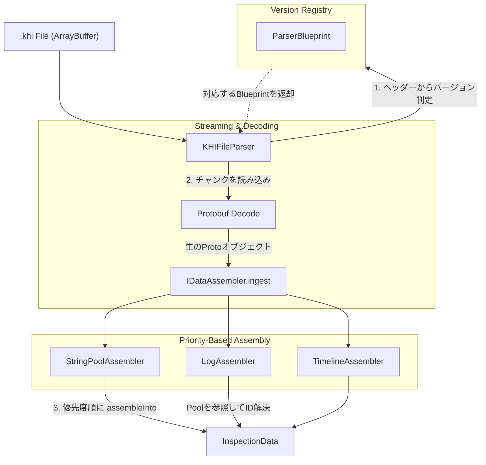

# KHI フロントエンドパーサー アーキテクチャ

本ドキュメントでは、KHI v6 ファイルフォーマットに対応するための、フロントエンド側のパーサーアーキテクチャについて説明します。

## 概要

巨大なファイルを効率的に処理しつつ、将来のフォーマット変更に対する拡張性を担保するため、KHI は Streamed Data Assembly アーキテクチャを採用しています。

ファイルからドメイン層の `InspectionData` までのデータの流れは以下のようになっています。



* **KHIFileParser**: ファイルのバイナリを順次読み込むオーケストレーターです。
* **ParserBlueprint**: ファイルのバージョンごとに、どのチャンクタイプをどのデコーダー・アセンブラーで処理すべきかを定義したレジストリです。
* **DataAssembler**: デコードされた Protobuf オブジェクトを受け取り、最終的なドメインモデルへと変換・構築する状態を持つクラスです。
* **InspectionData**: 実際のアプリケーションが利用するドメインモデルを保持するクラスです。InspectionDataはprotoの型に依存しません。DataAssemblerがInspectionDataの定義するDTOに変換しInspectionDataに受け渡します。

## 1. コアインターフェースと Blueprint

ネストしたファクトリに依存するのではなく、ファイルバージョンごとに `ParserBlueprint` を登録し、チャンクタイプとそれを処理するアセンブラーをマッピングします。

### 1.1 DataAssembler

ParserBlueprintはproto型ごとにDataAssemblerインターフェースを実装を登録しています。まず各DataAssemblerは新しいProtoがデコードされるごとにingestでデータが追加され、最終的にassembleIntoがInspectionDataとともに呼ばれるのでDTOに変換した値をInspectionDataに付加します。

```typescript
// デコードされたProtobufを収集し、最終モデルを構築する状態を持つアセンブラー
interface DataAssembler<TProto> {
    // デコードされたチャンクを受け取ります。チャンク分割により複数回呼ばれる可能性があります。
    ingest(proto: TProto): void;
    
    // 収集したデータを最終的な InspectionData へ統合します。
    assembleInto(model: InspectionData): void;
}
```

### 1.2 Blueprint レジストリ

バージョンごとのチャンクのパース戦略を定義します。

```typescript
// 特定のチャンクタイプの処理方法の定義
interface ChunkDefinition<TProto = any> {
    typeId: number;
    // 生のバイト配列をProtobufオブジェクトへデコードする純粋関数
    decode: (bytes: Uint8Array) => TProto; 
    // 状態を持つアセンブラーのファクトリメソッド
    createAssembler: () => DataAssembler<TProto>;
    // 依存関係解決のための実行優先度。数値が低いほど先に assembleInto が呼ばれます。
    priority: number; 
}

// バージョン固有のチャンク定義のレジストリ
type ParserBlueprint = Map<number, ChunkDefinition>;

// 実装例: v6 の Blueprint 定義
const V6_BLUEPRINT: ParserBlueprint = new Map([
    [2, { // InterningPoolChunk
        typeId: 2,
        decode: (bytes) => InterningPoolChunk.fromBinary(bytes),
        createAssembler: () => new V6StringPoolAssembler(),
        priority: 10 // 文字列プールは他のチャンクより先に解決される必要がある
    }],
    [3, { // LogChunk
        typeId: 3,
        decode: (bytes) => LogChunk.fromBinary(bytes),
        createAssembler: () => new V6LogAssembler(),
        priority: 100
    }],
    //...
]);
```

この設計により、将来 v8 が登場した場合でも、KHIFileParserの実装には手を加えず、`V8_BLUEPRINT` を追加するだけで透過的に対応可能となります。

## 2. 実行フロー

`KHIFileParser` は、Protobuf のスキーマや特定のバージョンに依存しない汎用的なオーケストレーターとして機能します。メモリの急増を防ぐため、ArrayBuffer をシーケンシャルにストリーミングします。

### 2.1 ヘッダー検証と Blueprint 解決

ファイルの先頭からマジックバイト `KHI` とバージョン番号を読み取ります。バージョン番号を元に `VERSION_REGISTRY` から対応する `ParserBlueprint` を取得します。未対応バージョンの場合は即座にエラーをスローします。

### 2.2 チャンクのストリーミングと取り込み

ファイルの EOF に達するまで以下の手順を繰り返します。

1. チャンクサイズとチャンクタイプを読み取ります。
2. チャンクタイプに対応する `ChunkDefinition` を Blueprint から取得します。
3. バイト配列を抽出して `decode` を呼び出し、Protobuf オブジェクトに変換します。
4. 対応する `DataAssembler` を遅延初期化し、`ingest(proto)` メソッドにデコード済みのオブジェクトを渡してデータを蓄積させます。

### 2.3 優先度に基づく組み立て

ファイルの終端に達した後、蓄積されたデータを最終的なドメインモデルに変換します。

1. 空の `InspectionData` オブジェクトを作成します。
2. 実行されたアセンブラーの `ChunkDefinition` を `priority` の昇順でソートします。
3. ソートされた順序に従い、各アセンブラーの `assembleInto(model)` を順次呼び出します。

これにより、例えば優先度 `10` の StringPool 用アセンブラーが先に `model.stringPool` を構築し、その後優先度 `100` の Log 用アセンブラーが構築済みの文字列プールを参照して正しくドメインモデルを組み立てるといった、確実な依存関係の解決が保証されます。

### 2.4 エラーハンドリングとトレーサビリティ

バイナリパース中のエラーは原因の特定が難しいため、KHI では高度なコンテキスト情報を持たせたエラーハンドリング戦略を実装します。

* `KHIInvalidFileError`: ヘッダー検証時にスローされます。
* `KHIVersionMismatchError`: サポートされていないファイルバージョンの場合にスローされます。
* `KHIChunkDecodeError`: Protobuf のデコード処理失敗時にスローされます。
* `KHIDataAssemblyError`: `assembleInto` フェーズでの統合失敗時にスローされます。

## 3. ドメイン層

パーサーが最終的に構築し出力するオブジェクトが、ドメイン層のルートとなる `InspectionData` です。この層は、KHIのフロントエンド・アプリケーションにおける純粋なデータモデルを表現しており、以下のような特徴と役割を持っています。

* `InspectionData` やその配下にある `LogStore`、`TimelineStore` などのストア群は、Protobuf の生成コードである `_pb.js` や `_pb.d.ts` に一切依存しません。
* ファイル内に圧縮目的で存在していた「チャンクの分割」,「gzip」といった転送・永続化のためのリアルタイムにデコードが難しい構造は、パーサーがInspectionDataに変換する際に全て解決・結合されます。
* 文字列のインターン化などは動的にストアから要素を取り出す時点で、文字列のIDは実際の文字列へ、`InternedStruct`はデコードされたJavaScriptオブジェクトへと透過的に変換されます。これにより膨大なログもフロントエンド側である程度小さな形で保持することができます。
* 検索しやすい構造を提供します。フロントエンドのビューが実際にデータを取得するのはドメイン層から取得するため統一的な高速な検索インターフェースを提供します。
* ドメイン層は常にフロントエンドがわのメモリに乗るためJSのメモリ構造に配慮したコンパクトな形で保持します。例えばドメイン層の返すLog型はAdaptorパターンであり、実際に必要に応じて親のストアの情報を取得します。

```typescript
export class Log {
  constructor(public readonly id: number, private readonly store: LogStore) {}

  get timestamp(): bigint { return this.store._getTimestamp(this.id); }
  get summary(): string { return this.store._getSummary(this.id); }
  get body(): any { return this.store._decodeBody(this.id); }
  get severity(): ReadonlyDomainElement<Severity> { return this.store._getSeverity(this.id); }
}
```

このように、UIやViewModelが必要とするタイミングで初めてIDからの文字列解決や構造体の遅延評価デコードが行われます。
