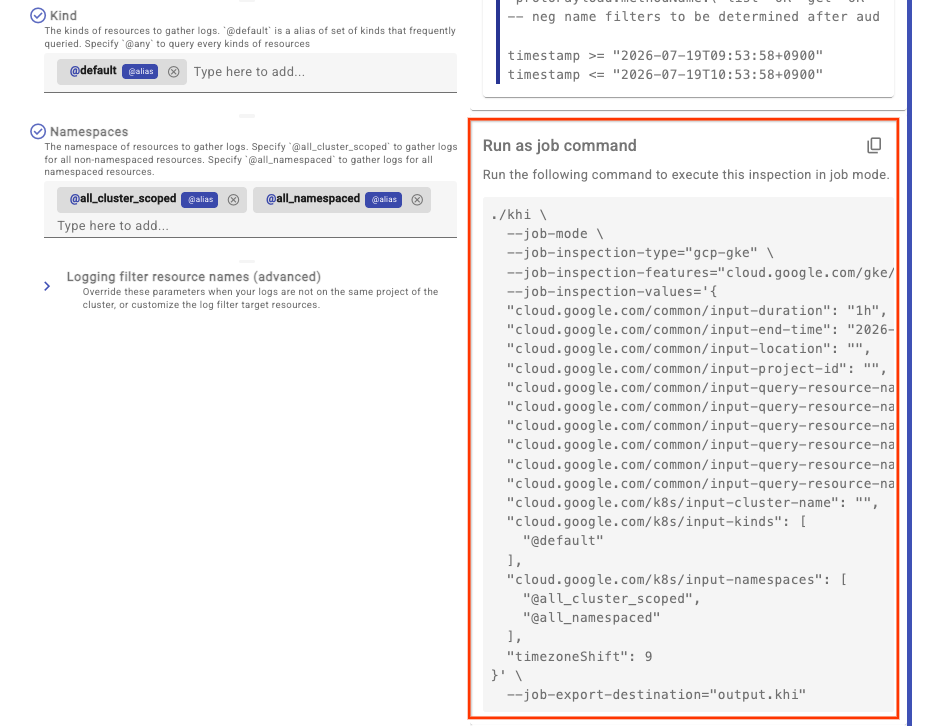

# Job モードガイド（CI/CD・自動化向け）

KHI には、Web サーバを起動せずに指定したログの分析・可視化処理を行い、直接 `.khi` ファイルを出力する **Job モード** が用意されています。

Job モードを使用すると、アラート通知時や CI/CD パイプライン（デプロイ時・テスト時等）のトリガーに合わせて自動的に `.khi` ファイルを生成・保存できます。生成された `.khi` ファイルは、後から KHI Web UI にアップロードしてインタラクティブに分析できます。

## Job モードのコマンドを取得する方法

KHI Web UI の「新規インスペクション作成」画面でパラメータを入力すると、画面下部に同等の設定で実行できる Job モードの CLI コマンドが表示されます。



> [!NOTE]
> UI 上に表示されるコマンド例ではバイナリ直実行（`./khi ...` 等）の形式となっています。Docker コンテナから実行する場合は、出力先ディレクトリをマウントして実行してください。

## Docker コンテナでの実行例

出力先ディレクトリをコンテナにマウント（例: `-v $(pwd):/output`）して実行します。

```bash
docker run --rm \
  -v $(pwd):/output \
  gcr.io/kubernetes-history-inspector/release:latest \
  --job-mode \
  --job-inspection-type="gke-basic" \
  --job-inspection-features="ALL" \
  --job-inspection-values='{"projectId":"my-gcp-project","clusterName":"my-cluster","location":"us-central1"}' \
  --job-export-destination="/output/result.khi"
```

> [!IMPORTANT]
> **入力ファイルパスの置き換えとマウントについて**
>
> ログファイルのアップロード等、パラメータにローカルファイルが含まれる場合、生成されるコマンドの `--job-inspection-values` 内には `"path/to/file"` というプレースホルダーが出力されます。
> Docker コンテナで実行する際は、この `"path/to/file"` を実際の入力ファイルのパス（コンテナ内にマウントしたパス）へ置き換える必要があります。
>
> ```bash
> docker run --rm \
>   -v $(pwd):/output \
>   -v /path/to/local/audit.log:/input/audit.log:ro \
>   gcr.io/kubernetes-history-inspector/release:latest \
>   --job-mode \
>   --job-inspection-type="oss-log" \
>   --job-inspection-features="ALL" \
>   --job-inspection-values='{"logFilePath":"/input/audit.log"}' \
>   --job-export-destination="/output/result.khi"
> ```

## パラメータ詳細

Job モードで使用可能な各パラメータ・フラグの定義については [pkg/parameters/job.go](../../../pkg/parameters/job.go) を参照してください。
