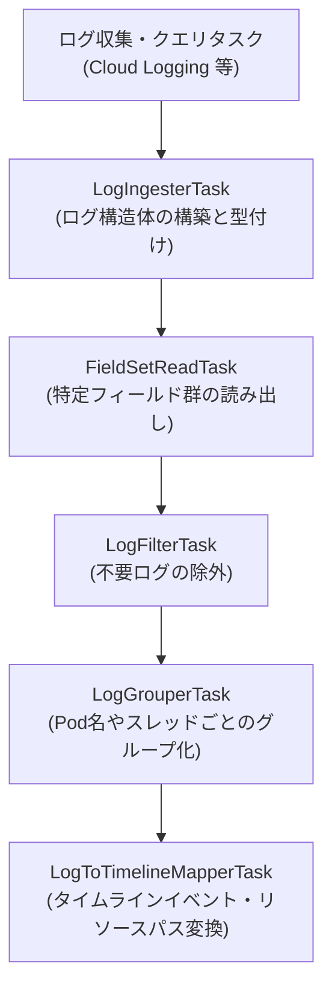

# ログ解析のためのタスク実装パターン (実践ガイド)

[< 前へ: 基本文法と実行モード](./01-syntax-and-modes.md) | [インデックスへ戻る](../khi-task-system-concept.md) | [次へ: 高度なタスクパターン >](./03-advanced-and-form-tasks.md)

---

本ドキュメントでは、KHI におけるログ解析の全体パイプラインと、開発者が新しいログのパースやタイムライン変換を実装するために使用する **6 種類の高レベルタスク作成ユーティリティの実践的なクックブック** を提供します。

## 1. ログ解析パイプラインの全体像

KHI はその堅牢なタスクシステムを使用してログ解析を実行します。このアーキテクチャは KHI を非常に拡張性の高いものにし（新しいタスクを作成するだけで新しい機能を追加できます）、Go の並行処理機能をフル活用することを可能にします。
しかし、ログ解析には多くの共通パターンがあるため、ログ解析タスクは KHI が提供する高レベルなタスク作成ユーティリティを使用して実装すべきです。

KHI は、基本的なログ解析のユースケースをカバーするために、以下の高レベルタスク作成ユーティリティを提供しています:

- **`FieldSetReadTask`** : 構造化ログのフィールドを型付き構造体に格納します。
- **`LogGrouperTask`** : 特定のフィールドでログをグループ化します。
- **`LogFilterTask`** : 条件に基づいてログをフィルタリングします。
- **`LogIngesterTask`** : ログを最終的な履歴データに取り込みます。
- **`LogToTimelineMapperTask`** : 取り込まれたログを KHI の UI 上で表示するタイムラインのイベントへとマッピングします。

以下は、これら 5 種類のタスクを組み合わせて、Cloud Logging から取得した Kubernetes ノードの監査ログを解析し、UI タイムラインへと描画するまでのパイプライン全体の依存グラフ例です:



開発者が新しいログ種別をサポートする際は、このパイプラインに沿って各タスクを宣言し、タスクグラフに結合します。
これらはすべて `pkg/core/inspection/taskbase` パッケージのユーティリティ関数（`NewFieldSetReadTask` 等）から生成します。

---

## 2. フィールドセットの読み出し (`FieldSetReadTask`)

KHI のログは初期状態では構造化されていない形式であり、ログの各フィールドを読み取るには `FieldSetReadTask` を使用すべきです。
これは、ログ内の特定の一連のフィールドを、定義済みの Go の構造体型にアンマーシャル・型付けして格納します。

```go
// 1. 読み取りたいフィールドに対応する構造体を定義
type MyFieldSet struct {
    foo string
    bar int
}

// 2. フィールドセットをログ構造体に結合するタスクの定義
var MyFieldSetReadTask = inspectiontaskbase.NewFieldSetReadTask(
    MyFieldSetReadTaskID, // このタスク自身の ID
    SourceLogsTaskID.Ref(), // 対象となるログのリスト
    func(ctx context.Context, l *log.Log) (*MyFieldSet, error) {
        // ... (ログ本文から値を抽出するロジック) ...
        return &MyFieldSet{
            foo: "foo",
            bar: 1,
        }, nil
    },
)
```

このユーティリティを使用するタスクでは、`log.GetFieldSet(l, MyFieldSetReadTaskID)` を使用してログから特定のフィールドセットを読み取ることができます。

```go
fieldSet := log.GetFieldSet(l, MyFieldSetReadTaskID)
```

> [!TIP]
> タスクから直接値を返すのではなくログそのものに情報を添付して受け渡す理由の詳細は、アーキテクチャドキュメントの **「ログの不変性と並行アクセス」** を参照してください。

---

## 3. ログのグループ化 (`LogGrouperTask`)

個別のログメッセージだけでは原因を特定できない場合、関連する複数のログを時系列でグループ化して処理する必要があります（例: Kubernetes の Pod の起動から終了までの一連のイベント群など）。
`LogGrouperTask` は、特定のキーに基づいてログをグルーピングします:

```go
var MyGrouperTask = inspectiontaskbase.NewLogGrouperTask(
    MyGrouperTaskID,
    SourceLogsTaskID.Ref(),
    func(ctx context.Context, l *log.Log) (string, error) {
        // ログ l からグループ化キーとなる文字列を返す
        fieldSet := log.GetFieldSet(l, MyFieldSetReadTaskID)
        return fieldSet.foo, nil
    },
)
```

後続のタスクは `log.GetGroup(l, MyGrouperTaskID)` を使用して、対象ログが属するグループ名（グループキー）を取得できます。

---

## 4. ログのフィルタリング (`LogFilterTask`)

膨大なログの中から、可視化や解析に不要なノイズログ（ヘルスチェックの正常ログなど）を事前に除外するには `LogFilterTask` を使用します。

```go
var MyFilterTask = inspectiontaskbase.NewLogFilterTask(
    MyFilterTaskID,
    SourceLogsTaskID.Ref(),
    func(ctx context.Context, l *log.Log) (bool, error) {
        // true を返したログのみが維持され、false を返したログは除外されます
        fieldSet := log.GetFieldSet(l, MyFieldSetReadTaskID)
        return fieldSet.bar > 0, nil
    },
)
```

---

## 5. ログの取り込み (`LogIngesterTask`)

`LogIngesterTask` は、クラウド API やローカルファイルなどから収集した生のログ文字列を KHI が扱える共通の `*log.Log` オブジェクトへと初期化・追加し、さらにログ種別ごとのパーサーや初期化処理（サマリー生成、必須フィールドセットの注入など）を実行するための取り込みタスクです。

### 1. `LogIngester` インターフェースの宣言

取り込みを行うタスクを定義する際は、まず `inspectiontaskbase.LogIngester` インターフェースを満たす構造体を実装します:

```go
type MyLogIngester struct{}

// ログソースとなる生ログまたは親タスクの参照IDを返します
func (i *MyLogIngester) RawLogTask() taskid.UntypedTaskReference {
    return SourceLogsTaskID.Ref()
}

// パーサーが必要とする依存関係のリストを返します
func (i *MyLogIngester) Dependencies() []taskid.UntypedTaskReference {
    return []taskid.UntypedTaskReference{}
}

// 個々のログに対して実行する初期処理や変換ロジックを実装します
func (i *MyLogIngester) ProcessLog(ctx context.Context, l *log.Log) error {
    // ログメッセージの要約や基礎フィールドの初期化
    l.Summary = "Parsed Log Summary"
    return nil
}

var _ inspectiontaskbase.LogIngester = (*MyLogIngester)(nil)
```

### 2. タスクインスタンスの構築

実装したインジェスター構造体のアドレスを `inspectiontaskbase.NewLogIngesterTask` に渡してタスクインスタンスを宣言します:

```go
var MyLogIngesterTask = inspectiontaskbase.NewLogIngesterTask(
    MyLogIngesterTaskID,
    &MyLogIngester{},
)
```

---

## 6. タイムラインへのマッピング (`LogToTimelineMapperTask`)

ログ解析の最終工程として、フィルタリングやグループ化を経た `*log.Log` オブジェクトから、KHI の UI 上に描画するリソースツリーおよび時系列タイムラインイベント（イベントバー、重要度、詳細メッセージ）へとマッピングするタスクが `LogToTimelineMapperTask` です。

### 6.1 `LogToTimelineMapper[T]` インターフェースの実装

マッパータスクを作成するには、`inspectiontaskbase.LogToTimelineMapper[T]` インターフェースを満たす構造体を宣言します。
通常は、独自の順次処理を記述しやすいように **`inspectiontaskbase.SinglePassMapperBase[T]`** を埋め込んで定型コードを省略し、必要なメソッドのみをオーバーライドします。

```go
type MyGroupData struct {
    Count int
}

type MyMapper struct {
    inspectiontaskbase.SinglePassMapperBase[MyGroupData]
}

func (m *MyMapper) GroupingTask() taskid.UntypedTaskReference {
    return MyGrouperTaskID.Ref()
}

func (m *MyMapper) LogTask() taskid.UntypedTaskReference {
    return SourceLogsTaskID.Ref()
}

func (m *MyMapper) Dependencies() []taskid.UntypedTaskReference {
    return []taskid.UntypedTaskReference{MyFieldSetReadTaskID.Ref()}
}
```

### 6.2 ツリー構造を保持したタイムラインパスの構築

現在のタイムライン API では、リソース名や文字列を `#` や `/` で単純連結するレガシーな文字列パスは廃止され、リソースの階層関係（ツリー構造）を明確に型で表現する **`*khifilev6.TimelinePath`** を用いてイベントを追加・解決します。

```go
// メッセージを処理し、タイムラインイベントを追加するロジック
func (m *MyMapper) ProcessLogByGroup(ctx context.Context, l *log.Log, prevData MyGroupData) (*khifilev6.TimelineChangeSet, MyGroupData, error) {
    cs := khifilev6.NewTimelineChangeSet()

    // パスプールの使用により同一パスのオブジェクト生成を抑止し最適化
    pathPool := khictx.MustGetValue(ctx, inspectioncore_contract.TimelinePathPool)
    podPath := pathPool.Get("test-cluster", "default", "my-pod")

    // イベント追加
    cs.AddEvent(podPath)

    // 更新した状態をグループ内の次のログ処理へと受け渡す
    return cs, MyGroupData{Count: prevData.Count + 1}, nil
}

// タスクとして初期化
var MyMapperTask = inspectiontaskbase.NewLogToTimelineMapperTask(
    MyMapperTaskID,
    &MyMapper{},
    inspectioncore_contract.FeatureTaskLabel("my-mapper", /* その他パラメータ */),
)
```

### 6.3 マッパーのユニットテスト (`testchangeset.AssertTimeline`)

マッパーのテストでは、`testchangeset.AssertTimeline(t, cs)` を使用して、生成された `TimelineChangeSet` の内容を宣言的に検証します。
文字列パスや非推奨の API は使用せず、期待される `*khifilev6.TimelinePath` を作成して検証します。

```go
func TestMyMapper_ProcessLogByGroup(t *testing.T) {
    l := log.NewLogWithFieldSetsForTest(&log.CommonFieldSet{Timestamp: time.Now()}, /* ... */)
    mapper := &MyMapper{}

    cs, _, err := mapper.ProcessLogByGroup(t.Context(), l, MyGroupData{})
    if err != nil {
        t.Fatalf("unexpected error: %v", err)
    }

    wantPodPath := commonlogk8saudit_contract.MustK8sPodTimeline(t.Context(), "test-cluster", "default", "my-pod")
    testchangeset.AssertTimeline(t, cs).
        HasEvent(wantPodPath).
        HasLogSeverity(enum.SeverityInfo)
}
```

---

[< 前へ: 基本文法と実行モード](./01-syntax-and-modes.md) | [インデックスへ戻る](../khi-task-system-concept.md) | [次へ: 高度なタスクパターン >](./03-advanced-and-form-tasks.md)
