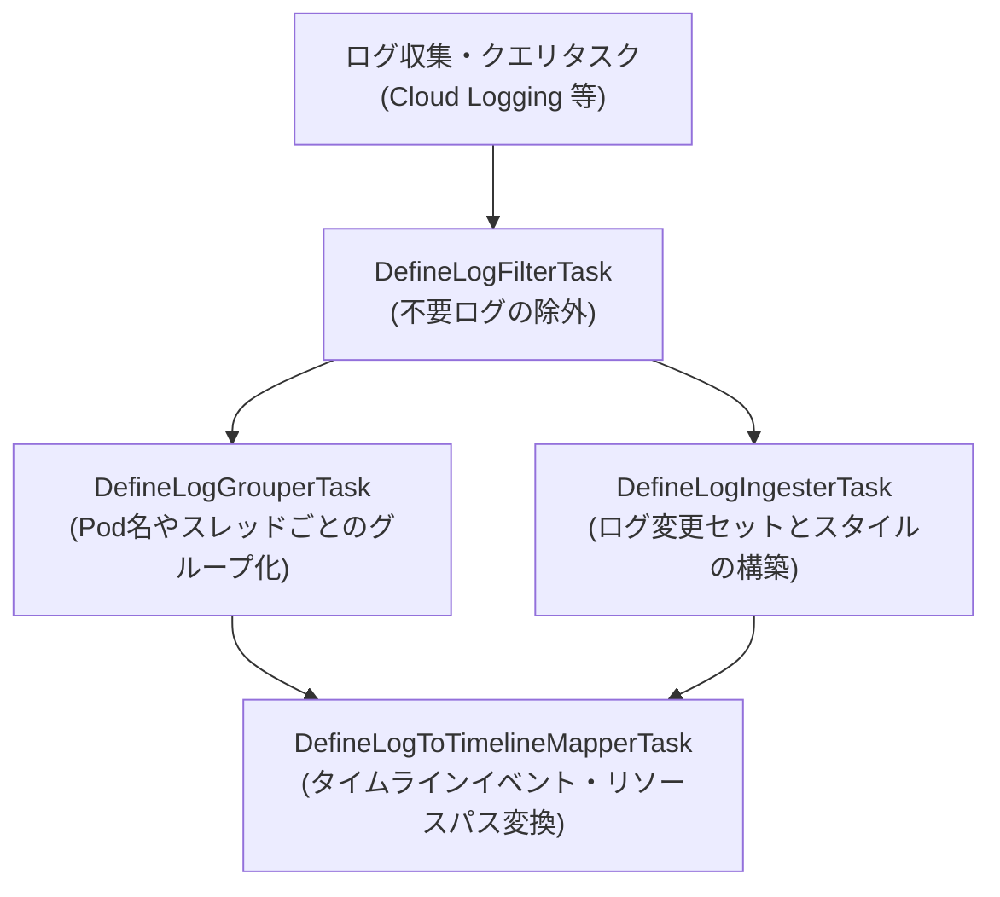

# ログ解析のためのタスク実装パターン (実践ガイド)

[< 前へ: 基本文法と実行モード](./01-syntax-and-modes.md) | [インデックスへ戻る](../khi-task-system-concept.md) | [次へ: 高度なタスクパターン >](./03-advanced-and-form-tasks.md)

---

本ドキュメントでは、KHI におけるログ解析の全体パイプラインと、開発者が新しいログのパースやタイムライン変換を実装するために使用する **4 種類の高レベルタスク作成ユーティリティの実践的なクックブック** を提供します。

## 1. ログ解析パイプラインの全体像

KHI はその堅牢なタスクシステムを使用してログ解析を実行します。このアーキテクチャにより、新しいタスクを作成するだけで新機能を追加できる高い拡張性を備え、Go の並行処理機能を最大限に活用できます。
ログ解析には多くの共通パターンがあるため、ログ解析タスクは KHI が提供する高レベルなタスク作成ユーティリティを使用して実装すべきです。

KHI は、基本的なログ解析のユースケースをカバーするために、以下の高レベルタスク作成ユーティリティを提供しています:

- **`DefineLogFilterTask`** : 条件に基づいてログをフィルタリングします。
- **`DefineLogGrouperTask`** : エンティティ名や相関 ID といった特定のキーでログをグループ化します。
- **`DefineLogIngesterTask`** : ログを最終的な履歴データに取り込み、ログレベルのメタデータである `LogChangeSet` を生成します。
- **`DefineLogToTimelineMapperTask`** : 取り込まれたログを KHI の UI 上で表示するタイムラインのイベントやリソースリビジョンである `TimelineChangeSet` へとマッピングします。

以下は、これら 4 種類のタスクを組み合わせて、Cloud Logging から取得したログを解析し、UI タイムラインへと描画するまでのパイプライン全体の依存グラフ例です:


```mermaid
flowchart TD
    Fetch["ログ収集・クエリタスク<br>(Cloud Logging 等)"]
    Filter["DefineLogFilterTask<br>(不要ログの除外)"]
    Grouper["DefineLogGrouperTask<br>(Pod名やスレッドごとのグループ化)"]
    Ingester["DefineLogIngesterTask<br>(ログ変更セットとスタイルの構築)"]
    Mapper["DefineLogToTimelineMapperTask<br>(タイムラインイベント・リソースパス変換)"]

    Fetch --> Filter
    Filter --> Grouper
    Filter --> Ingester
    Grouper --> Mapper
    Ingester --> Mapper
```

開発者が新しいログ種別をサポートする際は、このパイプラインに沿って各タスクを宣言し、タスクグラフに結合します。
これらはすべて `pkg/core/inspection/taskbase` パッケージのユーティリティ関数から生成します。

---

## 2. Extractor 関数によるフィールド抽出

KHI のログは、`l.NodeReader` を介して高速・ゼロコピーな `*structured.NodeReader` を提供します。
生ログから構造化フィールドを抽出するには、`contract` パッケージに Extractor 関数と型付き構造体を定義します:

```go
package myapp_contract

import (
    "github.com/GoogleCloudPlatform/khi/pkg/common/structured"
)

var (
    pathFoo = structured.CompileFieldPath("jsonPayload.foo")
    pathBar = structured.CompileFieldPath("jsonPayload.bar")
)

type MyFields struct {
    Foo string
    Bar int
}

func ExtractMyFields(reader *structured.NodeReader) (MyFields, error) {
    return MyFields{
        Foo: reader.ReadStringOrDefaultByPath(pathFoo, ""),
        Bar: reader.ReadIntOrDefaultByPath(pathBar, 0),
    }, nil
}
```

タスクは中間タスクのオーバーヘッドやログごとのハッシュマップ割り当てなしに、`ExtractMyFields(l.NodeReader)` を直接呼び出して値を受け取ることができます。

---

## 3. ログのフィルタリング (`DefineLogFilterTask`)

膨大なログの中から、ヘルスチェックの正常ログなど可視化や解析に不要なノイズログを事前に除外するには `DefineLogFilterTask` を使用します。

```go
var MyFilterTask = inspectiontaskbase.DefineLogFilterTask(
    MyFilterTaskID,
    SourceLogsTaskID.Ref(),
    func(b *coretask.Binder) inspectiontaskbase.LogFilterFunc {
        return func(ctx context.Context, l *log.Log) bool {
            fields, err := myapp_contract.ExtractMyFields(l.NodeReader)
            return err == nil && fields.Bar > 0
        }
    },
)
```

---

## 4. ログのグループ化 (`DefineLogGrouperTask`)

個別のログメッセージだけでは原因を特定できない場合、Kubernetes の Pod の起動から終了までの一連のイベント群のように、関連する複数のログを時系列でグループ化して処理する必要があります。
`DefineLogGrouperTask` は、特定のキーに基づいてログをグルーピングします:

```go
var MyGrouperTask = inspectiontaskbase.DefineLogGrouperTask(
    MyGrouperTaskID,
    SourceLogsTaskID.Ref(),
    func(b *coretask.Binder) inspectiontaskbase.LogGrouperFunc {
        return func(ctx context.Context, l *log.Log) string {
            fields, err := myapp_contract.ExtractMyFields(l.NodeReader)
            if err == nil && fields.Foo != "" {
                return fields.Foo
            }
            return "unknown"
        }
    },
)
```

---

## 5. ログの取り込み (`DefineLogIngesterTask`)

`DefineLogIngesterTask` は、ログ種別、タイムスタンプ、重要度、サマリーなどのログレベルのメタデータを `*khifilev6.LogChangeSet` に設定する取り込みタスク (`coretask.Task[struct{}]`) です。
第二引数に生ログタスクの参照 (`taskid.TaskReference[[]*log.Log]`) を、第三引数に `inspectiontaskbase.LogIngesterFunc` を返す `bind` 関数を渡します:

```go
var MyLogIngesterTask = inspectiontaskbase.DefineLogIngesterTask(
    MyLogIngesterTaskID,
    SourceLogsTaskID.Ref(),
    func(b *coretask.Binder) inspectiontaskbase.LogIngesterFunc {
        return func(ctx context.Context, l *log.Log) (*khifilev6.LogChangeSet, error) {
            cs, err := khifilev6.NewLogChangeSet(l)
            if err != nil {
                return nil, err
            }

            cs.SetTimestamp(l.Timestamp)
            cs.SetLogType(myapp_contract.LogTypeMyApp)

            if fields, err := myapp_contract.ExtractMyFields(l.NodeReader); err == nil {
                cs.SetSummary(fmt.Sprintf("[%s] count=%d", fields.Foo, fields.Bar))
            }

            return cs, nil
        }
    },
)
```

インジェスターが追加の上流タスク入力を必要とする場合は、外側の関数内で `b *coretask.Binder` にバインドし、返される `LogIngesterFunc` の中で入力ハンドルを読み取ります。

---

## 6. タイムラインへのマッピング (`DefineLogToTimelineMapperTask`)

ログ解析の最終工程として、フィルタリングやグループ化を経た `*log.Log` オブジェクトから、KHI の UI 上に描画するリソースツリー、およびイベントバーや重要度、詳細メッセージを含む時系列タイムラインイベントへとマッピングするタスクが `DefineLogToTimelineMapperTask` です。

### 6.1 `TimelineMapper[T]` インターフェースの実装

マッパータスクを作成するには、`inspectiontaskbase.TimelineMapper[T]` インターフェースを満たす構造体を宣言します。
通常は、独自の順次処理を記述しやすいように **`inspectiontaskbase.SinglePassMapperBase[T]`** または **`inspectiontaskbase.StatelessMapperBase`** を埋め込んで定型コードを省略し、必要なメソッドのみをオーバーライドします。

```go
type MyGroupData struct {
    Count int
}

type MyMapper struct {
    inspectiontaskbase.SinglePassMapperBase[MyGroupData]
}

var _ inspectiontaskbase.TimelineMapper[MyGroupData] = (*MyMapper)(nil)
```

### 6.2 タイムラインパス生成ユーティリティの作成と利用

現在の KHI 実装では、マッパー内で生の文字列からパスを直接構築するのではなく、リソースのツリー構造を明確に型で表現する **`*khifilev6.TimelinePath`** を用いてイベントを追加・解決します。
さらに、親階層を `TimelineAccumulator.GetPath` でゼロから再構築するのではなく、`MustXXXTimeline` といった既存の親タイムラインヘルパー関数を合成して子リソースのパスを生成する**タイムラインパス生成ユーティリティ**を作成する実装パターンを採用しています。

#### 1. タイムラインパス生成ヘルパーの作成例 (`contract` または `impl` パッケージに定義)

```go
// 親タイムラインヘルパー関数を合成する複合 TimelinePath ヘルパー関数の作成例
func MustK8sPodTimeline(ctx context.Context, clusterName string, namespace string, podName string) *khifilev6.TimelinePath {
    clusterPath := commonlogk8saudit_contract.MustK8sClusterTimeline(ctx, clusterName)
    apiVersionPath := commonlogk8saudit_contract.MustK8sAPIVersionTimeline(ctx, clusterPath, "core/v1")
    kindPath := commonlogk8saudit_contract.MustK8sKindTimeline(ctx, apiVersionPath, "pod")
    namespacePath := commonlogk8saudit_contract.MustK8sNamespaceTimeline(ctx, kindPath, namespace)
    return commonlogk8saudit_contract.MustK8sNamespacedResourceTimeline(ctx, namespacePath, podName)
}
```

#### 2. マッパーからのタイムラインパスヘルパーの利用

```go
// メッセージを処理し、タイムラインイベントを追加するロジック
func (m *MyMapper) ProcessLogByGroup(ctx context.Context, l *log.Log, prevData MyGroupData) (*khifilev6.TimelineChangeSet, MyGroupData, error) {
    cs := khifilev6.NewTimelineChangeSet(l)

    // 作成したタイムラインパス生成ヘルパーを呼び出してパスを安全に取得
    podPath := MustK8sPodTimeline(ctx, "test-cluster", "default", "my-pod")

    // イベント追加
    cs.AddEvent(podPath)

    // 更新した状態をグループ内の次のログ処理へと受け渡す
    return cs, MyGroupData{Count: prevData.Count + 1}, nil
}

// タスクとして初期化
var MyMapperTask = inspectiontaskbase.DefineLogToTimelineMapperTask(
    MyMapperTaskID,
    inspectiontaskbase.TimelineMapperInputs{
        LogIngester: MyLogIngesterTaskID.Ref(),
        GroupedLogs: MyGrouperTaskID.Ref(),
    },
    func(b *coretask.Binder) inspectiontaskbase.TimelineMapper[MyGroupData] {
        return &MyMapper{}
    },
    inspectioncore_contract.FeatureTaskLabel(
        "Custom App Logs",
        "Parser and timeline mapping for Custom App logs.",
        9000,
        false,
    ),
)
```

### 6.3 マッパーのユニットテスト (`testchangeset.AssertTimeline`)

マッパーのテストでは、`testchangeset.AssertTimeline(t, cs)` を使用して、生成された `TimelineChangeSet` の内容を宣言的に検証します。
文字列パスや非推奨の API は使用せず、期待される `*khifilev6.TimelinePath` を作成して検証します。

```go
func TestMyMapper_ProcessLogByGroup(t *testing.T) {
    ctx := inspectiontest.WithDefaultTestInspectionTaskContext(t.Context())

    l := testlog.NewMockLog(time.Date(2026, 5, 22, 12, 0, 0, 0, time.UTC))
    mapper := &MyMapper{}

    cs, _, err := mapper.ProcessLogByGroup(ctx, l, MyGroupData{})
    if err != nil {
        t.Fatalf("unexpected error: %v", err)
    }

    wantPodPath := MustK8sPodTimeline(ctx, "test-cluster", "default", "my-pod")
    testchangeset.AssertTimeline(t, cs).
        HasEvent(wantPodPath)
}
```

---

[< 前へ: 基本文法と実行モード](./01-syntax-and-modes.md) | [インデックスへ戻る](../khi-task-system-concept.md) | [次へ: 高度なタスクパターン >](./03-advanced-and-form-tasks.md)
