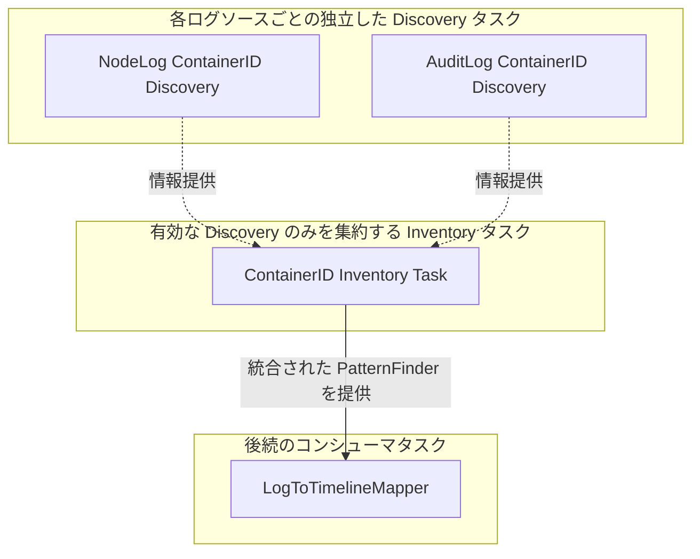

# 高度なタスクパターンとユーティリティ

[< 前へ: ログ解析のためのタスク実装パターン](./02-log-processing-cookbook.md) | [インデックスへ戻る](../khi-task-system-concept.md)

---

本ドキュメントでは、KHI のタスクシステムを用いて、登録やラベル選択、リソースディスカバリ、入力フォーム、進捗報告、キャッシュ戦略といった高度な解析パイプラインや UI 連携を構築するための仕様とユーティリティについて解説します。

## 1. インスペクションタスクサーバーへのタスク登録

KHI のビルドスクリプトは、`pkg/task/inspection/<プロバイダ>/<機能>/impl` 以下に `module.go` が存在する場合、初期化時にそのパッケージの `Module` を自動で登録するよう構成します。
新しいタスクや Inspection Type を追加するパッケージを定義するには、`module.go` 内で `coreinspection.Module` 型の公開変数 `Module` を宣言します。

```go
// Module declares the OSS Kubernetes log files inspection type and the tasks that build timelines from uploaded kube-apiserver audit logs.
var Module = coreinspection.Module{
    Name: "oss/k8s",
    Scope: coreinspection.Scope{
        inspectioncore_contract.InspectionTypeLabelKeyLogSource:    "file",
        inspectioncore_contract.InspectionTypeLabelKeyEnvironment:  "oss",
        inspectioncore_contract.InspectionTypeLabelKeyBasePlatform: "kubernetes",
    },
    InspectionTypes: []coreinspection.InspectionType{ossclusterk8s_contract.OSSKubernetesLogFilesInspectionType},
    Tasks: []coretask.UntypedTask{
        InputAuditLogFilesTask,
        InputNodeLogFilesTask,
        SerialPortLogIngesterTask,
    },
}
```

## 2. インスペクションタスクのラベル

KHI の「New Inspection」画面では、選択された環境やログ種別に応じて、どのタスクをグラフに含めて実行するかが動的に決定されます。これらを制御するために、インスペクションタスクには特別なラベルを付与できます。

### 2.1 `InspectionTypeLabelSelector` によるタスクの絞り込み

KHI では、各 `InspectionType` が対象環境やログソース、プラットフォームを表すキー・バリュー形式のラベルを保持しています。代表的なキーは以下の通りです。

- `inspectioncore_contract.InspectionTypeLabelKeyEnvironment` (`"khi.google.com/environment"`)
- `inspectioncore_contract.InspectionTypeLabelKeyLogSource` (`"khi.google.com/log_source"`)
- `inspectioncore_contract.InspectionTypeLabelKeyBasePlatform` (`"khi.google.com/base_platform"`)

特定のインスペクションタイプでのみタスクを実行可能にするには、タスク定義時に `InspectionTypeLabelSelector` ラベルオプションを指定して必要なキー・バリューのペアを設定します。

```go
var AdvancedTask = coretask.Define(
    AdvancedTaskID,
    func(b *coretask.Binder) func(ctx context.Context) (any, error) {
        return func(ctx context.Context) (any, error) {
            return nil, nil
        }
    },
    inspectioncore_contract.InspectionTypeLabelSelector(map[string]string{
        inspectioncore_contract.InspectionTypeLabelKeyEnvironment:  "googlecloud",
        inspectioncore_contract.InspectionTypeLabelKeyBasePlatform: "kubernetes",
    }),
)
```

インスペクション開始時、ランナーはセレクタに含まれるすべてのキー・バリューが選択された `InspectionType.Labels` に一致するかを検証します。`InspectionTypeLabelSelector` が指定されていないタスクはグローバルタスクとして扱われ、すべてのインスペクションタイプで利用可能になります。

また、パッケージ内の全タスクに一括してセレクタを適用する場合は、`coreinspection.Module` の `Scope` フィールドを設定します。さらに特定のタスクに対してのみ条件を追加して絞り込む場合は `SubModules` を使用できます。

```go
var Module = coreinspection.Module{
    Name: "googlecloud/example",
    Scope: coreinspection.Scope{
        inspectioncore_contract.InspectionTypeLabelKeyEnvironment: "googlecloud",
    },
    Tasks: []coretask.UntypedTask{TaskA, TaskB},
    SubModules: []coreinspection.Module{
        {
            Name:  "cloud-logging",
            Scope: coreinspection.Scope{inspectioncore_contract.InspectionTypeLabelKeyLogSource: "cloud_logging"},
            Tasks: []coretask.UntypedTask{CloudLoggingOnlyTask},
        },
    },
}
```

### 2.2 FeatureTask ラベル

FeatureTask ラベルは、そのタスクを KHI の「New Inspection」画面におけるトグル可能な機能として公開するための特別なラベルです。
マッパータスクなどの主機能となるタスクに指定することで、ユーザーは機能の有効/無効を選択できます。

```go
inspectioncore_contract.FeatureTaskLabel("機能ラベル", "機能詳細の説明文", 1000, true)
```

## 3. ログから情報を発見するためのタスクユーティリティ (`Inventory` と `Discovery` タスク)

### 3.1 なぜ Inventory - Discovery パターンが必要なのか

KHI の大きな特徴は、ユーザーが「New Inspection」画面で任意のパーサータスクの有効・無効を自由に切り替えられる点にあります。
例えば、「コンテナ ID と Pod 名の対応関係」は、**ノードログから発見できる場合もあれば、監査ログから発見できる場合もあります**。
もし、後続のマッパータスクが「ノードログからコンテナ ID を解析する特定のパーサータスク」へ直接依存する設計にしてしまうと、**ユーザーがノードログのパースを無効化していても、依存関係解決の際にそのパーサータスクが強制的にタスクグラフへと含まれ、実行されてしまう問題**が発生します。

この「機能有効化／無効化の独立性」と「複数の情報源からの疎結合な情報統合」を両立させるために導入されているのが、**`Inventory` - `Discovery` タスクパターン**です。



**Inventory タスク**は、特定のパーサーに直接依存するのではなく、そのインスペクション環境において**現在有効になっている Discovery タスクの結果のみを透過的に収集・統合**し、後続タスクに値を提供します。
これにより、特定のログパース機能が無効化されていてもグラフ解決を壊すことなく、監査ログなど有効な他のログソースから発見された情報だけを最大限活用することが可能になります。

### 3.2 Discovery タスクの作成と Inventory タスクによる統合

KHI では、インベントリ型に対応する `coretask.Tag[T]` を宣言し、各ログソースから `coretask.ProvidesTag` でタグを提供する **個別の Discovery タスク** と、それらを `inspectiontaskbase.NewInventoryTask` で統合する **単一の Inventory タスク** を組み合わせて構築します。

1. **Discovery タスクは `coretask.ProvidesTag(tag)` で結果を提供する**:
   各 Discovery タスクは、自身の `Binder` 上で前提となるログパーサー入力を宣言し、`coretask.ProvidesTag(tag)` を付与します。
2. **`NewInventoryTask` による有効な機能からの結果統合**:
   `inspectiontaskbase.NewInventoryTask` は内部で `coretask.UseTag(b, tag.Ref(coretask.FromActiveFeatures))` をバインドし、**今回のインスペクションで有効化された機能に属するデータソースを持つ Discovery タスクの結果のみ**を引き込んでマージします。

#### 実装サンプル: ノードログと監査ログの 2 つの Discovery タスクと統合 Inventory タスク

```go
// 1. 発見されたコンテナ識別情報のマップに対応するタグを contract で宣言
var ContainerIDInventoryTag = coretask.NewTag[commonlogk8saudit_contract.ContainerIDToContainerIdentity](
    "khi.google.com/inventory/container-id",
)

// 2-A. ノードログからのコンテナ ID 発見タスク
var NodeLogContainerIDDiscoveryTask = inspectiontaskbase.DefineInspectionTask(
    NodeLogContainerIDDiscoveryTaskID,
    func(b *coretask.Binder) inspectiontaskbase.InspectionTaskFunc[commonlogk8saudit_contract.ContainerIDToContainerIdentity] {
        logsInput := coretask.Use(b, NodeLogParserTaskID.Ref())
        return func(ctx context.Context, taskMode inspectioncore_contract.InspectionTaskModeType) (commonlogk8saudit_contract.ContainerIDToContainerIdentity, error) {
            if taskMode == inspectioncore_contract.TaskModeDryRun {
                return nil, nil
            }
            return extractContainersFromNodeLogs(logsInput.Get(ctx)), nil
        }
    },
    coretask.ProvidesTag(ContainerIDInventoryTag),
)

// 2-B. 監査ログからのコンテナ ID 発見タスク
var AuditLogContainerIDDiscoveryTask = inspectiontaskbase.DefineInspectionTask(
    AuditLogContainerIDDiscoveryTaskID,
    func(b *coretask.Binder) inspectiontaskbase.InspectionTaskFunc[commonlogk8saudit_contract.ContainerIDToContainerIdentity] {
        logsInput := coretask.Use(b, AuditLogParserTaskID.Ref())
        return func(ctx context.Context, taskMode inspectioncore_contract.InspectionTaskModeType) (commonlogk8saudit_contract.ContainerIDToContainerIdentity, error) {
            if taskMode == inspectioncore_contract.TaskModeDryRun {
                return nil, nil
            }
            return extractContainersFromAuditLogs(logsInput.Get(ctx)), nil
        }
    },
    coretask.ProvidesTag(ContainerIDInventoryTag),
)

// 3. 複数ソースからの結果を重複排除・結合するマージ関数
func mergeContainerIDs(results []commonlogk8saudit_contract.ContainerIDToContainerIdentity) (commonlogk8saudit_contract.ContainerIDToContainerIdentity, error) {
    result := map[string]*commonlogk8saudit_contract.ContainerIdentity{}
    for _, r := range results {
        for cid, s := range r {
            if current, ok := result[cid]; ok {
                // 同一のコンテナ ID が既に存在する場合は情報を結合・補完
                result[cid] = current.Merge(s)
            } else {
                result[cid] = s
            }
        }
    }
    return result, nil
}

// 4. 有効になっている Discovery タスクの結果のみを集計・マージする Inventory タスク
var ContainerIDInventoryTask = inspectiontaskbase.NewInventoryTask(
    ContainerIDInventoryTaskID,
    ContainerIDInventoryTag,
    mergeContainerIDs,
)
```

このようにタグ解決のスコープを有効な機能に限定することで、ユーザーが一部のログパース機能をオフにしていても安全かつ柔軟に動作するリソースインベントリを実現しています。

### 3.3 PatternFinder による検索器の生成と計算量削減

`InventoryTask` で集約された raw リストを、後続の複数のパーサーやマッパーから毎回ループ探索すると計算量が `O(N * M)` となり膨大な時間がかかります。
これを避けるため、KHI では収集されたインベントリを **`PatternFinder`** と呼ばれる Aho-Corasick アルゴリズムや二分探索をベースにした高速検索オートマトンやプレフィックスツリーへと変換する **`PatternFinderTask` / `DiscoveryTask`** を構成します。

代表的な Discovery / PatternFinder ユーティリティ:

- **`NodeNameDiscoveryTask`**: ノード名とクラスタ情報、IP アドレスの対応表を集約。
- **`ResourceUIDDiscoveryTask` / `ResourceUIDPatternFinderTask`**: Kubernetes オブジェクトの UID (`metadata.uid`) とリソース名・Namespace の対応を記録し、UID しか持たない監査ログからの高速逆引きを実現。
- **`ContainerIDDiscoveryTask` / `ContainerIDPatternFinderTask`**: コンテナランタイムが出力した長いハッシュ (`6123c6aac...`) やプレフィックスから、Pod 名・Namespace を即座に解決。
- **`IPLeaseHistoryDiscoveryTask`**: 時系列で変動する IP アドレスの割り当て履歴を追跡し、特定の時刻における IP から Pod や Node を特定。

#### マッパータスクからの利用法

`DefineLogToTimelineMapperTask` の `Binder` 上でこれら Discovery/PatternFinder タスクの参照をバインドすることで、マッパーの `ProcessLogByGroup` 内から `coretask.Input[T]` ハンドル経由で検索器を取得し、`patternfinder.FindAllWithStarterRunes(...)` 等を用いて O(1)〜O(log N) の高速な関連付け解決を実行できます。

```go
type MyMapper struct {
    inspectiontaskbase.SinglePassMapperBase[MyGroupData]
    containerFinder coretask.Input[patternfinder.PatternFinder[*commonlogk8saudit_contract.ContainerIdentity]]
}

func (m *MyMapper) ProcessLogByGroup(ctx context.Context, l *log.Log, prevData MyGroupData) (*khifilev6.TimelineChangeSet, MyGroupData, error) {
    // バインドした入力ハンドルからコンテナ ID 検索器を取得
    containerFinder := m.containerFinder.Get(ctx)

    originalMsg := l.Message // メッセージ本文
    // アルファベット/数字で始まるコンテナ ID パターンを高速に走査
    results := patternfinder.FindAllWithStarterRunes(originalMsg, containerFinder, false, '"')

    cs := khifilev6.NewTimelineChangeSet(l)
    for _, res := range results {
        // 発見されたコンテナ情報をもとに Pod のタイムラインイベントを追加
        podPath := commonlogk8saudit_contract.MustK8sPodTimeline(ctx, clusterName, res.Value.PodNamespace, res.Value.PodName)
        cs.AddEvent(podPath)
    }
    return cs, prevData, nil
}

var MyMapperTask = inspectiontaskbase.DefineLogToTimelineMapperTask(
    MyMapperTaskID,
    inspectiontaskbase.TimelineMapperInputs{
        LogIngester: MyLogIngesterTaskID.Ref(),
        GroupedLogs: MyGrouperTaskID.Ref(),
    },
    func(b *coretask.Binder) inspectiontaskbase.TimelineMapper[MyGroupData] {
        return &MyMapper{
            containerFinder: coretask.Use(b, commonlogk8saudit_contract.ContainerIDPatternFinderTaskID.Ref()),
        }
    },
)
```

## 4. タスクフォームとユーザー入力フィールド (`formtask`)

KHI の「New Inspection」ダイアログで、プロジェクト ID、ロケーション、クラスタ名、期間、ログファイルといったパラメータをユーザーから入力・選択させるために、タスクは宣言的なフォームタスクパッケージ (`github.com/GoogleCloudPlatform/khi/pkg/core/inspection/formtask`) を使用して実装されます。

### 4.1 フォーム定義関数の種類

入力形式に応じて、以下の 3 種類の定義関数を使い分けます:

- **`formtask.DefineTextForm(...)`**: オートコンプリート、型変換、および正規表現バリデーションに対応した、文字列やテキスト入力用のフォームタスクを定義します。
- **`formtask.DefineSetForm(...)`**: ドロップダウンやチェックリストなど、選択肢から単一または複数の値を選択させるフォームタスクを定義します。
- **`formtask.DefineFileForm(...)`**: ユーザーのローカル環境からのログファイルアップロードやファイルパス選択を受け取るフォームタスクを定義します。

### 4.2 リッチな入力フォームの構築とオートコンプリート連携

`formtask.DefineTextForm` は、フォームの必須メタデータである `id`、`priority`、`label`、`description` と、`b *coretask.Binder` 上で上流タスク入力を宣言して `formtask.TextFormSpec[T]` を返す `bind` 関数を受け取ります。`TextFormSpec[T]` には以下のオプションコールバックを指定できます:

- **`DefaultValue`**: 前回のインスペクション実行時の入力履歴やバインドした上流タスクの結果をもとに、動的にデフォルト値を算出します。ヘルパーとして `formtask.PreviousOrDefaultValue` も利用できます。
- **`Suggestions`**: ユーザーが入力中の文字列に合わせて、バインドしたオートコンプリートタスクの結果から動的に候補リストを並べ替えて提示します。並べ替えには `common.SortForAutocomplete` を標準的に利用します。
- **`Validator`**: 必須入力チェックや正規表現チェックなどを行い、不正な入力に対してエラーメッセージを表示して実行をブロックします。
- **`Converter`**: バリデーション済みの入力文字列をタスクの出力型 `T` へと変換します。`T` が `string` の場合はそのまま返す変換がデフォルトとなります。
- **`Readonly` / `Hint` / `ValidationTiming`**: 入力欄の編集可否やヒントメッセージ、バリデーションのタイミングを制御します。

#### 実装サンプル: オートコンプリートとバリデーションを備えたロケーション入力タスク

以下は、`InputLocationsTask` に用いられている、オートコンプリート連携および妥当性検証 (`Validator`) を組み込んだ宣言的タスク実装例です:

```go
var InputLocationsTask = formtask.DefineTextForm(
    googlecloudcommon_contract.InputLocationsTaskID,
    googlecloudcommon_contract.PriorityForResourceIdentifierGroup+3000,
    "Location",
    "The location (region) to specify where the resource exists",
    func(b *coretask.Binder) formtask.TextFormSpec[string] {
        autocompleteLocation := coretask.Use(b, googlecloudcommon_contract.AutocompleteLocationTaskID.Ref())
        return formtask.TextFormSpec[string]{
            DefaultValue: func(ctx context.Context, previousValues []string) (string, error) {
                locations := autocompleteLocation.Get(ctx)
                if len(previousValues) > 0 && slices.Contains(locations.Values, previousValues[0]) {
                    return previousValues[0], nil
                }
                if len(locations.Values) == 0 {
                    return "", nil
                }
                return locations.Values[0], nil
            },
            Suggestions: func(ctx context.Context, value string, previousValues []string) ([]string, error) {
                regions := autocompleteLocation.Get(ctx)
                return common.SortForAutocomplete(value, regions.Values), nil
            },
            Validator: func(ctx context.Context, value string) (string, error) {
                if value == "" {
                    return "location is required", nil
                }
                return "", nil
            },
        }
    },
)
```

### 4.3 後続タスクからの入力値の取得方法

ログクエリタスクやリソース特定タスクといった後続のコンシューマタスクは、`coretask.Use` で入力フォームタスクの参照をバインドし、返された `coretask.Input[T]` ハンドルを呼び出すことで、ユーザーが画面で確定した入力値を型安全に取得できます:

```go
var ClusterIdentityTask = inspectiontaskbase.DefineInspectionTask(
    googlecloudk8scommon_contract.ClusterIdentityTaskID,
    func(b *coretask.Binder) inspectiontaskbase.InspectionTaskFunc[GoogleCloudClusterIdentity] {
        locationInput := coretask.Use(b, googlecloudcommon_contract.InputLocationsTaskID.Ref())
        clusterNameInput := coretask.Use(b, googlecloudk8scommon_contract.InputClusterNameTaskID.Ref())
        return func(ctx context.Context, taskMode inspectioncore_contract.InspectionTaskModeType) (GoogleCloudClusterIdentity, error) {
            return GoogleCloudClusterIdentity{
                Location:    locationInput.Get(ctx),
                ClusterName: clusterNameInput.Get(ctx),
            }, nil
        }
    },
)
```

## 5. 低レベルタスクユーティリティ

### 5.1 `progress` パッケージによる動的な進捗報告

KHI のすべてのタスクには、タスクランナーのインターセプタによって実行時の `context.Context` に進捗メタデータが自動的に付与されます。`github.com/GoogleCloudPlatform/khi/pkg/core/inspection/progress` パッケージを使用することで、タスクの実行中に進捗状況をフロントエンドへ動的に報告できます。

デフォルトでは、進捗ラベルとして短縮されたタスク ID が表示されます。プログレスバーに分かりやすい表示タイトルを設定するには、タスク定義時に `progress.WithTitle("...")` をラベルオプションとして指定します:

```go
var HeavyProcessingTask = inspectiontaskbase.DefineInspectionTask(
    HeavyProcessingTaskID,
    func(b *coretask.Binder) inspectiontaskbase.InspectionTaskFunc[ResultType] {
        logsInput := coretask.Use(b, SourceLogsTaskID.Ref())
        return func(ctx context.Context, taskMode inspectioncore_contract.InspectionTaskModeType) (ResultType, error) {
            // タスクの実装...
        }
    },
    progress.WithTitle("Analyze Node Logs"),
)
```

#### 1. `progress.NewTracker` と `progress.ForEach` による定量的な進捗追跡

処理対象の総件数が事前に判明している場合は、`progress.NewTracker` または `progress.ForEach` を使用します。トラッカーは UI 更新頻度を自動的に間引くことで過剰な描画負荷を防ぎ、進捗率と残り時間の予測を算出します:

```go
var HeavyProcessingTask = inspectiontaskbase.DefineInspectionTask(
    HeavyProcessingTaskID,
    func(b *coretask.Binder) inspectiontaskbase.InspectionTaskFunc[ResultType] {
        logsInput := coretask.Use(b, SourceLogsTaskID.Ref())
        return func(ctx context.Context, taskMode inspectioncore_contract.InspectionTaskModeType) (ResultType, error) {
            if taskMode != inspectioncore_contract.TaskModeRun {
                return ResultType{}, nil
            }

            logs := logsInput.Get(ctx)

            // ログの総件数と単位ラベルを指定してトラッカーを生成
            tracker := progress.NewTracker(ctx, len(logs), progress.WithUnit("logs"))
            defer tracker.Done()

            for _, l := range logs {
                // 各ログエントリの処理...
                processLog(l)
                tracker.Inc()
            }

            return result, nil
        }
    },
    progress.WithTitle("Process Logs"),
)
```

スライスに対する単純な反復処理では、`progress.ForEach` を使用することで、トラッカーの生成・カウント加算・終了処理を自動化できます:

```go
err := progress.ForEach(ctx, logs, func(i int, l *log.Log) error {
    return processLog(l)
}, progress.WithUnit("logs"))
```

#### 2. `progress.ReportIndeterminate` と `progress.Report` による不定進捗または任意の進捗率の報告

チャネルからのストリーミング処理や外部 API の応答待機など、完了までの総作業量が事前に判明しない場合は、`progress.ReportIndeterminate` を呼び出してステータスメッセージ付きの不定進捗を表示するか、`progress.Report` を用いて `0.0` から `1.0` の進捗率を直接指定します:

```go
var UnknownLengthTask = inspectiontaskbase.DefineInspectionTask(
    UnknownLengthTaskID,
    func(b *coretask.Binder) inspectiontaskbase.InspectionTaskFunc[ResultType] {
        _ = coretask.Use(b, SomeDependencyTaskID.Ref())
        return func(ctx context.Context, taskMode inspectioncore_contract.InspectionTaskModeType) (ResultType, error) {
            if taskMode != inspectioncore_contract.TaskModeRun {
                return ResultType{}, nil
            }

            // ステータスメッセージ付きで不定進捗を報告
            progress.ReportIndeterminate(ctx, "Fetching resources from API...")

            // 動的に発見されるアイテムの処理...
            for item := range dynamicItemsChannel {
                process(item)
            }

            return result, nil
        }
    },
    progress.WithTitle("Fetch Dynamic Resources"),
)
```

### 5.2 タスク結果のキャッシュ (`DefineCachedTask`)

計算量が多い処理や外部 API 呼び出しなど、結果が入力パラメータのみに依存する高コストなタスクの場合は、`inspectiontaskbase.DefineCachedTask[T]` を用いて、入力のダイジェストが変化しない限り直近の計算結果をキャッシュして再利用できます。

`*coretask.Binder` 上で上流タスクの入力を宣言し、以下のフィールドを持つ `inspectiontaskbase.CachedTaskSpec[T]` を返す `bind` 関数を渡します:

- **`Scope`**: キャッシュの生存期間を指定します:
  - **`inspectiontaskbase.CacheScopeInspection`**: デフォルトのゼロ値であり、`InspectionSharedMap` に値を保持して同一インスペクション内での `DryRun` 更新や `Run` 実行の間で結果を再利用します。
  - **`inspectiontaskbase.CacheScopeGlobal`**: `GlobalSharedMap` に値を保持し、入力ダイジェストが一致する限り異なるインスペクション間でも結果を再利用します。
- **`InputDigest`**: バインドした入力からダイジェスト文字列を算出する `func(ctx context.Context) string` です。この値がキャッシュ済みエントリのダイジェストと異なる場合にのみ `Compute` が実行されます。
- **`Compute`**: キャッシュミス時に値を計算する `func(ctx context.Context) (T, error)` です。エラーが返された場合はキャッシュされずそのまま返されます。

#### 実装サンプル

以下は、入力パラメータのダイジェストが変更されていない場合に同一インスペクション内で前回のキャッシュ値を再利用する `DefineCachedTask` の実装例です:

```go
var CachedHeavyTask = inspectiontaskbase.DefineCachedTask(
    CachedHeavyTaskID,
    func(b *coretask.Binder) inspectiontaskbase.CachedTaskSpec[ResultType] {
        paramsInput := coretask.Use(b, InputParamsTaskID.Ref())
        return inspectiontaskbase.CachedTaskSpec[ResultType]{
            Scope: inspectiontaskbase.CacheScopeInspection,
            InputDigest: func(ctx context.Context) string {
                return calculateDigest(paramsInput.Get(ctx))
            },
            Compute: func(ctx context.Context) (ResultType, error) {
                return doHeavyCalculation(paramsInput.Get(ctx))
            },
        }
    },
)
```

> [!TIP]
> **インスペクション終了時のリソース解放**
> `CacheScopeInspection` を指定した `DefineCachedTask` で生成されたキャッシュデータや割り当てたリソースをインスペクションの破棄時にクリーンアップしたい場合は、以下のように `context.AfterFunc` を使用してライフサイクルを紐付けることができます:
>
> ```go
> inspectionContext := khictx.MustGetValue(ctx, inspectioncore_contract.InspectionContext)
> context.AfterFunc(inspectionContext, func() {
>     // ソケットのクローズやテンポラリファイルの削除などの解放処理
> })
> ```

---

[< 前へ: ログ解析のためのタスク実装パターン](./02-log-processing-cookbook.md) | [インデックスへ戻る](../khi-task-system-concept.md)
