# ユーザーガイド

> [!NOTE]
> このドキュメントでは、KHI起動後の使用方法について説明します。KHIを起動していない場合は、[README](../../README.ja.md) をご確認ください。

## KHI でログをクエリする

KHI を実行してページを開くと、ウェルカムページが表示されます。
`New inspection` ボタンをクリックしてログをクエリするか、KHI ファイルを開くことができます。
後述の手順でログのクエリが完了すると、右側にインスペクションリストが表示されます。

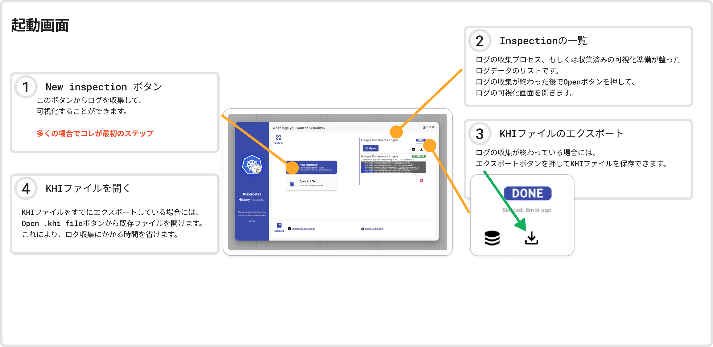

ログをクエリするには、3つのステップでいくつかの情報を入力する必要があります。

1. クラスタの種類を選択します。
2. クエリするログタイプを選択します。
3. ログフィルタの作成に必要なパラメータを入力します。

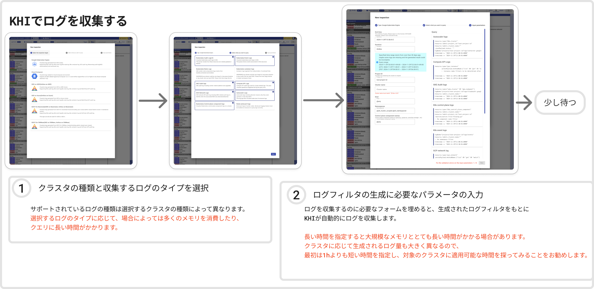

クエリダイアログの `Run` ボタンをクリックすると、スタート画面にプログレスバーが表示されます。
クエリが完了したら、`Open` ボタンをクリックして可視化結果を開くことができます。

## 可視化を理解する

ログを開くと、カラフルな可視化が表示されます。
これが KHI のメインビューで、左側にはタイムライン図が表示され、クラスタ内のリソースの大局的な状態を可視化しています。
右側は、各リソースの詳細を表示しています。タイムラインでリソースを選択すると、対象の詳細情報を確認できます。

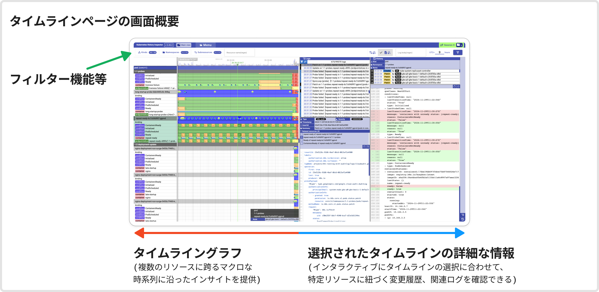

### タイムラインビュー

図中のタイムラインは、階層順 (Kind > Namespace > リソース名 > サブリソース) に表示されます。
タイムライン図を拡大または縮小するには、Shift キーを押しながらマウスをスクロールします。KHI は、マウスポインタの位置にある時点を中心にビューを拡大縮小します。

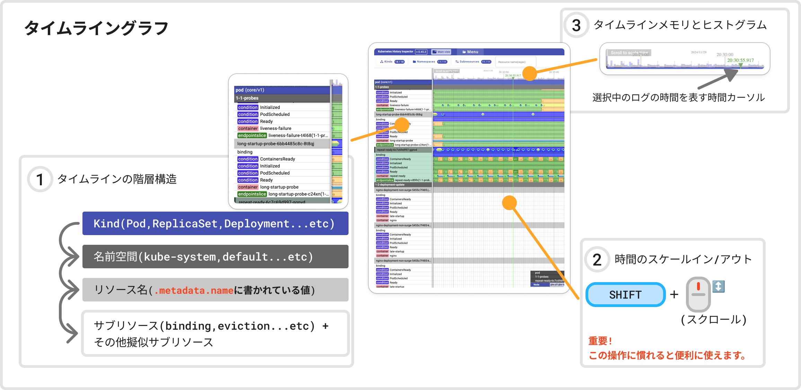

タイムライン上のカラフルな帯は `リビジョン` と呼ばれます。各リビジョンは、左端 (開始時刻) から右端 (終了時刻) まで続く一つの状態を表します。
リビジョンにマウスポインタを合わせると、各色の意味を確認できます。

KHI は、いくつかの補足的なタイムラインを擬似サブリソースタイムラインとして表示します。これらの擬似サブリソースは、Kubernetes の実際​​のサブリソースではありませんが、KHI は、より良い可視化のために、これらの補完的なタイムラインをリソースに関連付けます。これらの擬似サブリソースの色の意味は、親リソースとの関係によって異なる場合があります。
この関係は、左側のサブリソース名の横にあるカラフルなチップで示されます。

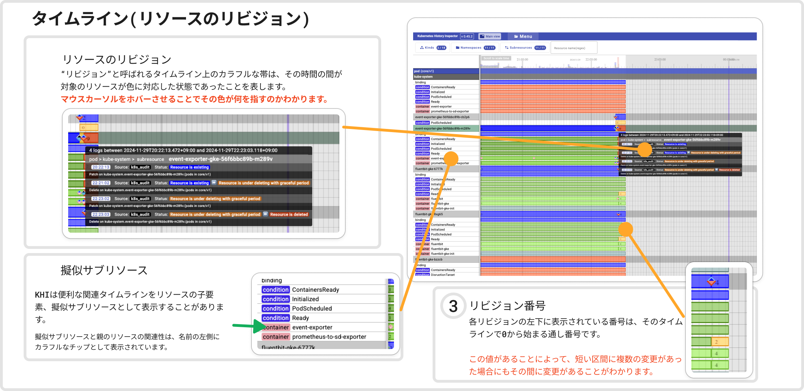

タイムライン上のダイヤ形の点は、KHI では `イベント` と呼ばれます (これらは Kubernetes のイベントではないことに注意してください)。これらは、ログがその特定の時点でリソースに関連付けられたことを示します。
イベントの色は、その重大度とログの種類を示します。イベントにマウスポインタを合わせると、詳細が表示されます。

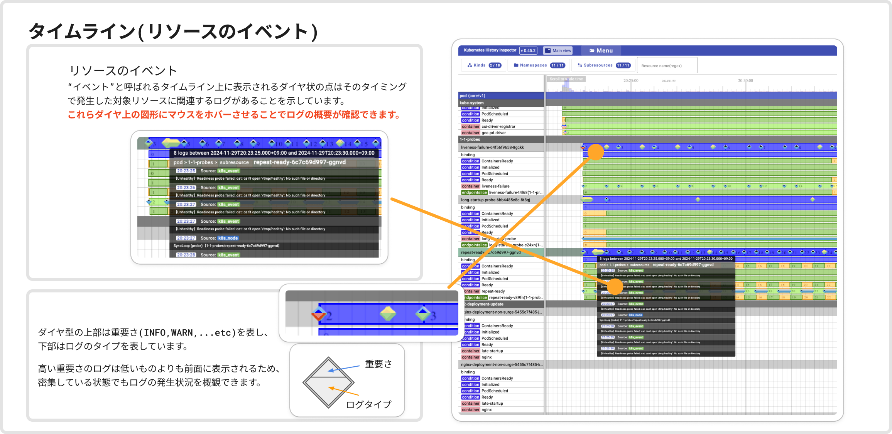

タイムラインの名前またはその中の要素をクリックすると、そのタイムラインが選択されます。タイムライン図の右側にあるログビューと履歴ビューには、選択したタイムラインに対応するデータが表示されます。

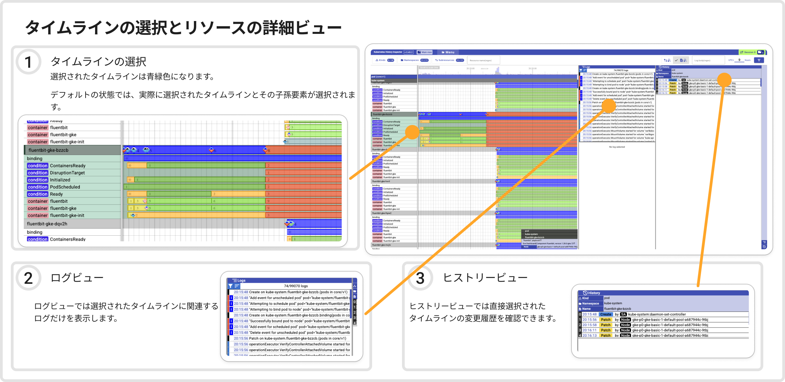

### ログビュー

ログビューには、選択したタイムラインに関連するログのみが自動的に表示されます。

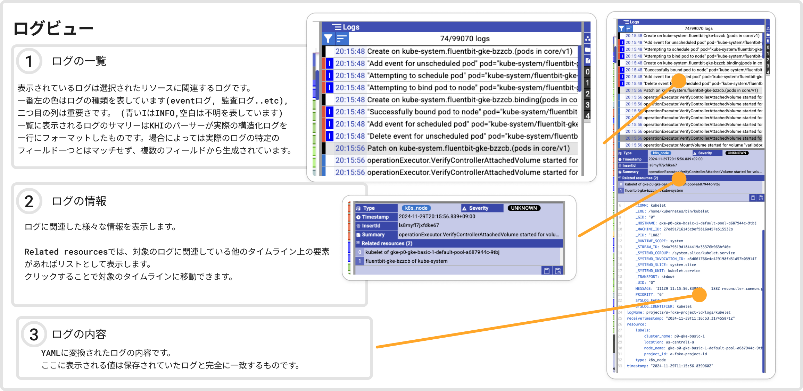

### ヒストリービュー

ヒストリービューには、選択したタイムラインの変更履歴が表示されます。

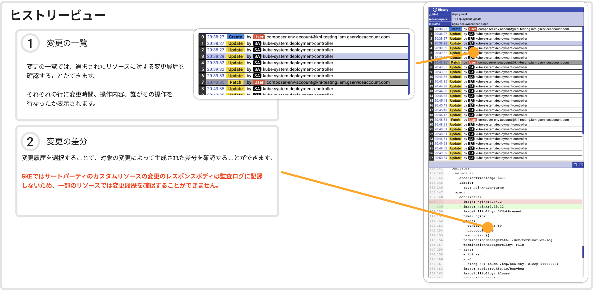

### フィルタリング

タイムライン図の左上にある入力フィールドを使用して、Kind、名前空間、およびリソース名でタイムラインをフィルタリングできます。
これにより、現在の調査に関連するタイムラインのみに表示をすばやく絞り込むことができます。

また、右上の入力フィールドに正規表現を使用してログをフィルタリングすることもできます。これにより、正規表現に一致するログがないタイムラインも除外されます。

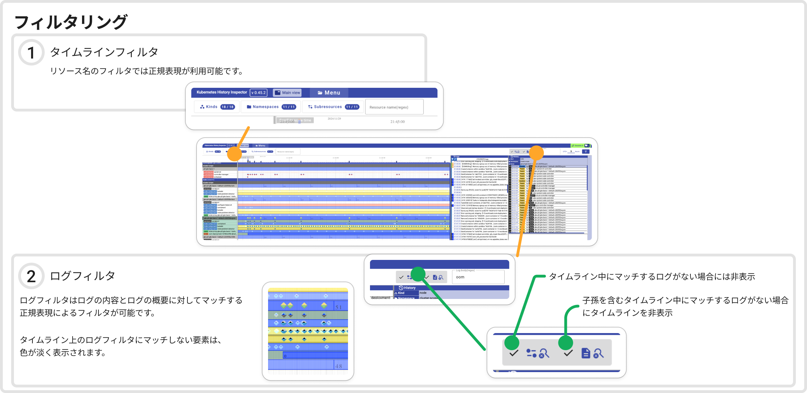

### リソースの関連性の可視化 (アルファ版)

リソースの関連性の可視化機能を用いて、あるタイミングにおけるクラスタ内のKubernetes リソース間の関係を視覚的に表現します。
これは、ログ内の特定の時点でのリソース同士の関連性を理解するのに役立ちます。

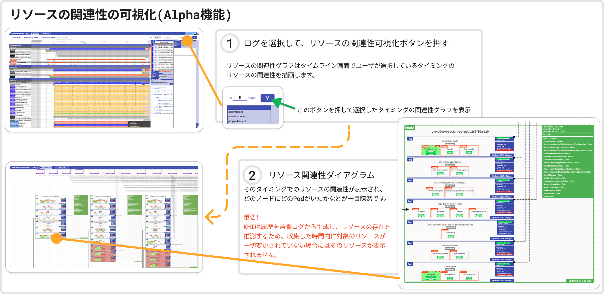