# Common Log K8s Audit Inspection Tasks

This package contains inspection tasks for processing Kubernetes Audit Logs.
It constructs a timeline of resource changes by analyzing audit logs, generating manifests, and tracking resource states.

## Task Graph

```mermaid
graph TD
    %% External Dependencies
    Provider[K8sAuditLogProviderRef]
    MergeConfig[defaultK8sResourceMergeConfigTask]

    classDef external stroke-dasharray: 5 5;
    class Provider,MergeConfig external;

    Ingester[k8sAuditLogIngesterTask]
    SuccessFilter[successLogFilterTask]
    NonSuccessFilter[nonSuccessLogFilterTask]
    
    %% Groupers
    NonSuccessGrouper[nonSuccessLogGrouperTask]
    ChangeTargetGrouper[changeTargetGrouperTask]
    
    %% Manifest, Lifetime & Inventory
    ManifestGenerator[manifestGeneratorTask]
    LifetimeTracker[resourceLifetimeTrackerTask]

    NodeNameDiscovery[nodeNameDiscoveryTask]
    ResourceUIDDiscovery[resourceUIDDiscoveryTask]
    ResourceUIDPF[uidPatternFinderTask]
    ContainerIDDiscovery[containerIDDiscoveryTask]
    ContainerIDPF[containerIDPatternFinderTask]
    IPLeaseDiscovery[ipLeaseHistoryDiscoveryTask]
    ResourceCreationTimeDiscovery[resourceTimelineCreationTimeDiscoveryTask]
    PodPhaseCreationTimeDiscovery[podPhaseTimelineCreationTimeDiscoveryTask]
    
    %% Timeline Mappers
    NamespaceRequestMapper[namespaceRequestLogToTimelineMapperTask]
    NonSuccessMapper[nonSuccessLogLogToTimelineMapperTask]
    RevisionMapper[resourceRevisionLogToTimelineMapperTask]
    OwnerRefMapper[resourceOwnerReferenceTimelineMapperTask]
    EndpointMapper[endpointResourceLogToTimelineMapperTask]
    PodPhaseMapper[podPhaseLogToTimelineMapperTask]
    ContainerMapper[containerLogToTimelineMapperTask]
    ConditionMapper[conditionLogToTimelineMapperTask]

    %% Connections
    Provider --> Ingester
    Provider --> SuccessFilter
    Provider --> NonSuccessFilter
    Provider --> NodeNameDiscovery
    Provider --> ResourceUIDDiscovery
    Provider --> ContainerIDDiscovery
    Provider --> IPLeaseDiscovery

    ResourceUIDDiscovery --> ResourceUIDPF
    ContainerIDDiscovery --> ContainerIDPF
    
    SuccessFilter --> ChangeTargetGrouper
    NonSuccessFilter --> NonSuccessGrouper
    
    ChangeTargetGrouper --> ManifestGenerator
    MergeConfig --> ManifestGenerator
    
    ManifestGenerator --> LifetimeTracker
    ManifestGenerator --> ResourceCreationTimeDiscovery
    ManifestGenerator --> PodPhaseCreationTimeDiscovery

    ManifestGenerator --> NamespaceRequestMapper
    Ingester --> NamespaceRequestMapper
    
    %% Timeline Mapper dependencies
    NonSuccessGrouper --> NonSuccessMapper
    Ingester --> NonSuccessMapper
    
    LifetimeTracker --> RevisionMapper
    Ingester --> RevisionMapper
    
    LifetimeTracker --> OwnerRefMapper
    Ingester --> OwnerRefMapper
    
    LifetimeTracker --> EndpointMapper
    Ingester --> EndpointMapper
    
    LifetimeTracker --> PodPhaseMapper
    Ingester --> PodPhaseMapper
    
    LifetimeTracker --> ContainerMapper
    Ingester --> ContainerMapper
    
    LifetimeTracker --> ConditionMapper
    Ingester --> ConditionMapper
```

## Task Descriptions

### Common tasks (filter, grouper, ingester, etc.)

- **`K8sAuditLogProviderRef`**: Reference to the external task that provides the raw Kubernetes Audit Logs.
- **`k8sAuditLogIngesterTask`**: Serializes audit logs into the history data and populates log-level metadata (timestamp, severity, and request summary).
- **`successLogFilterTask`**: Filters out non-success logs (e.g., error responses) to focus on successful operations that likely changed the cluster state.
- **`nonSuccessLogFilterTask`**: Filters out success logs to focus on failed operations (errors, forbidden, etc.).
- **`nonSuccessLogGrouperTask`**: Groups non-success logs by their resource path.
- **`changeTargetGrouperTask`**: Groups logs by the *target* resource being modified. It handles complex cases like subresources (e.g., `status`, `scale`) and delete collection operations, ensuring they are associated with the correct parent resource.

### Manifest & Lifetime

- **`manifestGeneratorTask`**: Reconstructs the resource manifest at each point in time by applying the changes from the audit logs. It uses `defaultK8sResourceMergeConfigTask` (`K8sResourceMergeConfigTaskID`) to handle specific merge strategies for different Kubernetes resources.
- **`resourceLifetimeTrackerTask`**: Tracks the lifetime of each resource (creation and deletion). It determines when a resource is created or deleted based on the audit logs and manifest changes.

### Discovery & Inventory Tasks

- **`nodeNameDiscoveryTask`**: Scans audit logs to discover and collect cluster node names.
- **`resourceUIDDiscoveryTask`**: Collects mappings between resource UIDs and their identity (Kind, Namespace, Name).
- **`uidPatternFinderTask`**: Builds a pattern finder (`PatternFinder`) from aggregated UIDs for efficient reference resolution.
- **`containerIDDiscoveryTask`**: Collects mappings between container IDs and container identities from pod creation logs.
- **`containerIDPatternFinderTask`**: Builds a pattern finder from aggregated container IDs.
- **`ipLeaseHistoryDiscoveryTask`**: Discovers IP lease histories from audit logs to resolve IP-to-Pod associations at any timestamp.
- **`resourceTimelineCreationTimeDiscoveryTask`** / **`podPhaseTimelineCreationTimeDiscoveryTask`**: Discover earliest creation timestamps for resource and Pod phase timelines from generated manifests.

### Timeline Mappers

These tasks generate the timeline events and revisions for the resources.

- **`nonSuccessLogLogToTimelineMapperTask`**: Generates events for failed operations, marking them as errors in the timeline.
- **`resourceRevisionLogToTimelineMapperTask`**: Generates the main resource revisions, showing the state of the resource body over time. It handles standard CRUD operations.
- **`resourceOwnerReferenceTimelineMapperTask`**: Adds owner reference information to the timeline, allowing KHI to link resources (e.g., Pod to ReplicaSet).
- **`endpointResourceLogToTimelineMapperTask`**: Specifically tracks `Endpoint` and `EndpointSlice` resources, generating revisions that show the status of individual endpoints (ready, terminating, etc.).
- **`podPhaseLogToTimelineMapperTask`**: Tracks the phase of Pods (Pending, Running, Succeeded, Failed) and their node assignment.
- **`containerLogToTimelineMapperTask`**: Tracks the status of containers within Pods (Waiting, Running, Terminated) and their state details (reason, exit code).
- **`conditionLogToTimelineMapperTask`**: Tracks the `status.conditions` of resources, generating revisions when conditions change (e.g., NodeReady, PodScheduled).
- **`namespaceRequestLogToTimelineMapperTask`**: Records events for requests against entire resources in a namespace.
