# 共通 K8s 監査ログインスペクションタスク

`common/k8saudit` パッケージは、Kubernetes 監査ログを処理するためのインスペクションタスク群を提供します。
監査ログを解析してマニフェストを生成・復元し、リソースの状態変化やコンテナ ID、ノード名、リソース UID、IP リース履歴など各種インベントリ情報を追跡してタイムラインを構築します。

## タスクグラフ

```mermaid
graph TD
    %% 外部依存
    Provider[K8sAuditLogProviderRef]
    MergeConfig[defaultK8sResourceMergeConfigTask]

    classDef external stroke-dasharray: 5 5;
    class Provider,MergeConfig external;

    Ingester[k8sAuditLogIngesterTask]
    SuccessFilter[successLogFilterTask]
    NonSuccessFilter[nonSuccessLogFilterTask]
    
    %% グルーパー
    NonSuccessGrouper[nonSuccessLogGrouperTask]
    ChangeTargetGrouper[changeTargetGrouperTask]
    
    %% マニフェスト・ライフタイム・インベントリ
    ManifestGenerator[manifestGeneratorTask]
    LifetimeTracker[resourceLifetimeTrackerTask]
    
    NodeNameDiscovery[nodeNameDiscoveryTask]
    ResourceUIDDiscovery[resourceUIDDiscoveryTask]
    ResourceUIDPF[uidPatternFinderTask]
    ContainerIDDiscovery[containerIDDiscoveryTask]
    ContainerIDPF[containerIDPatternFinderTask]
    IPLeaseDiscovery[ipLeaseHistoryDiscoveryTask]
    ResourceCreationTimeDiscovery[resourceTimelineCreationTimeDiscoveryTask]
    PodPhaseCreationTimeDiscovery[podPhaseTimelineCreationTimeDiscoveryTask]
    
    %% タイムラインマッパー
    NamespaceRequestMapper[namespaceRequestLogToTimelineMapperTask]
    NonSuccessMapper[nonSuccessLogLogToTimelineMapperTask]
    RevisionMapper[resourceRevisionLogToTimelineMapperTask]
    OwnerRefMapper[resourceOwnerReferenceTimelineMapperTask]
    EndpointMapper[endpointResourceLogToTimelineMapperTask]
    PodPhaseMapper[podPhaseLogToTimelineMapperTask]
    ContainerMapper[containerLogToTimelineMapperTask]
    ConditionMapper[conditionLogToTimelineMapperTask]

    %% 接続関係
    Provider --> Ingester
    Provider --> SuccessFilter
    Provider --> NonSuccessFilter
    Provider --> NodeNameDiscovery
    Provider --> ResourceUIDDiscovery
    Provider --> ContainerIDDiscovery
    Provider --> IPLeaseDiscovery
    
    ResourceUIDDiscovery --> ResourceUIDPF
    ContainerIDDiscovery --> ContainerIDPF
    
    SuccessFilter --> ChangeTargetGrouper
    NonSuccessFilter --> NonSuccessGrouper
    
    ChangeTargetGrouper --> ManifestGenerator
    MergeConfig --> ManifestGenerator
    
    ManifestGenerator --> LifetimeTracker
    ManifestGenerator --> ResourceCreationTimeDiscovery
    ManifestGenerator --> PodPhaseCreationTimeDiscovery

    ManifestGenerator --> NamespaceRequestMapper
    Ingester --> NamespaceRequestMapper
    
    %% 各種タイムラインマッパーへの依存関係
    NonSuccessGrouper --> NonSuccessMapper
    Ingester --> NonSuccessMapper
    
    LifetimeTracker --> RevisionMapper
    Ingester --> RevisionMapper
    
    LifetimeTracker --> OwnerRefMapper
    Ingester --> OwnerRefMapper
    
    LifetimeTracker --> EndpointMapper
    Ingester --> EndpointMapper
    
    LifetimeTracker --> PodPhaseMapper
    Ingester --> PodPhaseMapper
    
    LifetimeTracker --> ContainerMapper
    Ingester --> ContainerMapper
    
    LifetimeTracker --> ConditionMapper
    Ingester --> ConditionMapper
```

## タスク詳細説明

### 共通タスク

- **`K8sAuditLogProviderRef`**: 外部から生 Kubernetes 監査ログの配列を提供するタスク参照です。
- **`k8sAuditLogIngesterTask`**: 監査ログを履歴データストアに取り込み、タイムスタンプ、重要度、リクエストサマリーといったログレベルのメタデータを設定します。
- **`successLogFilterTask`**: クラスタ状態を変える正常成功レスポンスのログのみを抽出します。
- **`nonSuccessLogFilterTask`**: エラーやアクセス権拒否など、非成功レスポンスのログのみを抽出します。
- **`nonSuccessLogGrouperTask`**: 非成功ログをリソースパスごとにグループ化します。
- **`changeTargetGrouperTask`**: `status` や `scale` などのサブリソース操作および delete collection による一括削除操作を解決し、実際の変更対象リソースパスごとにログをグループ化します。

### マニフェスト・ライフタイム

- **`manifestGeneratorTask`**: 監査ログの変更を順次適用して各時点のリソースマニフェストを復元します。Kubernetes リソースごとのマージ戦略の解決には `defaultK8sResourceMergeConfigTask` を使用します。
- **`resourceLifetimeTrackerTask`**: マニフェスト生成結果から各リソースの生成・削除時点であるライフタイムを判定・追跡します。

### インベントリ・ディスカバリ系タスク

- **`nodeNameDiscoveryTask`**: 監査ログを走査してクラスタに出現するノード名一覧を発見・収集します。
- **`resourceUIDDiscoveryTask`**: Pod などの各リソースにおける UID と Kind・Namespace・Name のマッピングを収集します。
- **`uidPatternFinderTask`**: 収集された UID のパターン検索器を構築し、他のタスクからの高速参照を可能にします。
- **`containerIDDiscoveryTask`**: Pod 作成時等に出現するコンテナ ID と Pod 名やコンテナ名などのコンテナ識別子のマッピング情報を収集します。
- **`containerIDPatternFinderTask`**: 収集されたコンテナ ID のパターン検索器を構築します。
- **`ipLeaseHistoryDiscoveryTask`**: 監査ログ中に記録された IP アドレス割り当て履歴を収集し、特定のタイムスタンプにおける IP から Pod への名前解決情報を提供します。
- **`resourceTimelineCreationTimeDiscoveryTask` / `podPhaseTimelineCreationTimeDiscoveryTask`**: 生成されたマニフェストから、リソースタイムラインおよび Pod Phase タイムラインの初回作成時刻を収集します。

### タイムラインマッパー

- **`nonSuccessLogLogToTimelineMapperTask`**: 非成功操作のログをタイムライン上にエラーイベントとして記録します。
- **`resourceRevisionLogToTimelineMapperTask`**: 各リソースのステータスやマニフェスト差分を持つリビジョンをタイムライン上に記録します。
- **`resourceOwnerReferenceTimelineMapperTask`**: リソース間の Owner Reference を追跡して関連を付与します。
- **`endpointResourceLogToTimelineMapperTask` / `podPhaseLogToTimelineMapperTask` / `containerLogToTimelineMapperTask` / `conditionLogToTimelineMapperTask`**: それぞれ Endpoint リソース、Pod Phase 遷移、コンテナ状態遷移、リソース Condition 履歴を解析・タイムラインへ記録します。
- **`namespaceRequestLogToTimelineMapperTask`**: Namespace 全体に対するリクエストのイベントをタイムラインへ記録します。
