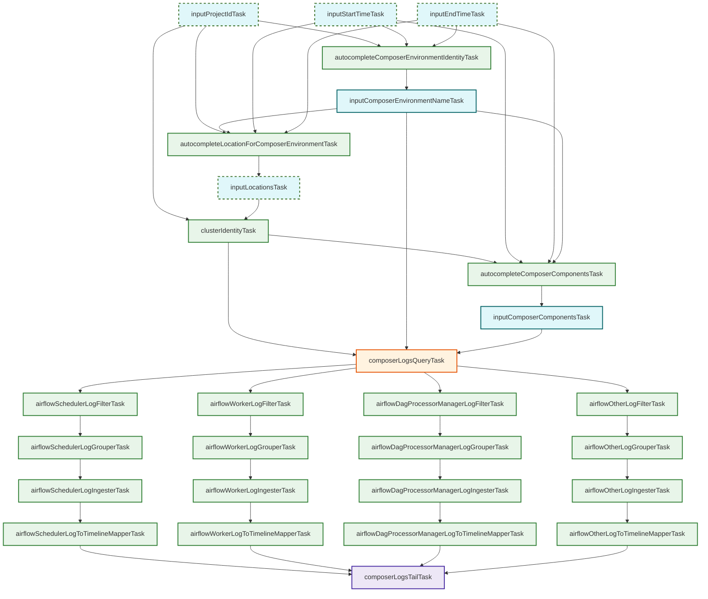

# Cloud Composer Airflow Inspection Tasks

This package (`googlecloud/composerairflow`) and its cluster definition counterpart (`googlecloud/cluster/composer`) contain the tasks for inspecting Google Cloud Composer environments. It performs environment discovery, log fetching, filtering, parsing, and mapping into Kubernetes History Inspector (KHI) timeline events.

## Task Overview

The Composer inspection pipeline can be divided into four main phases:

1. **Discovery & Inputs**: Resolving the target Composer environment and the components the user wants to inspect.
2. **Log Fetching**: Querying Cloud Logging for the target log entries.
3. **Parsing & Mapping Pipelines**: Reading log fields and mapping them to KHI timeline events. The pipeline splits into parallel streams depending on the Airflow component (Scheduler, Worker, DAG Processor Manager, or Other fallback).
4. **Aggregation**: Unifying the pipelines into a final feature task sequence.

### 1. Discovery & Inputs

- **`autocompleteComposerEnvironmentIdentityTask`**: Suggests available Composer environments.
- **`autocompleteLocationForComposerEnvironmentTask`**: Suggests the location of the selected environment.
- **`inputComposerEnvironmentNameTask`**: Captures the user-selected environment name.
- **`autocompleteComposerComponentsTask`**: Queries Cloud Monitoring (`logging.googleapis.com/log_entry_count`) to dynamically suggest available Airflow components (e.g. `scheduler`, `worker`, `dag-processor-manager`, `webserver`, etc.).
- **`inputComposerComponentsTask`**: Captures the user-selected components to inspect.

### 2. Log Fetching

- **`composerLogsQueryTask`**: Generates the Cloud Logging query based on input properties and fetches the raw logs.

### 3. Parsing & Mapping Pipelines

Logs are filtered into specific component streams using extractors. Each stream typically follows the pattern of:
`Filter` -> `Grouper` -> `Ingester` -> `Mapper`

- **Scheduler Pipeline**: Handles `airflow-scheduler` component logs.
  - Tasks: `airflowSchedulerLogFilterTask`, `airflowSchedulerLogGrouperTask`, `airflowSchedulerLogIngesterTask`, `airflowSchedulerLogToTimelineMapperTask`.
- **Worker Pipeline**: Handles `airflow-worker` component logs.
  - Tasks: `airflowWorkerLogFilterTask`, `airflowWorkerLogGrouperTask`, `airflowWorkerLogIngesterTask`, `airflowWorkerLogToTimelineMapperTask`.
- **Dag Processor Manager Pipeline**: Handles `airflow-dag-processor-manager` logs.
  - Tasks: `airflowDagProcessorManagerLogFilterTask`, `airflowDagProcessorManagerLogGrouperTask`, `airflowDagProcessorManagerLogIngesterTask`, `airflowDagProcessorManagerLogToTimelineMapperTask`.
- **Other Pipeline (Fallback)**: Catches any component logs that do not match the above three (e.g., `webserver`, `triggerer`).
  - Tasks: `airflowOtherLogFilterTask`, `airflowOtherLogGrouperTask`, `airflowOtherLogIngesterTask`, `airflowOtherLogToTimelineMapperTask`.

### 4. Aggregation

- **`composerLogsTailTask`**: Waits for all `...LogToTimelineMapperTask` tasks to complete and exposes the Composer logs feature toggle.

## Task Relationship Diagram

The following Mermaid diagram illustrates the dependencies and data flow through the Composer inspection tasks.

