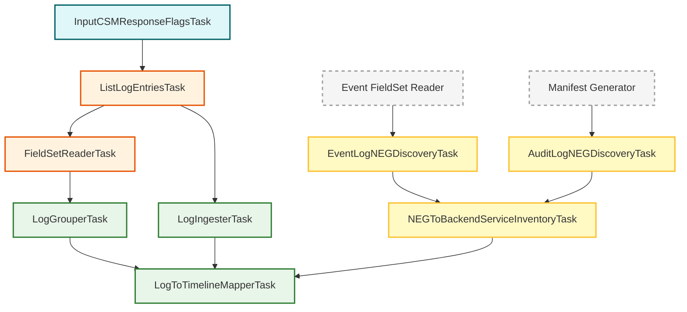

# Cloud Service Mesh (CSM) Inspection Tasks

This package (`googlecloudlogcsm`) contains tasks for inspecting Cloud Service Mesh (CSM) access logs. It handles querying logs, parsing Envoy-related fields, and mapping them to KHI timeline events.

## Task Overview

The CSM inspection pipeline handles the following:

1. **Inputs**: Capturing user-specified filters such as Envoy response flags.
2. **Log Fetching**: Querying Cloud Logging for CSM access logs.
3. **Inventory**: Extracting mappings between NEGs (Network Endpoint Groups) and BackendServices from Kubernetes Event logs and Audit logs.
4. **Parsing & Mapping**: Reading log fields and mapping them to resource timelines.

### Inventory Tasks

These tasks are used to discover associations that are not directly present in the access logs but are required for proper resource mapping. They are provided by shared Google Cloud components and log provider packages.

- **`EventLogNEGDiscoveryTask`** (in `googlecloudlogk8sevent`): Discovers NEG to BackendService mappings by parsing Kubernetes Event logs.
- **`AuditLogNEGDiscoveryTask`** (in `googlecloudlogk8saudit`): Discovers NEG to BackendService mappings by parsing Kubernetes Audit logs (via resource manifests).
- **`NEGToBackendServiceInventoryTask`** (in `googlecloudk8scommon`): Aggregates the discovery results into a single consolidated inventory map.

### CSM Access Log Pipeline

- **`InputCSMResponseFlagsTask`**: Form input for filtering logs by Envoy response flags.
- **`ListLogEntriesTask`**: Fetches CSM access logs from Cloud Logging.
- **`FieldSetReaderTask`**: Parses raw logs into `CSMFieldSet` to extract structured fields.
- **`LogIngesterTask`**: Ingests the logs into the final KHI history.
- **`LogGrouperTask`**: Groups logs by the reporter pod.
- **`LogToTimelineMapperTask`**: Maps CSM access log events to resource timelines, utilizing the NEG inventory for accurate service association.

## Task Relationship Diagram

