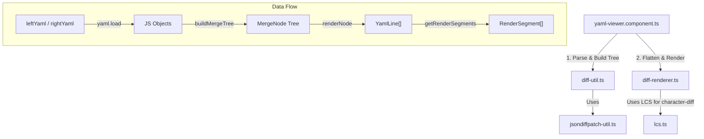

# YAML Viewer Component (`yaml-viewer`)

The `yaml-viewer` is an Angular component designed to display YAML definitions and visually compare and render differences (diffs) between two YAML documents (e.g., Kubernetes resources).

In addition to a single YAML preview, it features advanced capabilities such as object-level diff detection using `jsondiffpatch`, character-level diff highlighting using the LCS (Longest Common Subsequence) algorithm, line collapsing, search highlighting, and relationship indicator (arrow) rendering for moved values.

---

## Architecture & Data Flow

The component parses the input YAML strings into JavaScript objects, builds a merged diff tree, and then flattens it into line-by-line rendering data.

### Processing Steps

1. **Parse & Diff Extraction (`diff-util.ts`)**:
   It parses the `leftYaml` (original) and `rightYaml` (updated) strings into objects using `js-yaml`. It detects differences (additions, modifications, deletions, and moves) between the objects using `jsondiffpatch` and builds a merged tree structure called `MergeNode`.
2. **Flattening to Line Data (`diff-renderer.ts`)**:
   It traverses the `MergeNode` tree and flattens it into a list of `YamlLine` objects, which contain indentation, key/value information, and `DiffStatus`.
   If a value is modified, it calculates character-level differences using `lcs.ts` to identify exactly which parts were added or deleted, storing them in `valueSegments`.
3. **Rendering & Interaction (`yaml-viewer.component.ts`)**:
   It generates `RenderSegment`s from `YamlLine`s (incorporating search query matches) and renders them in the HTML template.
   It also manages the collapsed states of paths (`collapsedPaths`) and controls the drawing of SVG arrows connecting moved elements.

---

## File Roles

| File Name                                                  | Role                                                                                                                                                                                                                                        |
| :--------------------------------------------------------- | :------------------------------------------------------------------------------------------------------------------------------------------------------------------------------------------------------------------------------------------ |
| [yaml-viewer.component.ts](./yaml-viewer.component.ts)     | The main component class controlling the logic. It manages component states using Angular Signals, handles search query matching, controls scrolling, and implements the logic to draw SVG arrows connecting moved-from and moved-to lines. |
| [yaml-viewer.component.html](./yaml-viewer.component.html) | The HTML template. It defines the layout for line numbers, collapse/expand toggle buttons, keys, colons, values, diff highlights, tooltips, and the SVG container for relationship arrows.                                                  |
| [yaml-viewer.component.scss](./yaml-viewer.component.scss) | Styles for syntax highlighting (keys, strings, numbers, booleans, etc.), background/border colors based on `DiffStatus` (Added, Deleted, Modified, Moved), and layout for scroll synchronization and arrow positioning.                     |
| [diff-util.ts](./diff-util.ts)                             | Utility to compare two objects and build a unified `MergeNode` tree. It contains complex comparison logic, such as pairing array elements using specific object properties (like `name` or `type`) to detect item moves.                    |
| [diff-renderer.ts](./diff-renderer.ts)                     | Traverses the `MergeNode` tree and flattens it into a list of `YamlLine`s representing the YAML text. It constructs the key, colon, value, and character-level diff segments (`RenderSegment`) for each line.                               |
| [jsondiffpatch-util.ts](./jsondiffpatch-util.ts)           | Helper functions to determine the type of delta (addition, modification, deletion, or move) produced by `jsondiffpatch` in a type-safe manner.                                                                                              |
| [lcs.ts](./lcs.ts)                                         | An implementation of the Longest Common Subsequence (LCS) algorithm. It is used to compute character-level additions and deletions within modified string values for detailed highlighting.                                                 |
| `*.spec.ts`                                                | Unit tests for each module (`yaml-viewer.component`, `diff-util`, `diff-renderer`, `jsondiffpatch-util`, and `lcs`).                                                                                                                        |
| `yaml-viewer.stories.ts`                                   | Storybook story definitions. It provides various preview patterns, including single preview, diff preview, and complex diffs with moved elements.                                                                                           |
