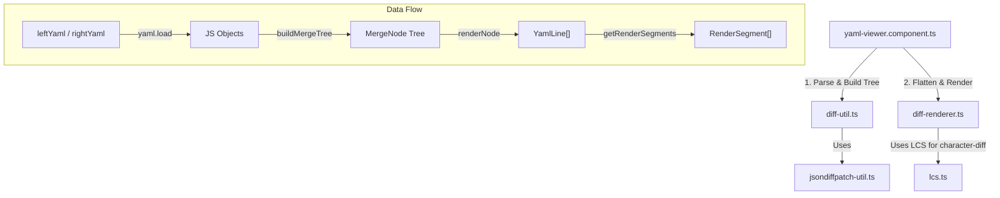

# YAML Viewer コンポーネント (`yaml-viewer`)

`yaml-viewer` は、Kubernetes リソース等の YAML 定義を表示し、2つの YAML 間の差分（Diff）を視覚的に比較・レンダリングするための Angular コンポーネントです。

単一の YAML プレビュー表示に加え、`jsondiffpatch` を用いたオブジェクトレベルの差分検出、LCS（最長共通部分系列）アルゴリズムを用いた文字レベルの差分ハイライト、行の折りたたみ、検索ハイライト、値が移動（Move）した際の関連インジケータ（矢印）描画などの高度な機能を備えています。

---

## アーキテクチャとデータフロー

コンポーネントは、入力された YAML 文字列をオブジェクトにパースし、差分ツリーを構築した後に、行ごとのレンダリング用データへフラット化して描画します。

### 処理の流れ

1. **オブジェクトのパースと差分抽出 (`diff-util.ts`)**:
   `leftYaml` (比較元) と `rightYaml` (比較先) の文字列を `js-yaml` でオブジェクトにパースします。`jsondiffpatch` を用いてオブジェクト間の差分（追加・変更・削除・移動）を検出し、マージされたツリー構造である `MergeNode` を構築します。
2. **フラットな行データへの変換 (`diff-renderer.ts`)**:
   `MergeNode` ツリーを走査し、インデントやキー・値の情報、差分ステータス（`DiffStatus`）を含んだフラットな `YamlLine` の配列に変換します。
   値の変更がある場合、`lcs.ts` を用いて文字レベルの差分（どの部分が追加/削除されたか）を計算し、`valueSegments` に格納します。
3. **描画とインタラクション (`yaml-viewer.component.ts`)**:
   `YamlLine` からさらに検索クエリとの一致などを考慮した `RenderSegment` を生成し、HTML テンプレート上でレンダリングします。
   行の折りたたみ状態（`collapsedPaths`）の管理や、移動した要素（Move）を繋ぐ矢印の描画処理などを制御します。

---

## 各ファイルの役割

| ファイル名                                                 | 役割                                                                                                                                                                                                                               |
| :--------------------------------------------------------- | :--------------------------------------------------------------------------------------------------------------------------------------------------------------------------------------------------------------------------------- |
| [yaml-viewer.component.ts](./yaml-viewer.component.ts)     | コンポーネントのロジックを制御するメインクラス。Angular 信号（Signals）を用いた状態管理、検索クエリの一致処理、スクロール制御、SVG による移動元・移動先のコネクション矢印の描画ロジックなどを持ちます。                            |
| [yaml-viewer.component.html](./yaml-viewer.component.html) | YAML 表示のテンプレート。行番号、折りたたみ用の展開ボタン、キー、コロン、値、差分ハイライト、ホバー時のツールチップ、および移動関係を示す SVG 矢印のコンテナを定義しています。                                                     |
| [yaml-viewer.component.scss](./yaml-viewer.component.scss) | シンタックスハイライト（キー、文字列、数値、Boolean 等）、差分ステータス（Added, Deleted, Modified, Moved）に応じた背景色・ボーダー、およびスクロール同期や矢印描画のためのスタイル。                                              |
| [diff-util.ts](./diff-util.ts)                             | 2つのオブジェクトを比較し、共通のツリー構造 `MergeNode` を構築するユーティリティ。配列要素の対応付け（オブジェクト内の `name` や `type` プロパティを用いたオブジェクトの同定と位置移動の検出）など、高度な比較ロジックを含みます。 |
| [diff-renderer.ts](./diff-renderer.ts)                     | `MergeNode` ツリーを探索し、人間が読める YAML テキスト形式の行（`YamlLine`）のリストにフラット化します。各行の中のキー、コロン、値、および文字レベルの差分セグメント（`RenderSegment`）を組み立てます。                            |
| [jsondiffpatch-util.ts](./jsondiffpatch-util.ts)           | `jsondiffpatch` が生成するデルタ（Delta）配列の形式を型安全に判定するためのヘルパー関数群（追加、変更、削除、移動の判定）。                                                                                                        |
| [lcs.ts](./lcs.ts)                                         | 最長共通部分系列 (Longest Common Subsequence) アルゴリズムの実装。主に `Modified`（変更）された値の文字列に対して、文字単位での追加・削除を特定し、ハイライト用のセグメントに分割するために使用されます。                          |
| `*.spec.ts`                                                | 各モジュール（`yaml-viewer.component`, `diff-util`, `diff-renderer`, `jsondiffpatch-util`, `lcs`）に対応するユニットテストコード。                                                                                                 |
| `yaml-viewer.stories.ts`                                   | Storybook 用のストーリー定義。単一表示、差分表示、移動（Move）を含む複雑な差分など、様々な表示パターンを確認できます。                                                                                                             |
